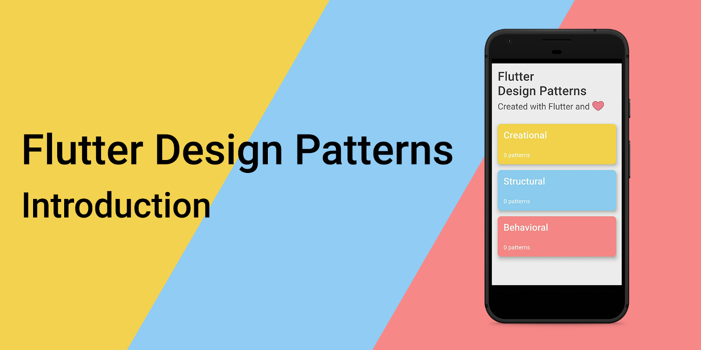
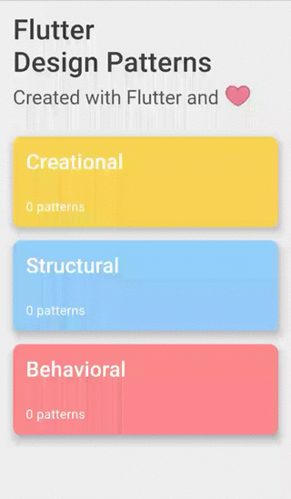
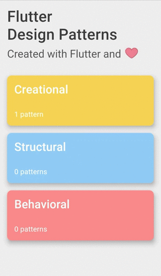
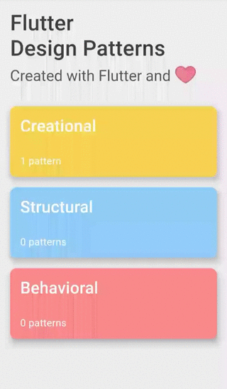

_这是一系列关于面向对象编程(OOP)设计模式及其在 Dart 和 Flutter 中实现的文章的介绍。_



<!--truncate-->
要查看所有设计模式的实际应用，请查看[Flutter 设计模式应用程序。](https://flutterdesignpatterns.com/).
## 关于这个系列

在这个系列的每篇文章中，我将概述一个设计模式，使用 Dart 编程语言实现它，并在 Flutter 中准备一个实用的（如果可能的话）示例，并将其添加到 Flutter 设计模式 应用程序中。关于设计模式的理论部分将主要基于 “四人帮” (GoF) 的书籍[“设计模式：可复用面向对象软件的基础”](https://en.wikipedia.org/wiki/Design_Patterns)，在我看来，这是关于软件设计模式最具标志性的软件工程书籍之一。这本书包含了 23 种不同的 OOP 设计模式，意味着 - 系列中有 23 篇文章！

### 什么是 OOP？
OOP 代表 “面向对象编程”。简单来说，它是一种编程范式，使用 **对象** 的概念来表示 **数据** 和操作这些数据的**方法**。这个概念让软件工程师编写的代码能够代表现实世界中的对象、它们包含的数据以及它们与其他对象的关系，通过相应的代码结构来实现。如果你已经使用 Dart 或任何其他 OOP 编程语言（仅举几个例子，C#、C++、Java）编写过一些代码，可能你已经看到并使用了类，定义了类内的属性和/或方法，创建了类实例并与之操作，指定了不同对象/类之间的关系 —— 这就是面向对象编程！

### 什么是 OOP 设计模式？
OOP 设计模式是软件设计中常见问题的典型解决方案。在 GoF 书中，设计模式的目的是这样描述的：

> 设计模式为常见设计结构的关键方面命名、抽象并识别，使其对创建可复用的面向对象设计有用。

软件设计模式并不是关于解决具体的 UI/UX 问题（一开始可能会因为注意到设计这个词而这样看），它更多的是关于代码结构，这就像是解决特定面向对象设计问题或代码中的问题的蓝图。通过应用这些模式，你可以加速开发过程，编写出更灵活、可复用的代码。然而，这些模式最难的部分是理解它们背后的主要思想，识别代码中可以应用这些模式的地方以及它们可以解决的问题。但这正是这个系列的全部内容 —— 介绍并提供几种设计模式的基础，帮助你为特定的问题选择合适的模式。

## 应用概览
正如我已经提到的，通过在每篇文章中介绍一个新的设计模式，我还将构建一个 **Flutter 设计模式** Flutter 应用程序，并逐步扩展其设计模式库。当然，这个应用程序是开源的，它的代码已经在 [GitHub](https://github.com/mkobuolys/flutter-design-patterns) 上向大家开放！应用程序仅由三个不同的屏幕组成 —— 主菜单、设计模式类别屏幕和设计模式屏幕。



我希望你已经注意到了主菜单中的小心跳动画，以及页面过渡和内容动画，这些为应用程序提供了一些动态效果。



为了展示应用程序如何展示设计模式，我在 [repository](https://github.com/mkobuolys/flutter-design-patterns/tree/0-introduction) 中创建了一个新分支。我不会将其合并到主分支（它仅用于演示目的），但通过使用这些更改[changes](https://github.com/mkobuolys/flutter-design-patterns/commit/3320e126d1e78730267a1f7709c3cb50e8c8e8ab)，我将解释如何向应用程序中添加（并将会添加）一个新的设计模式。

首先，应该向`assets/data/design_patterns.json`中添加一个新的数据对象，包含设计模式的信息（id、标题、描述和路由）：

```json title="design_patterns.json"
...
{
  "id": "introduction",
  "title": "Introduction",
  "description": "Laborum qui ea velit sint officia culpa aute ad sint fugiat excepteur ex pariatur consectetur.",
  "route": "/introduction"
}
...
```

然后，必须向 `assets/markdown` 文件夹中添加一个与设计模式 JSON 中设置的 id 同名的 markdown 文件。这个 markdown 将包含关于设计模式的信息 —— 通常是一些代码片段和对如何实现该模式的一些解释。提供 markdown 文件后，应该实现设计模式，并为设计模式屏幕准备其示例小部件。对于这个示例，我创建了一个简单的 Hello World 小部件（`introduction.dart`）：

```dart title="introduction.dart"
class Introduction extends StatelessWidget {
  @override
  Widget build(BuildContext context) {
    return Center(
      child: Text('Hello world!'),
    );
  }
}
```

最后，应该向 router.dart 文件中添加一个新路由，通过将路由名称添加到 DesignPatternRoutes 类（它应与设计模式 JSON 文件中的路由值匹配）并添加一个带有之前创建的示例的新 DesignPatternDetails 小部件：

```dart title="router.dart" {15-22}
class Router {
  static Route<dynamic> generateRoute(RouteSettings settings) {
    switch (settings.name) {
      case initialRoute:
        return MaterialPageRoute(
          builder: (_) => MainMenu(),
        );
      case categoryRoute:
        var category = settings.arguments as DesignPatternCategory;
        return MaterialPageRoute(
          builder: (_) => Category(
            category: category,
          ),
        );
      case _DesignPatternRoutes.introductionRoute:
        var designPattern = settings.arguments as DesignPattern;
        return MaterialPageRoute(
          builder: (_) => DesignPatternDetails(
            designPattern: designPattern,
            example: Introduction(),
          ),
        );
      default:
        return MaterialPageRoute(
          builder: (_) => MainMenu(),
        );
    }
  }
}

class _DesignPatternRoutes {
  static const String introductionRoute = '/introduction';
}
```

就是这样！完成这些步骤后，一个新的设计模式就在 **Flutter 设计模式** 库中可用了：



