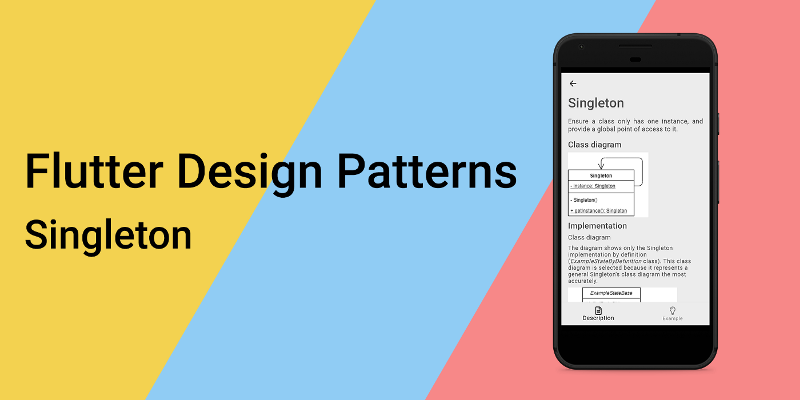
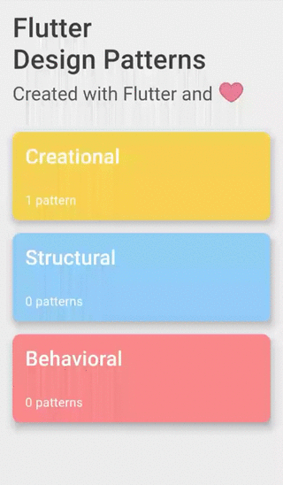
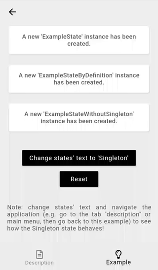

_单例设计模式的概述及其在 Dart 和 Flutter 中的实现_



要查看所有设计模式的实际应用，请查看[Flutter 设计模式应用程序。](https://flutterdesignpatterns.com/).

## 什么是单例？

**单例**是一个**创建型**设计模式，确保一个类只有一个实例，并且提供了一个全局访问点。这个模式的动机在[GoF book](https://en.wikipedia.org/wiki/Design_Patterns)中有所阐述：

> 对于某些类来说，拥有确切的一个实例是非常重要的。尽管一个系统中可以有多台打印机，但应该只有一个打印队列。应该只有一个文件系统和一个窗口管理器...

这个模式的主要思想是让类本身负责跟踪其唯一实例。单例被认为是最简单的设计模式之一，但如果不小心处理，也是很容易出错的。那么，让我们来分析一下，明确单例及其实现的细节。

## 分析

首先，我必须提到，在这个系列中你会在每篇文章中找到几个 UML 类图。如果你不熟悉类图及其符号，我强烈建议你阅读这篇参考资料[reference](https://www.uml-diagrams.org/class-reference.html)。


### 类图和基本结构

实现单例的一般方法在下面的类图中表示：


- Singleton 类包含了**static**属性 `instance`，它是对类实例本身的引用（这种关系以从类 Singleton 到自身的关联链接表示）；
- 只能通过 **static**方法 `getInstance()` 访问这个实例；
- 类构造函数被标记为**private**（在其他实现中可能是受保护的），以确保不能从类外部实例化该类。

### 适用性
在创建类的实例代价昂贵的情况下可以使用单例，例如，实例化一个类需要从外部来源加载大量数据。此外，当你需要在代码中反复访问同一个对象时，该模式也有帮助，例如日志记录器（这个问题通常通过应用另一个设计模式——依赖注入来解决，但那是将来的话题 😊）。当需要某种缓存层时，也可以使用单例——单例类可以在实例请求时检查和管理缓存。

### 一般思考和风险
- 在设计单例时，应考虑延迟构造 —— 类实例应仅在首次需要时创建；
- 通常，单例类不应该需要参数来构造。如果您的类设计需要参数，可能导致基于该参数创建一个某种程度上不同的对象 —— 那么，这个类还能被称为单例吗？一些资源认为这是一种有效的方法，但我有不同的看法；
- 线程安全 —— 你应该注意多线程应用中的单例。如果它们持有某种可变数据，可能导致意外结果，因此应该考虑同步机制。由于我们在这个系列中讨论的是Dart编程语言，你应该知道Dart是一种单线程编程语言，其代码运行在机器上一个小的隔离空间中，称为隔离区。因此，只要你不自己从代码中创建一个新的独立隔离区，就不必担心在Dart中实现单例时的线程安全。如果你对这个话题不熟悉，我强烈推荐你观看这个[video](https://www.youtube.com/watch?v=vl_AaCgudcY)关于Dart和Flutter中的隔离区和事件循环的视频。
- 在某些情况下，单例设计模式被认为是一种反模式。这是因为它违反了一个（实际上是不止一个，但在我看来，这个例子是最好的一个）SOLID原则 —— 单一职责原则。除了单例类的主要职责外，它还应管理其实例的生命周期，这是一个单独的关注点。此外，使用单例使得单元测试代码变得困难，因为无法模拟单例，除非你提供某种接口作为其类型。

### 实现

我们将使用单例设计模式来保存Flutter设计模式应用中的单例示例状态。为了更直接，状态仅保存单个文本属性。示例的状态本身有三种不同的实现方式：

- 使用按定义实现的单例设计模式；
- 使用Dart语言功能实现的单例设计模式；
- 完全不使用单例。

### ExampleStateBase

由于示例的状态以多种不同方式实现，因此创建了其抽象，以便在所有实现中重用。因此，`ExampleStateBase`提供了这种抽象状态：

```dart title="example_state_base.dart"
base class ExampleStateBase {
  @protected
  late String initialText;
  @protected
  late String stateText;
  String get currentText => stateText;

  void setStateText(String text) {
    stateText = text;
  }

  void reset() {
    stateText = initialText;
  }
}
```

正如前面提到的，示例的状态仅由一个单一的String属性`stateText`及其初始值`initialText`组成。属性`stateText`和`initialText`被标记为**protected** —— 这是为了使这些属性仅对扩展了`ExampleStateBase`类的类可访问。然而，Dart并不像某些人可能期望的那样支持与C#或Java等其他面向对象编程语言背景中相同的_protected_ 可见性 —— 我们只能将这些属性标记为_protected_，但这更多的是作为一个提醒，告诉开发者不要在类范围之外使用它们（在这种情况下，Visual Studio Code 编辑器甚至会显示警告）。此外，`ExampleStateBase`提供了操作`stateText`的方法。

### 按定义实现的单例

下面的类图展示了Flutter设计模式应用中实现单例设计模式的具体类。


- `ExampleStateByDefinition` 继承了`ExampleStateBase`类以获取对状态（在这个例子中是`stateText`和`initialText`）及其方法的访问权限。
- `ExampleStateByDefinition` 实现了单例设计模式，并处理实例的创建。实例只能通过**static**方法`getState()`访问。

`ExampleStateByDefinition` 的代码：

```dart title="example_state_by_definition.dart"
final class ExampleStateByDefinition extends ExampleStateBase {
  static ExampleStateByDefinition? _instance;

  ExampleStateByDefinition._internal() {
    initialText = "A new 'ExampleStateByDefinition' instance has been created.";
    stateText = initialText;
  }

  static ExampleStateByDefinition getState() {
    return _instance ??= ExampleStateByDefinition._internal();
  }
}
```

### 使用Dart方式实现的单例


类`ExampleState`采用“Dart方式”实现了单例设计模式：

```dart title="example_state.dart"
final class ExampleState extends ExampleStateBase {
  static final ExampleState _instance = ExampleState._internal();

  factory ExampleState() {
    return _instance;
  }

  ExampleState._internal() {
    initialText = "A new 'ExampleState' instance has been created.";
    stateText = initialText;
  }
}
```

通过比较这段代码和之前的实现，你会发现静态方法 `getState()` 不见了 —— 嗯，它已经不再需要了！Dart语言提供了一个工厂构造函数。它用于实现一个不总是创建其类的新实例的构造函数 —— 这是实现类作为单例的一种漂亮而优雅的方式，不是吗？现在，你可以通过调用工厂构造函数来创建`ExampleState`类的实例，就像调用默认构造函数一样 —— 工厂构造函数将创建一个新实例，或者如果它已经被初始化，就返回现有的实例。

### ExampleStateWithoutSingleton

仅仅是一个简单的状态类实现，没有涉及单例或任何其他“花哨”的设计模式

```dart title="example_state_without_singleton.dart"
final class ExampleStateWithoutSingleton extends ExampleStateBase {
  ExampleStateWithoutSingleton() {
    initialText =
        "A new 'ExampleStateWithoutSingleton' instance has been created.";
    stateText = initialText;
  }
}
```

## 例子

该示例本身使用了三种不同的状态实现：

```dart title="singleton_example.dart"
class SingletonExample extends StatefulWidget {
  const SingletonExample();

  @override
  _SingletonExampleState createState() => _SingletonExampleState();
}

class _SingletonExampleState extends State<SingletonExample> {
  final List<ExampleStateBase> stateList = [
    ExampleState(),
    ExampleStateByDefinition.getState(),
    ExampleStateWithoutSingleton()
  ];

  void _setTextValues([String text = 'Singleton']) {
    for (final state in stateList) {
      state.setStateText(text);
    }
    setState(() {});
  }

  void _reset() {
    for (final state in stateList) {
      state.reset();
    }
    setState(() {});
  }

  @override
  Widget build(BuildContext context) {
    return ScrollConfiguration(
      behavior: const ScrollBehavior(),
      child: SingleChildScrollView(
        padding: const EdgeInsets.symmetric(
          horizontal: LayoutConstants.paddingL,
        ),
        child: Column(
          children: <Widget>[
            for (var state in stateList)
              Padding(
                padding: const EdgeInsets.only(
                  bottom: LayoutConstants.paddingL,
                ),
                child: SingletonExampleCard(
                  text: state.currentText,
                ),
              ),
            const SizedBox(height: LayoutConstants.spaceL),
            PlatformButton(
              materialColor: Colors.black,
              materialTextColor: Colors.white,
              onPressed: _setTextValues,
              text: "Change states' text to 'Singleton'",
            ),
            PlatformButton(
              materialColor: Colors.black,
              materialTextColor: Colors.white,
              onPressed: _reset,
              text: 'Reset',
            ),
            const SizedBox(height: LayoutConstants.spaceXL),
            const Text(
              "Note: change states' text and navigate the application (e.g. go to main menu, then go back to this example) to see how the Singleton state behaves!",
              textAlign: TextAlign.justify,
            ),
          ],
        ),
      ),
    );
  }
}
```

单例实现（`ExampleStateByDefinition`和`ExampleState`）在`SingletonExample`小部件首次创建时仅创建一个新的状态对象，但是每次创建`SingletonExample`小部件时都会创建一个`ExampleStateWithoutSingleton`实例。这种行为可以通过更改状态并强制示例小部件重建来观察，例如通过切换标签页：




或者通过导航到主菜单并返回：



如您所见，作为单例实现的状态保持不变，因为在示例小部件重建时不会创建状态类的新实例。

所有关于单例设计模式及其示例实现的代码更改可以在这里找到[here](https://github.com/mkobuolys/flutter-design-patterns/pull/1)。

要查看该模式的实际运行效果，请查看交互式单例示例[interactive Singleton example](https://flutterdesignpatterns.com/pattern/singleton)。
