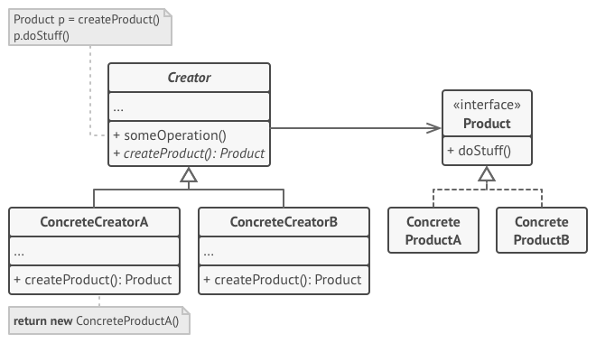
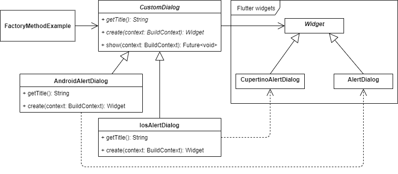
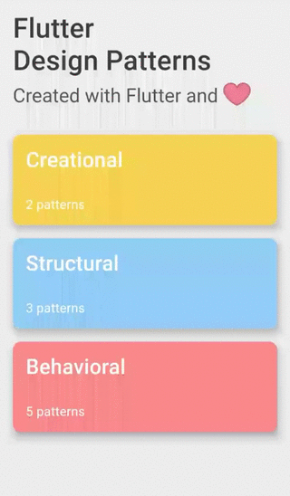

_工厂方法设计模式的概述及其在 Dart 和 Flutter 中的实现_

要查看所有设计模式的实际操作，请查看 [Flutter Design Patterns 应用程序](https://flutterdesignpatterns.com/)。

## 什么是工厂方法设计模式？


**工厂方法**（Factory Method），也被称为**虚拟构造函数**（Virtual Constructor），属于**创建型**设计模式的范畴。该设计模式的意图在 [GoF 书籍](https://en.wikipedia.org/wiki/Design_Patterns)中描述为：

> _定义创建对象的接口，但让子类决定要实例化哪个类。工厂方法允许一个类将实例化推迟到子类中。_

也就是说，工厂方法设计模式为负责创建对象的类定义了一个接口，从而将对象的实例化推迟到实现该接口的特定类中。这解决了在使用对象的类内部直接创建对象的问题。

此外，它通过子类化实现了编译时的灵活性。当对象在类内部被创建时，这是非常不灵活的，因为你不能独立于类更改对象的实例化——类被限定在特定的对象上。通过实现这种模式，可以编写子类来重新定义对象的创建方式。

最后，这种模式消除了将应用特定类直接绑定到代码中的问题。因此，代码只处理使用工厂方法创建的特定对象的接口。

为了更好地理解工厂方法设计模式，让我们通过分析其结构和实现来深入了解！

## 分析

工厂方法设计模式的一般结构如下所示：



- *Creator*（创建者）- 声明工厂方法，该方法返回新的产品对象。工厂方法可以被声明为抽象的，以强制所有子类实现它。这个类还可能提供工厂方法的默认实现，返回默认的 _ConcreteProduct_（具体产品）对象。
- *ConcreteCreator*（具体创建者）- 重写工厂方法以返回 _ConcreteProduct_ 的实例。注意，工厂方法不必每次都创建一个新的产品实例，例如，对象的实例可以存储在缓存中，稍后在调用工厂方法时返回。
- *Product*（产品）- 为工厂方法创建的所有对象定义一个共同的接口。
- *ConcreteProduct*（具体产品）- 实现 _Product_ 接口；这个对象的实例由特定的 _ConcreteCreator_ 类返回。

### 适用性

工厂方法设计模式的主要目的是将产品构造代码与实际使用该产品的代码分离。因此，当你需要添加一个新的具体产品时，只需创建一个新的创建者子类，重写工厂方法即可。所以，当你不知道代码应该使用哪些确切类型和依赖的对象时，这种模式是一个很好的选择。

如前所述，工厂方法并不必每次都创建一个新的对象实例。因此，如果你想节省一些系统资源，重用已经存在的对象而不是重新构建它，实现工厂方法可能是一个好方法，例如，通过引入一个缓存层或存储，来跟踪已经创建的对象，并在特定创建者子类上调用工厂方法时返回请求的对象。

## 实现


既然你正在阅读这篇文章，可能你已经使用过Flutter，或者想要熟悉它（谢谢，显而易见的船长）。使用Flutter的主要优势是使用相同的代码库为不同平台交付应用程序。但是...

> _“能力越大，责任越大。”_

即使你正在使用Flutter的相同代码库，通常还是需要不同平台上的UI组件看起来不同。在Flutter上下文中最简单的想象用例 - 根据你使用的是安卓还是iOS设备，分别显示Material风格或Cupertino风格的小部件。

要在UI中显示适当的小部件，你应该检查当前平台，然后提供Material或Cupertino小部件（一个简单的if语句应该可以解决这个问题）。通常来说，这种实现方式是不灵活的：

- 每个需要不同平台不同小部件的地方都应该检查当前平台；
- 当引入新平台时（例如，Web），代码维护变得困难 - 需要引入额外的检查，if语句将会扩展。

工厂方法设计模式为这个问题提供了一个相对简单的解决方案：每个平台特定的小部件都有其具体的创建者子类，扩展了通用的抽象创建者类。通过引入这个，UI代码只需要关心所有特定组件的公共接口（基类），基于当前平台，适当的工厂方法将被调用来创建小部件 - 代码不再必须引用这些组件的具体实现。

作为这种方法的一个例子，我们将创建一个页面，在这个页面上，你可以选择当前平台（使用单选按钮模拟），基于此显示适当的警告对话框（Material或Cupertino小部件）。

### 类图

下面的类图展示了工厂方法设计模式的实现：



`CustomDialog` 是一个抽象类，用作所有特定警告对话框的基类：

- `getTitle()` - 返回警告对话框标题的抽象方法。在UI中使用；
- `create()` - 返回警告对话框的具体实现（UI组件/小部件）的抽象方法；
- `show()` - 调用 `create()` 方法来构建（创建）警告对话框并在UI中显示。

`AndroidAlertDialog` 和 `IosAlertDialog` 是扩展 `CustomDialog` 类并实现其抽象方法的具体类。`AndroidAlertDialog` 创建一个类型为 `AlertDialog` 的Material风格警告对话框，而 `IosAlertDialog` 创建一个类型为 `CupertinoAlertDialog` 的Cupertino风格警告对话框。

`Widget`、`CupertinoAlertDialog` 和 `AlertDialog` 是Flutter库中已实现的类（小部件）。

`FactoryMethodExample` 包含 `CustomDialog` 类，使用 `show()` 方法显示该类型的特定警告对话框。

### CustomDialog

用于显示自定义对话框的抽象类。`CustomDialog` 类实现了显示对话框的主要逻辑（`show()` 方法）。对于对话框创建本身，仅提供了 `create()` 方法的头部，每个扩展 `CustomDialog` 的具体类应通过返回该特定警告对话框的自定义 `Widget` 对象来实现它。


```dart title="custom_dialog.dart"
abstract class CustomDialog {
  const CustomDialog();

  String getTitle();
  Widget create(BuildContext context);

  Future<void> show(BuildContext context) => showDialog<void>(
        context: context,
        barrierDismissible: false,
        builder: create,
      );
}
```

### Alert dialogs

`AndroidAlertDialog` - 一个具体的警告对话框类，扩展了 `CustomDialog` 并通过使用 Material `AlertDialog` 小部件实现了 `create()` 方法。

```dart title="android_alert_dialog.dart"
class AndroidAlertDialog extends CustomDialog {
  const AndroidAlertDialog();

  @override
  String getTitle() => 'Android Alert Dialog';

  @override
  Widget create(BuildContext context) {
    return AlertDialog(
      title: Text(getTitle()),
      content: const Text('This is the material-style alert dialog!'),
      actions: <Widget>[
        TextButton(
          onPressed: Navigator.of(context).pop,
          child: const Text('Close'),
        ),
      ],
    );
  }
}
```

`IosAlertDialog` - 一个具体的警告对话框类，扩展了 `CustomDialog` 并通过使用 Cupertino (iOS) `CupertinoAlertDialog` 小部件实现了 `create()` 方法。


```dart title="ios_alert_dialog.dart"
class IosAlertDialog extends CustomDialog {
  const IosAlertDialog();

  @override
  String getTitle() => 'iOS Alert Dialog';

  @override
  Widget create(BuildContext context) {
    return CupertinoAlertDialog(
      title: Text(getTitle()),
      content: const Text('This is the cupertino-style alert dialog!'),
      actions: <Widget>[
        CupertinoButton(
          onPressed: Navigator.of(context).pop,
          child: const Text('Close'),
        ),
      ],
    );
  }
}
```

## 示例

首先，准备了一个 markdown 文件作为模式的描述：


`FactoryMethodExample` 包含了一个 `CustomDialog` 对象列表。在列表中选择特定的对话框并触发 `showCustomDialog()` 方法后，通过在所选对话框上调用 `show()` 方法来显示该对话框。

```dart title="factory_method_example.dart"
class FactoryMethodExample extends StatefulWidget {
  const FactoryMethodExample();

  @override
  _FactoryMethodExampleState createState() => _FactoryMethodExampleState();
}

class _FactoryMethodExampleState extends State<FactoryMethodExample> {
  final List<CustomDialog> customDialogList = const [
    AndroidAlertDialog(),
    IosAlertDialog(),
  ];

  var _selectedDialogIndex = 0;

  Future _showCustomDialog(BuildContext context) async {
    final selectedDialog = customDialogList[_selectedDialogIndex];

    await selectedDialog.show(context);
  }

  void _setSelectedDialogIndex(int? index) {
    if (index == null) return;

    setState(() => _selectedDialogIndex = index);
  }

  @override
  Widget build(BuildContext context) {
    return ScrollConfiguration(
      behavior: const ScrollBehavior(),
      child: SingleChildScrollView(
        padding: const EdgeInsets.symmetric(
          horizontal: LayoutConstants.paddingL,
        ),
        child: Column(
          children: <Widget>[
            DialogSelection(
              customDialogList: customDialogList,
              selectedIndex: _selectedDialogIndex,
              onChanged: _setSelectedDialogIndex,
            ),
            const SizedBox(height: LayoutConstants.spaceL),
            PlatformButton(
              materialColor: Colors.black,
              materialTextColor: Colors.white,
              onPressed: () => _showCustomDialog(context),
              text: 'Show Dialog',
            ),
          ],
        ),
      ),
    );
  }
}
```

如你所见，在 `showCustomDialog()` 方法中，它不关心警告对话框的具体实现，只要它扩展了 `CustomDialog` 类并提供了 `show()` 方法。此外，对话框小部件的实现被封装并在单独的工厂方法中定义（在 `CustomDialog` 类的特定实现内 - `create()` 方法）。因此，UI 逻辑并不与任何具体的警告对话框类紧密耦合，其实现细节可以独立更改，而不影响 UI 本身的实现。

工厂方法设计模式实现的最终结果如下所示：



如你在示例中所见，通过选择特定的警告对话框样式并触发 _'显示对话框'_ 按钮，适当的对话框由工厂方法创建并提供给用户。

关于工厂方法设计模式及其示例实现的所有代码更改可以在[这里](https://github.com/mkobuolys/flutter-design-patterns/pull/11)找到。

要查看该模式的实际操作，请查看 [交互式工厂方法示例](https://flutterdesignpatterns.com/pattern/factory-method)。
