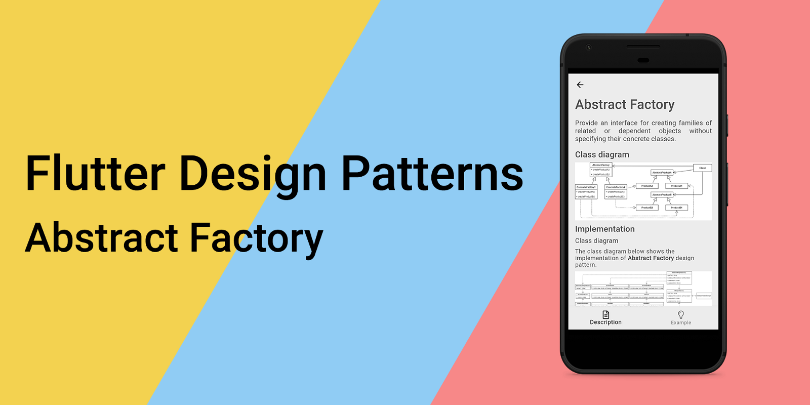
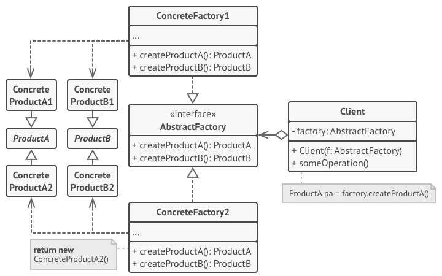
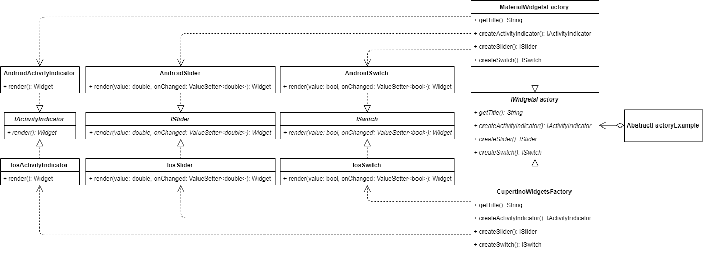
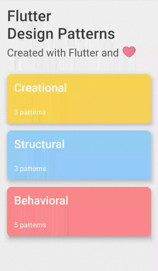

## 抽象工厂设计模式简介



要查看所有设计模式的实际应用，请查看 [Flutter 设计模式应用程序](https://flutterdesignpatterns.com/)。

## 什么是抽象工厂设计模式？


**抽象工厂** 是一种 **创造性** 设计模式，也被称为 **Kit**。在 [GoF 书籍](https://en.wikipedia.org/wiki/Design_Patterns)中，其目的被描述为：

> _提供一个接口，用于创建相关或依赖对象的家族，而不指定它们的具体类别。_

抽象工厂设计模式的主要目的是将一族对象的创建封装在一个单独的工厂对象中，从而抽象化对象创建过程。对于所有支持的对象家族，定义了一个创建对象家族的通用接口，然后创建一个具体的工厂类来实现这个接口。

如果你跟随这个系列，我期望你刚刚有了一种似曾相识的感觉，不是吗？工厂方法设计模式几乎有着相同的意图和目的。是的，就是这样简单。但那为什么还有一个单独的工厂模式呢？这两种模式的主要区别在于，抽象工厂模式提供了一种创建**相关对象家族**的方式 —— 单个工厂负责创建多个对象。因此，你不需要为每个特定类/组件提供单独的工厂。事实上，你可以将工厂方法设计模式视为抽象工厂模式的[子集](https://en.wikipedia.org/wiki/Subset) —— 抽象工厂包含了多个工厂方法，每个方法只创建一个特定对象。

抽象工厂设计模式使对象的创建更加灵活：

- _编译时_ 灵活性 —— 通过定义新的（子）类，可以独立于客户端实现和更改对象的创建方式；
- _运行时_ 灵活性 —— 类可以配置一个工厂对象，用它来创建对象，甚至可以动态交换工厂对象。

最后，这个模式消除了代码中应用特定类的直接绑定。相应地，代码只处理特定对象及其工厂的接口，而不是具体实现。

让我们深入分析，了解抽象工厂的细节以及如何实现这种设计模式。

## 分析

抽象工厂设计模式的一般结构如下：



- *抽象工厂* —— 声明创建抽象 _产品_ 对象的操作接口；
- *具体工厂* —— 实现创建 _具体产品_ 对象的操作。**每个 _具体工厂_ 只对应一种产品变体**；
- *产品* —— 为 _产品_ 对象类型声明一个接口；
- *具体产品* —— 实现 _产品_ 接口并定义由相应的 _具体工厂_ 创建的产品对象；
- *客户端* —— 仅使用 _抽象工厂_ 和 _产品_ 类声明的接口。

### 适用性

当系统的代码需要与各种相关对象（产品）家族一起工作，但不应依赖于这些产品的具体类别，或者如何创建、组合和表示它们时，应考虑使用抽象工厂设计模式。该设计模式提供了一个接口，用于从每个产品家族的类中创建对象。通过使用这个接口而不是对象的具体实现，表示层或系统的代码通常不用担心创建与家族中其他对象不匹配的错误产品变体。当你想在表示层引入特定平台的小部件/UI组件，并在整个系统中保持一致性时，这种限制是有帮助的。

## 实现


如果你阅读了上一篇[文章](../2019-12-19-flutter-design-patterns-10-factory-method/index.md)，你应该已经熟悉了可以通过使用工厂设计模式解决的问题。如果没有，这里是我们将解决的问题的简要概述：

> _尽管你在使用 Flutter 的同一代码库，但通常存在这样的需求，即在不同平台上的 UI 组件应该有不同的外观。在 Flutter 上下文中最简单的用例 —— 根据你是在 Android 还是 iOS 设备上使用，显示 Material 或 Cupertino 风格的小部件。_

上次，我们通过将工厂方法设计模式引入我们的代码，并为每个特定平台的组件提供一个单独的工厂来动态创建所需的小部件，从而解决了这个问题，因此将业务逻辑与表示层（UI）分离。然而，当存在多个组件需要在不同平台上有不同外观时，这种方法变成了巨大的头疼问题。基于工厂方法设计模式，每个组件都应该有一个专门的工厂类，例如，如果你正在为 Android、iOS 和 Web 创建应用程序，每个新组件也需要添加一个新的抽象类和 3 个额外的派生类，用于每个特定平台的实现。

考虑到这些问题，抽象工厂设计模式比工厂方法更好，因为每个平台只需要一个工厂，创建并一起使用一族组件。

### 类图

下面的类图展示了抽象工厂设计模式的实现。



`IWidgetsFactory` 定义了所有特定小部件工厂的通用接口：

- `getTitle()` - 返回工厂的标题。在 UI 中使用；
- `createActivityIndicator()` - 返回实现了 `IActivityIndicator` 接口的活动（进程）指示器的特定实现（UI 组件/小部件）；
- `createSlider()` - 返回实现了 `ISlider` 接口的滑块的特定实现（UI 组件/小部件）；
- `createSwitch()` - 返回实现了 `ISwitch` 接口的开关按钮的特定实现（UI 组件/小部件）。

`MaterialWidgetsFactory` 和 `CupertinoWidgetsFactory` 是 `IWidgetsFactory` 接口的具体实现。`MaterialWidgetsFactory` 创建 Material 风格的组件（小部件），而 `CupertinoWidgetsFactory` 创建 Cupertino 风格的小部件。

`IActivityIndicator`、`ISlider` 和 `ISwitch` 是定义每个组件的 `render()` 方法的接口。这些类由 Material 和 Cupertino 的小部件都实现。

`AndroidActivityIndicator`、`AndroidSlider` 和 `AndroidSwitch` 是 Material 小部件的具体实现，实现了相应接口的 `render()` 方法。

`IosActivityIndicator`、`IosSlider` 和 `IosSwitch` 是 Cupertino 小部件的具体实现，实现了相应接口的 `render()` 方法。

`AbstractFactoryExample` 包含实现了 `IWidgetsFactory` 接口的工厂列表。选择特定工厂后，示例小部件使用其方法创建相应的小部件/UI 组件。

### IWidgetsFactory

一个定义了特定工厂类需要实现的方法的接口。这些方法用于创建由具体工厂定义的特定类型的组件（小部件）。


```dart title="iwidgets_factory.dart"
abstract interface class IWidgetsFactory {
  String getTitle();
  IActivityIndicator createActivityIndicator();
  ISlider createSlider();
  ISwitch createSwitch();
}
```

### Widget factories

`MaterialWidgetsFactory` - 一个具体的工厂类，实现了 `IWidgetsFactory` 接口及其创建 Material 风格小部件的方法。

```dart title="material_widgets_factory.dart"
class MaterialWidgetsFactory implements IWidgetsFactory {
  const MaterialWidgetsFactory();

  @override
  String getTitle() => 'Android widgets';

  @override
  IActivityIndicator createActivityIndicator() =>
      const AndroidActivityIndicator();

  @override
  ISlider createSlider() => const AndroidSlider();

  @override
  ISwitch createSwitch() => const AndroidSwitch();
}
```

`CupertinoWidgetsFactory` - 一个具体的工厂类，实现了 `IWidgetsFactory` 接口及其创建 Cupertino 风格小部件的方法。

```dart title="cupertino_widgets_factory.dart"
class CupertinoWidgetsFactory implements IWidgetsFactory {
  const CupertinoWidgetsFactory();

  @override
  String getTitle() => 'iOS widgets';

  @override
  IActivityIndicator createActivityIndicator() => const IosActivityIndicator();

  @override
  ISlider createSlider() => const IosSlider();

  @override
  ISwitch createSwitch() => const IosSwitch();
}
```

### IActivityIndicator

一个定义 `render()` 方法来渲染活动指示器组件（小部件）的接口。

```dart title="iactivity_indicator.dart"
abstract interface class IActivityIndicator {
  Widget render();
}
```

### Activity indicator widgets

`AndroidActivityIndicator` - 活动指示器组件的特定实现，返回 Material 风格的小部件 `CircularProgressIndicator`。

```dart title="android_activity_indicator.dart"
class AndroidActivityIndicator implements IActivityIndicator {
  const AndroidActivityIndicator();

  @override
  Widget render() {
    return CircularProgressIndicator(
      backgroundColor: const Color(0xFFECECEC),
      valueColor: AlwaysStoppedAnimation<Color>(
        Colors.black.withOpacity(0.65),
      ),
    );
  }
}
```

`IosActivityIndicator` - 活动指示器组件的特定实现，返回 Cupertino 风格的小部件 `CupertinoActivityIndicator`。

```dart title="ios_activity_indicator.dart"
class IosActivityIndicator implements IActivityIndicator {
  const IosActivityIndicator();

  @override
  Widget render() {
    return const CupertinoActivityIndicator();
  }
}
```

### ISlider

一个定义 `render()` 方法来渲染滑块组件（小部件）的接口。

```dart title="islider.dart"
abstract interface class ISlider {
  Widget render(double value, ValueSetter<double> onChanged);
}
```

### Slider widgets

`AndroidSlider` - 滑块组件的特定实现，返回 Material 风格的小部件 `Slider`。

```dart title="android_slider.dart"
class AndroidSlider implements ISlider {
  const AndroidSlider();

  @override
  Widget render(double value, ValueSetter<double> onChanged) {
    return Slider(
      activeColor: Colors.black,
      inactiveColor: Colors.grey,
      max: 100.0,
      value: value,
      onChanged: onChanged,
    );
  }
}
```

`IosSlider` - 滑块组件的特定实现，返回 Cupertino 风格的小部件 `CupertinoSlider`。

```dart title="ios_slider.dart"
class IosSlider implements ISlider {
  const IosSlider();

  @override
  Widget render(double value, ValueSetter<double> onChanged) {
    return CupertinoSlider(
      max: 100.0,
      value: value,
      onChanged: onChanged,
    );
  }
}
```

### ISwitch

一个定义 `render()` 方法来渲染开关组件（小部件）的接口。

```dart title="iswitch.dart"
abstract interface class ISwitch {
  Widget render({required bool value, required ValueSetter<bool> onChanged});
}
```

### Switch widgets

`AndroidSwitch` - 开关按钮组件的特定实现，返回 Material 风格的小部件 `Switch`。

```dart title="android_switch.dart"
class AndroidSwitch implements ISwitch {
  const AndroidSwitch();

  @override
  Widget render({required bool value, required ValueSetter<bool> onChanged}) {
    return Switch(
      activeColor: Colors.black,
      value: value,
      onChanged: onChanged,
    );
  }
}
```

`IosSwitch` - 开关按钮组件的特定实现，返回 Cupertino 风格的小部件 `CupertinoSwitch`。

```dart title="ios_switch.dart"
class IosSwitch implements ISwitch {
  const IosSwitch();

  @override
  Widget render({required bool value, required ValueSetter<bool> onChanged}) {
    return CupertinoSwitch(
      value: value,
      onChanged: onChanged,
    );
  }
}
```

## 示例

首先，准备了一个 markdown 文件作为模式的描述：


`AbstractFactoryExample` 包含一系列 `IWidgetsFactory` 对象（工厂）。从列表中选择特定的工厂后，使用工厂方法创建相应的小部件，并提供给 UI。

```dart title="abstract_factory_example.dart"
class AbstractFactoryExample extends StatefulWidget {
  const AbstractFactoryExample();

  @override
  _AbstractFactoryExampleState createState() => _AbstractFactoryExampleState();
}

class _AbstractFactoryExampleState extends State<AbstractFactoryExample> {
  final List<IWidgetsFactory> widgetsFactoryList = const [
    MaterialWidgetsFactory(),
    CupertinoWidgetsFactory(),
  ];

  var _selectedFactoryIndex = 0;

  late IActivityIndicator _activityIndicator;

  late ISlider _slider;
  var _sliderValue = 50.0;
  String get _sliderValueString => _sliderValue.toStringAsFixed(0);

  late ISwitch _switch;
  var _switchValue = false;
  String get _switchValueString => _switchValue ? 'ON' : 'OFF';

  @override
  void initState() {
    super.initState();
    _createWidgets();
  }

  void _createWidgets() {
    _activityIndicator =
        widgetsFactoryList[_selectedFactoryIndex].createActivityIndicator();
    _slider = widgetsFactoryList[_selectedFactoryIndex].createSlider();
    _switch = widgetsFactoryList[_selectedFactoryIndex].createSwitch();
  }

  void _setSelectedFactoryIndex(int? index) {
    if (index == null) return;

    setState(() {
      _selectedFactoryIndex = index;
      _createWidgets();
    });
  }

  void _setSliderValue(double value) => setState(() => _sliderValue = value);

  void _setSwitchValue(bool value) => setState(() => _switchValue = value);

  @override
  Widget build(BuildContext context) {
    return ScrollConfiguration(
      behavior: const ScrollBehavior(),
      child: SingleChildScrollView(
        padding: const EdgeInsets.symmetric(
          horizontal: LayoutConstants.paddingL,
        ),
        child: Column(
          children: <Widget>[
            FactorySelection(
              widgetsFactoryList: widgetsFactoryList,
              selectedIndex: _selectedFactoryIndex,
              onChanged: _setSelectedFactoryIndex,
            ),
            const SizedBox(height: LayoutConstants.spaceL),
            Text(
              'Widgets showcase',
              style: Theme.of(context).textTheme.titleLarge,
            ),
            const SizedBox(height: LayoutConstants.spaceXL),
            Text(
              'Process indicator',
              style: Theme.of(context).textTheme.titleMedium,
            ),
            const SizedBox(height: LayoutConstants.spaceL),
            _activityIndicator.render(),
            const SizedBox(height: LayoutConstants.spaceXL),
            Text(
              'Slider ($_sliderValueString%)',
              style: Theme.of(context).textTheme.titleMedium,
            ),
            const SizedBox(height: LayoutConstants.spaceL),
            _slider.render(_sliderValue, _setSliderValue),
            const SizedBox(height: LayoutConstants.spaceXL),
            Text(
              'Switch ($_switchValueString)',
              style: Theme.of(context).textTheme.titleMedium,
            ),
            const SizedBox(height: LayoutConstants.spaceL),
            _switch.render(
              value: _switchValue,
              onChanged: _setSwitchValue,
            ),
          ],
        ),
      ),
    );
  }
}
```

如你在 `build()` 方法中看到的，示例小部件并不关心所选的具体工厂，只要它实现了 `IWidgetsFactory` 接口，其方法返回的组件实现了所有工厂间的相应通用接口，并提供了 UI 中使用的 `render()` 方法。此外，特定小部件的实现被封装并定义在实现 `render()` 方法的单独小部件类中。因此，UI 逻辑并没有与任何工厂或组件类紧密耦合，其实现细节可以独立更改，而不会影响 UI 本身的实现。



如示例中所示，通过选择特定平台的小部件选项，适当的小部件会由工厂方法创建并提供给用户。

所有关于抽象工厂设计模式及其示例实现的代码更改可在[此处](https://github.com/mkobuolys/flutter-design-patterns/pull/12)找到。

要查看该模式的互动示例，请查看[抽象工厂互动示例](https://flutterdesignpatterns.com/pattern/abstract-factory)。
