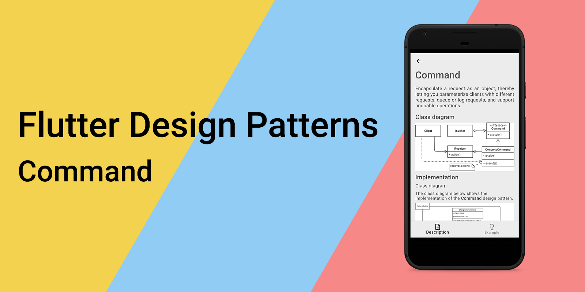
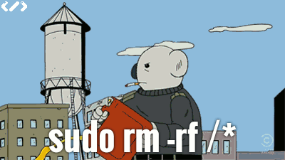
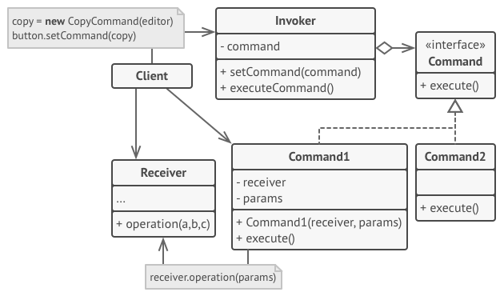
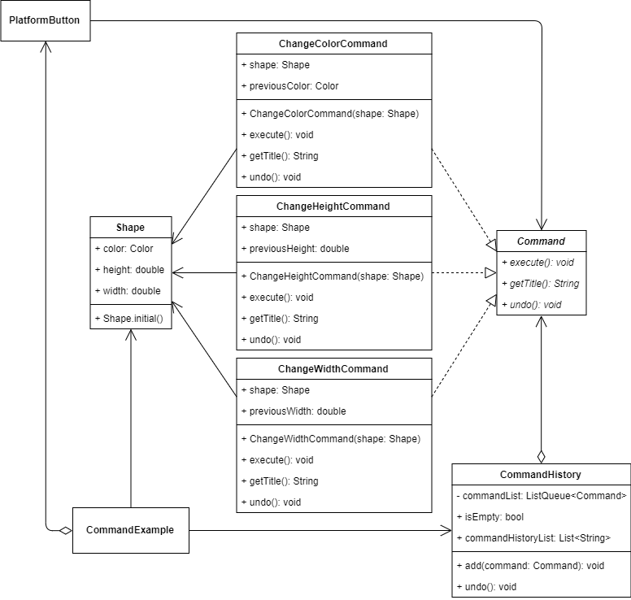
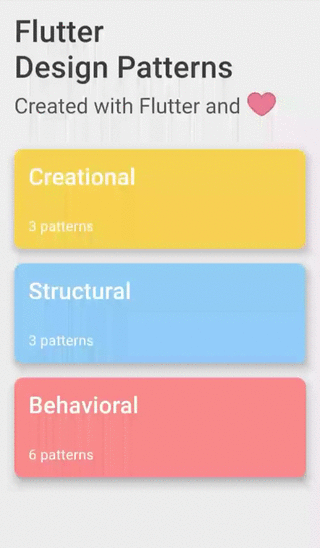

_关于命令设计模式及其在 Dart 和 Flutter 中的实现的概述_



要查看所有设计模式的实际操作，请查看 [Flutter 设计模式应用](https://flutterdesignpatterns.com/)。

## 什么是命令设计模式？



**命令**，也被称为 **动作** 或 **事务**，是行为型设计模式之一，其在 [GoF 书籍](https://en.wikipedia.org/wiki/Design_Patterns)中的目的描述如下：

> _将请求封装为对象，从而让您可以使用不同的请求参数化客户端，排队或记录请求，并支持可撤销的操作。_

这就是说，通过将请求封装为对象，客户端完全与命令的实现方式或执行方式解耦——客户端不必关心任何依赖。

命令设计模式由多个组件构成。通常，**命令** 对象充当各种 UI 和业务逻辑对象之间的链接。在这种情况下，命令对象可以在运行时由 **客户端** 绑定到 UI 元素，特定的 UI 组件，称为 **发送者**，触发请求。**发送者** 触发分配的 **命令**，而不是直接将请求发送给 **接收者** - 包含完成请求所需的实际逻辑的简单或复杂对象。特定 **命令** 将调用传递给接收者，由接收者完成实际工作。因此，命令成为减少 UI 和业务逻辑层之间耦合的便捷中间层。

让我们通过分析和实现部分来了解这种模式的细节，并学习如何实现它！

## 分析

命令设计模式的一般结构如下所示：



- *命令* - 声明执行操作的接口；
- _具体命令 (Command1/Command2)_ - 通过在 _接收者_ 上调用相应的操作来实现各种请求；
- *调用者* - 触发 _命令_ 而不是直接向 _接收者_ 发送请求的发送者类；
- *接收者* - 知道如何执行与完成请求相关的操作。任何类都可以作为 _接收者_；
- *客户端* - 创建 _具体命令_ 对象并设置其 _接收者_。

### 适用性

当你想通过一个操作来参数化对象时，可以使用命令设计模式。也就是说，操作（命令）被提取到一个单独的类中，这个对象可以作为方法参数传递、存储在另一个对象内部，或者在运行时切换关联的命令。

此外，当你想要排队操作、安排它们的执行或远程执行它们时，命令设计模式也很有用。由于命令本身只是一个简单的类，它的对象（如同任何其他对象）可以被序列化、存储，例如在数据库或文本文件中，稍后作为初始命令恢复并执行。这在你想要安排在特定时间或定期执行的特定任务时非常有用。

同样，命令最受欢迎的用途之一是用于创建可逆操作。为了能够撤销操作，你需要实现已执行操作的历史记录。命令历史记录是一个堆栈，包含所有执行的命令对象以及应用程序状态的相关备份。

最后，命令设计模式有助于编写更干净、可重用的代码。通过使用此模式，你提倡 **单一责任原则**（操作逻辑与执行该特定操作的组件解耦）和 **开放/封闭原则**（引入新命令到应用程序不需要更改现有代码）。

## 实现


为了展示命令设计模式的实际操作，我们将实现一个假的图形编辑器。编辑器本身被 _超级超级超级超级_ 简化（嗯，_Photoshop_ 应该也是从某些东西开始的，对吧？）并提供以下功能：

- 屏幕上只有一个可见的形状，不能被移除，但可以使用按钮调整其参数（颜色、高度和宽度）；
- 将形状的颜色更改为随机颜色；
- 将形状的高度更改为 50 到 150 之间的随机值；
- 将形状的宽度更改为 50 到 150 之间的随机值；
- 所有操作都可以使用 _撤销_ 按钮撤销。

就这些了。我知道，作为一个图形编辑器，这听起来很糟糕，但它足以展示命令设计模式的用途。

实现上述图形编辑器的主要思路是将按钮的实际业务逻辑与其表示分离。为了实现这一点，每个按钮的操作（请求）都被封装在一个单独的类对象中。此外，通过使用命令设计模式，可以实现 _撤销_ 操作——由于每个命令都被封装在一个单独的类中，很容易存储已执行命令的对象列表，并通过对列表中的最后一个命令调用 _undo()_ 方法来撤销最后一次操作。

让我们先看看类图，然后研究每个类/组件，看看命令设计模式如何帮助我们构建这样一个图形编辑器。


### 类图

下面的类图显示了命令设计模式的实现：



`Command` 为所有具体命令定义了一个通用接口：

- `execute()` - 执行命令；
- `getTitle()` - 返回命令的标题。用于命令历史记录 UI；
- `undo()` - 撤销命令并将接收者恢复到之前的状态。

`ChangeColorCommand`、`ChangeHeightCommand` 和 `ChangeWidthCommand` 是 `Command` 接口的具体实现。

`Shape` 是一个接收者类，存储定义 UI 中呈现的形状的多个属性：`color`、`height` 和 `width`。

`CommandHistory` 是一个简单的类，存储已执行命令的列表 (`commandList`) 并提供方法将新命令添加到命令历史列表（`add()`）以及从该列表中撤销最后一个命令（`undo()`）。

`CommandExample` 初始化并包含 `CommandHistory` 和 `Shape` 对象。此组件还包含多个 `PlatformButton` 小部件，每个小部件都分配了一个特定的 `Command` 实现。当按下按钮时，命令被执行并添加到存储在 `CommandHistory` 对象中的命令历史列表中。


### Shape

一个简单的类，用于存储有关形状的信息：其颜色、高度和宽度。此类还包含一个命名构造函数，用于创建具有预定义初始值的形状对象。

```dart title="shape.dart"
class Shape {
  Shape.initial()
      : color = Colors.black,
        height = 150.0,
        width = 150.0;

  Color color;
  double height;
  double width;
}
```

### Command

一个接口，定义了特定命令类应实现的方法。

```dart title="command.dart"
abstract interface class Command {
  void execute();
  String getTitle();
  void undo();
}
```

### Commands

`ChangeColorCommand` - 一个特定的命令实现，用于更改 `Shape` 对象的颜色。

```dart title="change_color_command.dart"
class ChangeColorCommand implements Command {
  ChangeColorCommand(this.shape) : previousColor = shape.color;

  final Color previousColor;
  Shape shape;

  @override
  String getTitle() => 'Change color';

  @override
  void execute() => shape.color = Color.fromRGBO(
        random.integer(255),
        random.integer(255),
        random.integer(255),
        1.0,
      );

  @override
  void undo() => shape.color = previousColor;
}
```

`ChangeHeightCommand` - 一个特定的命令实现，用于更改 `Shape` 对象的高度。

```dart title="change_height_command.dart"
class ChangeHeightCommand implements Command {
  ChangeHeightCommand(this.shape) : previousHeight = shape.height;

  final double previousHeight;
  Shape shape;

  @override
  String getTitle() => 'Change height';

  @override
  void execute() => shape.height = random.integer(150, min: 50).toDouble();

  @override
  void undo() => shape.height = previousHeight;
}
```

`ChangeWidthCommand` - 一个特定的命令实现，用于更改 `Shape` 对象的宽度。

```dart title="change_width_command.dart"
class ChangeWidthCommand implements Command {
  ChangeWidthCommand(this.shape) : previousWidth = shape.width;

  final double previousWidth;
  Shape shape;

  @override
  String getTitle() => 'Change width';

  @override
  void execute() => shape.width = random.integer(150, min: 50).toDouble();

  @override
  void undo() => shape.width = previousWidth;
}
```

### CommandHistory

一个简单的类，存储已执行命令的列表。此类还提供 `isEmpty` 和 `commandHistoryList` getter 方法，分别返回命令历史列表是否为空和返回存储在命令历史中的命令名称列表。可以通过 `add()` 方法将新命令添加到命令历史列表中，并且可以使用 `undo()` 方法撤销最后一个命令（如果命令历史列表不为空）。

```dart title="command_history.dart"
class CommandHistory {
  final _commandList = ListQueue<Command>();

  bool get isEmpty => _commandList.isEmpty;
  List<String> get commandHistoryList =>
      _commandList.map((c) => c.getTitle()).toList();

  void add(Command command) => _commandList.add(command);

  void undo() {
    if (_commandList.isEmpty) return;

    _commandList.removeLast().undo();
  }
}
```

## 示例

首先，准备了一个 markdown 文件，用作模式的描述：


`CommandExample` 包含 `CommandHistory` 和 `Shape` 对象。此小部件还包含几个 `PlatformButton` 组件，每个组件都使用特定功能执行一个具体命令。执行命令后，它被添加到存储在 `CommandHistory` 对象中的命令历史列表中。如果命令历史不为空，_撤销_ 按钮将被启用，可以撤销最后一个命令。

```dart title="command_example.dart"
class CommandExample extends StatefulWidget {
  const CommandExample();

  @override
  _CommandExampleState createState() => _CommandExampleState();
}

class _CommandExampleState extends State<CommandExample> {
  final _commandHistory = CommandHistory();
  final _shape = Shape.initial();

  void _changeColor() {
    final command = ChangeColorCommand(_shape);
    _executeCommand(command);
  }

  void _changeHeight() {
    final command = ChangeHeightCommand(_shape);
    _executeCommand(command);
  }

  void _changeWidth() {
    final command = ChangeWidthCommand(_shape);
    _executeCommand(command);
  }

  void _executeCommand(Command command) => setState(() {
        command.execute();
        _commandHistory.add(command);
      });

  void _undo() => setState(() => _commandHistory.undo());

  @override
  Widget build(BuildContext context) {
    return ScrollConfiguration(
      behavior: const ScrollBehavior(),
      child: SingleChildScrollView(
        padding: const EdgeInsets.symmetric(
          horizontal: LayoutConstants.paddingL,
        ),
        child: Column(
          children: <Widget>[
            ShapeContainer(
              shape: _shape,
            ),
            const SizedBox(height: LayoutConstants.spaceM),
            PlatformButton(
              materialColor: Colors.black,
              materialTextColor: Colors.white,
              onPressed: _changeColor,
              text: 'Change color',
            ),
            PlatformButton(
              materialColor: Colors.black,
              materialTextColor: Colors.white,
              onPressed: _changeHeight,
              text: 'Change height',
            ),
            PlatformButton(
              materialColor: Colors.black,
              materialTextColor: Colors.white,
              onPressed: _changeWidth,
              text: 'Change width',
            ),
            const Divider(),
            PlatformButton(
              materialColor: Colors.black,
              materialTextColor: Colors.white,
              onPressed: _commandHistory.isEmpty ? null : _undo,
              text: 'Undo',
            ),
            const SizedBox(height: LayoutConstants.spaceM),
            Row(
              children: <Widget>[
                CommandHistoryColumn(
                  commandList: _commandHistory.commandHistoryList,
                ),
              ],
            ),
          ],
        ),
      ),
    );
  }
}
```

客户端代码（UI 元素、命令历史等）并没有与具体的命令类耦合，因为它通过命令接口与命令进行交互。这种方式允许在不破坏任何现有代码的情况下向应用程序引入新命令。



如你所见，在示例中，通过触发特定命令，其对象被创建、执行并添加到命令历史列表中。因此，即使命令在几个步骤之前就已经执行了，也可以撤销它——这就是使用命令设计模式的优势之一。

所有关于命令设计模式及其示例实现的代码更改可以在[此处](https://github.com/mkobuolys/flutter-design-patterns/pull/13)找到。

要查看模式的实际操作，请查看[交互式命令示例](https://flutterdesignpatterns.com/pattern/command)。

