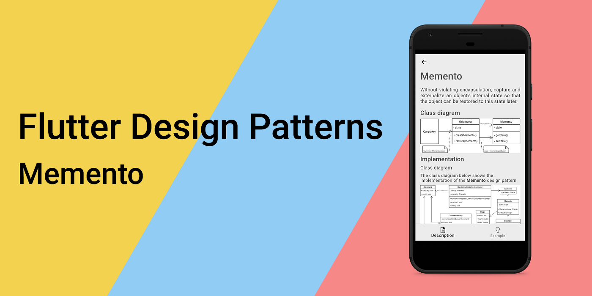
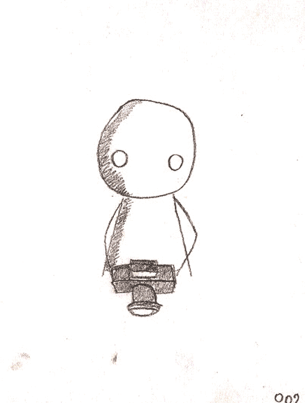
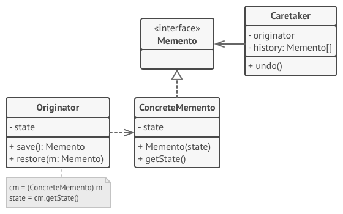
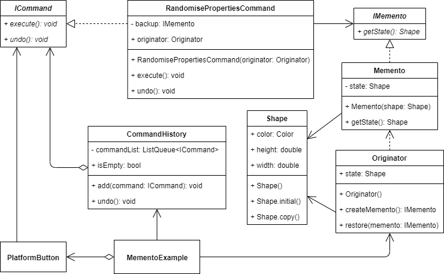
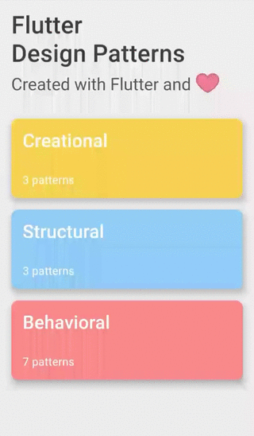

_关于备忘录设计模式及其在 Dart 和 Flutter 中的实现的概述_

### 概述



要查看所有设计模式的实际操作，请查看 [Flutter Design Patterns 应用程序](https://flutterdesignpatterns.com/)。

## 什么是备忘录设计模式？



**备忘录**，也被称为**令牌**，属于**行为型**设计模式。这个设计模式的目的在 [GoF 书籍](https://en.wikipedia.org/wiki/Design_Patterns)中被描述为：

> _不违反封装的情况下，捕获并外化一个对象的内部状态，以便稍后可以将该对象恢复到此状态。_

这个模式的关键思想是让一个对象（**发起人**）自己负责保存和恢复其内部状态。内部状态（其快照）保存在另一个对象中——一个**备忘录**。当需要恢复发起人的内部状态时，撤销机制会向发起人请求备忘录。负责保存和恢复发起人内部状态的客户端（**负责人**）存储了一系列备忘录对象，以便可以将备忘录传回发起人以恢复到之前的状态。但是，负责人本身不允许访问或修改备忘录——只有创建特定备忘录的发起人对象被允许这样做。

为了更好地理解备忘录设计模式，让我们通过分析其结构和实现来深入了解！

## 分析

备忘录设计模式的一般结构如下所示：



- *备忘录* - 声明一个接口，限制对 _具体备忘录_ 字段的访问，只声明与备忘录元数据相关的方法，这个接口被 _负责人_ 用来处理 _具体备忘录_ 对象；
- *具体备忘录* - 存储 _发起人_ 的内部状态。同时，防止除了创建 _具体备忘录_ 的 _发起人_ 之外的对象访问。
- *负责人* - 负责 _备忘录_ 的安全保管，永远不操作或检查 _备忘录_ 的内容。
- *发起人* - 创建包含其当前内部状态快照的 _具体备忘录_。同时，提供 _restore()_ 方法使用 _具体备忘录_ 恢复内部状态。

### 适用性

当你想要生成对象状态的快照以便能够恢复对象以前的状态时，应该使用备忘录设计模式。备忘录模式允许你制作对象状态的完整副本，包括私有字段，并将它们与对象分开存储。

此外，出于安全原因，当直接访问对象的字段/获取器/设置器违反其封装时，也可以使用该模式。备忘录使对象自己负责创建其状态的快照。没有其他对象可以读取快照，使原始对象的状态数据安全且安全。

## 实现


为了实现备忘录设计模式并展示其优点，我们将在命令设计模式的示例上进一步工作。因此，如果您错过了[上一篇文章](../2020-01-09-flutter-design-patterns-12-command/index.md)，我强烈建议您现在查看其实现部分。

示例的主要思想保持不变 - 我们将创建一个非常简单的虚构图形编辑器。为了简化命令设计模式的部分，示例的 UI 中只创建并可用一个命令 - `RandomisePropertiesCommand`。这个命令随机化形状对象的所有属性 - 高度、宽度和颜色 - 这充当我们示例的状态。

显然，与之前的实现不同的是 - 添加了备忘录设计模式。在实现命令设计模式的示例时，我们将其状态（形状对象）存储在示例组件本身中。这一次，状态存储在发起人对象内部，只能由它来操纵。`RandomisePropertiesCommand` 充当负责人对象，将发起人状态的先前快照存储在备份属性中。备份属性只不过是发起人在执行命令之前创建的 `Memento` 对象。

使用备忘录设计模式的结果是，示例的状态被封装并移出了示例组件。此外，可以从其备忘录快照中恢复命令的 `undo()` 操作的先前状态。在这种情况下，备忘录设计模式扩展了命令设计模式，并与之非常好地协作。

在实现备忘录设计模式并将其集成到我们的示例之前，让我们先检查类图，然后研究其组件。

### 类图

下面的类图展示了备忘录设计模式的实现：



`ICommand` 定义了特定命令的通用接口：

- `execute()` - 执行命令；
- `undo()` - 撤销命令并将状态恢复到之前的快照。

`RandomisePropertiesCommand` 是一个实现了 `ICommand` 接口的具体命令。

`CommandHistory` 是一个简单的类，存储了已执行命令的列表（`commandList`），并提供方法向命令历史列表中添加新命令（`add()`）以及撤销列表中的最后一个命令（`undo()`）。

`IMemento` 定义了特定备忘录类的通用接口：

- `getState()` - 返回发起人内部状态的快照。

`Memento` 是一个充当发起人内部状态快照的类，该状态存储在 `state` 属性中，并通过 `getState()` 方法返回。

`Shape` 是一个简单的数据类，用作发起人的内部状态。它存储了定义 UI 中展示的形状的多个属性：`color`、`height` 和 `width`。

`Originator` - 一个简单的类，包含其内部状态，并使用 `createMemento()` 方法将其状态的快照存储到 `Memento` 对象中。此外，发起人的状态可以通过提供的 `Memento` 对象恢复，使用 `restore()` 方法。

`MementoExample` 初始化并包含 `CommandHistory` 和 `Originator` 对象。此组件还包含一个分配有 `RandomisePropertiesCommand` 命令的 `PlatformButton` 小部件。当按钮被按下时，命令被执行并添加到存储在 `CommandHistory` 对象中的命令历史列表中。

### Shape

一个简单的类，用于存储有关形状的信息：颜色、高度和宽度。此类还包含几个构造函数：

- `Shape()` - 基本构造函数，用于创建具有提供的值的形状对象；
- `Shape.initial()` - 命名构造函数，用于创建具有预定义初始值的形状对象；
- `Shape.copy()` - 命名构造函数，用于创建作为提供的 `Shape` 值副本的形状对象。

```dart title="shape.dart"
class Shape {
  Shape.initial()
      : color = Colors.black,
        height = 150.0,
        width = 150.0;

  Shape.copy(Shape shape)
      : color = shape.color,
        height = shape.height,
        width = shape.width;

  Color color;
  double height;
  double width;
}
```

### ICommand

一个定义特定命令类应实现的方法的接口。

```dart title="icommand.dart"
abstract interface class ICommand {
  void execute();
  void undo();
}
```

### RandomisePropertiesCommand

一种特定的命令实现，将存储在 `Originator` 中的 `Shape` 对象的所有属性设置为随机值。此类还实现了 `undo` 操作。

```dart title="randomise_properties_command.dart"
class RandomisePropertiesCommand implements ICommand {
  RandomisePropertiesCommand(this.originator)
      : _backup = originator.createMemento();

  final Originator originator;
  final IMemento _backup;

  @override
  void execute() {
    final shape = originator.state;

    shape.color = Color.fromRGBO(
      random.integer(255),
      random.integer(255),
      random.integer(255),
      1.0,
    );
    shape.height = random.integer(150, min: 50).toDouble();
    shape.width = random.integer(150, min: 50).toDouble();
  }

  @override
  void undo() => originator.restore(_backup);
}
```

### CommandHistory

一个简单的类，存储已执行命令的列表。此类还提供了 `isEmpty` 获取方法，如果命令历史列表为空则返回 true。新命令可以通过 `add()` 方法添加到命令历史列表中，如果命令历史列表不为空，可以使用 `undo()` 方法撤销最后一个命令。


```dart title="command_history.dart"
class CommandHistory {
  final _commandList = ListQueue<ICommand>();

  bool get isEmpty => _commandList.isEmpty;

  void add(ICommand command) => _commandList.add(command);

  void undo() {
    if (_commandList.isEmpty) return;

    _commandList.removeLast().undo();
  }
}
```

### IMemento

一个定义 `getState()` 方法的接口，由特定的备忘录类实现。

```dart title="imemento.dart"
abstract interface class IMemento {
  Shape getState();
}
```

### Memento

实现 `IMemento` 接口的类，存储 `Originator` 内部状态（`Shape` 对象）的快照。状态可以通过 `getState()` 方法供 `Originator` 访问。


```dart title="memento.dart"
class Memento implements IMemento {
  Memento(Shape shape) : _state = Shape.copy(shape);

  final Shape _state;

  @override
  Shape getState() => _state;
}
```

### Originator

一个定义 `createMemento()` 方法的类，用于将当前内部状态保存到一个 `Memento` 对象中。

```dart title="originator.dart"
class Originator {
  Originator() : state = Shape.initial();

  Shape state;

  IMemento createMemento() => Memento(state);

  void restore(IMemento memento) => state = memento.getState();
}
```

## Example

首先，准备了一个 markdown 文件并作为模式描述提供：


`MementoExample` 包含 `CommandHistory` 和 `Originator` 对象。此组件还包含一个 `PlatformButton` 组件，它使用 `RandomisePropertiesCommand` 来随机化形状的属性值。命令执行后，它被添加到存储在 `CommandHistory` 对象中的命令历史列表中。如果命令历史不为空，_撤销_ 按钮将被启用，可以撤销最后一个命令。

```dart title="memento_example.dart"
class MementoExample extends StatefulWidget {
  const MementoExample();

  @override
  _MementoExampleState createState() => _MementoExampleState();
}

class _MementoExampleState extends State<MementoExample> {
  final _commandHistory = CommandHistory();
  final _originator = Originator();

  void _randomiseProperties() {
    final command = RandomisePropertiesCommand(_originator);
    _executeCommand(command);
  }

  void _executeCommand(ICommand command) => setState(() {
        command.execute();
        _commandHistory.add(command);
      });

  void _undo() => setState(() => _commandHistory.undo());

  @override
  Widget build(BuildContext context) {
    return ScrollConfiguration(
      behavior: const ScrollBehavior(),
      child: SingleChildScrollView(
        padding: const EdgeInsets.symmetric(
          horizontal: LayoutConstants.paddingL,
        ),
        child: Column(
          children: <Widget>[
            ShapeContainer(
              shape: _originator.state,
            ),
            const SizedBox(height: LayoutConstants.spaceM),
            PlatformButton(
              materialColor: Colors.black,
              materialTextColor: Colors.white,
              onPressed: _randomiseProperties,
              text: 'Randomise properties',
            ),
            const Divider(),
            PlatformButton(
              materialColor: Colors.black,
              materialTextColor: Colors.white,
              onPressed: _commandHistory.isEmpty ? null : _undo,
              text: 'Undo',
            ),
            const SizedBox(height: LayoutConstants.spaceM),
          ],
        ),
      ),
    );
  }
}
```

正如您在这个示例中看到的，客户端代码（UI 元素、命令历史等）并没有与任何特定的命令类耦合，因为它通过 `ICommand` 接口与命令交互。

除了命令设计模式为这个示例提供的功能外，备忘录设计模式还为示例的状态添加了额外的层。状态存储在 `Originator` 对象内部，命令本身不直接改变状态，而是通过 `Originator`。此外，存储在 `Command` 内部的备份（状态快照）是一个 `Memento` 对象，而不是状态（`Shape` 对象）本身 - 如果触发了状态恢复（命令上的撤销操作），特定命令会调用 `Originator` 上的 `restore()` 方法，将其内部状态恢复到快照中存储的值。因此，它允许在单个请求中恢复多个属性值（一个复杂的状态对象），同时状态本身完全与命令的代码或UI逻辑分离。



正如您在示例中看到的，当命令执行时，实际上存储了发起人内部状态的快照，稍后可以通过在命令上执行撤销操作来恢复。

所有备忘录设计模式及其示例实现的代码更改可以在[这里](https://github.com/mkobuolys/flutter-design-patterns/pull/14)找到。

要查看模式的实际应用，请查看[交互式备忘录示例](https://flutterdesignpatterns.com/pattern/memento)。
