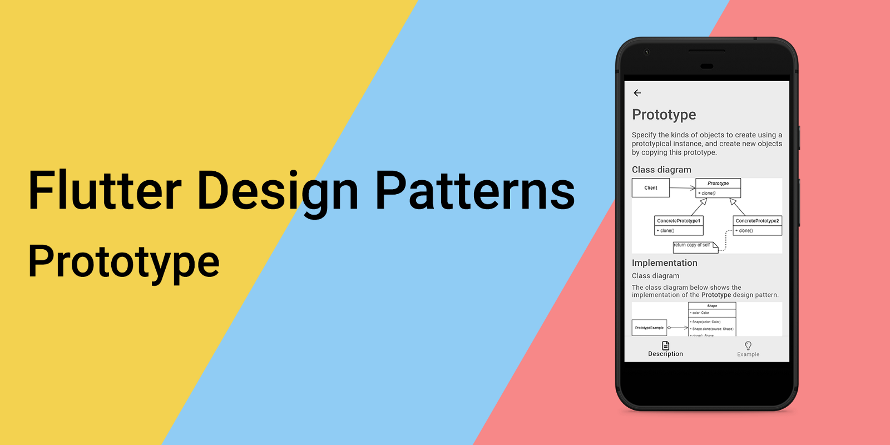
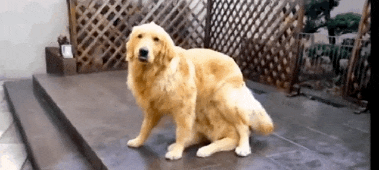
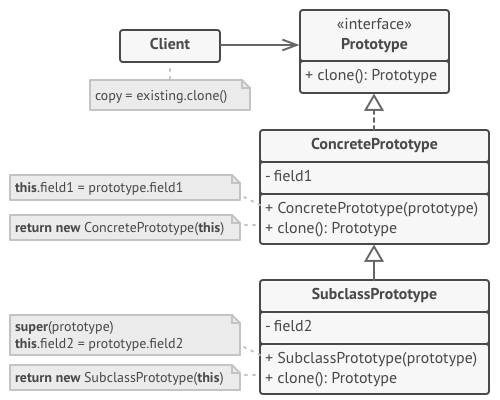
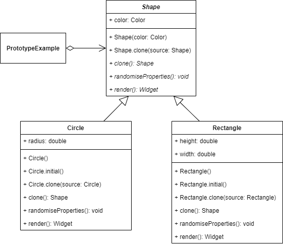
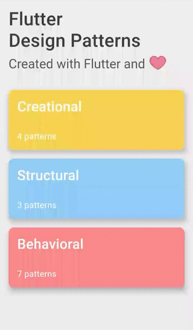

### 原型设计模式概述及其在 Dart 和 Flutter 中的实现



要查看所有设计模式的动态实现，请访问 [Flutter Design Patterns 应用程序](https://flutterdesignpatterns.com/)。

## Prototype 设计模式是什么？



**Prototype** 是一种 **创建型** 设计模式，其在 [GoF 书籍](https://en.wikipedia.org/wiki/Design_Patterns)中的目的描述如下：

> _使用原型实例指定要创建的对象类型，并通过复制这个原型来创建新对象。_

也就是说，Prototype 模式不是直接创建一个新对象，而是使用一些原型，允许通过复制这个原型来创建新对象。当你想要复制一个具有复杂状态的对象时，这可能是有用的，这意味着仅仅初始化一个新对象是不够的，你还需要达到该对象的特定状态才能认为它是有效的副本。简单来说，当你的代码只需要一个具有相同状态的特定对象的副本，并且你不关心如何达到这种状态的细节时 - 那么，你的代码应该提供一种复制（克隆）它的方式。

通常，在需要（使用）对象的类内直接创建对象是一种不灵活的方式。Prototype 设计模式使得运行时灵活性成为可能，因为一个类可以配置不同的 Prototype 对象，这些对象被复制以创建新对象，甚至可以在运行时动态地添加和移除 Prototype 对象。

让我们通过分析和实现部分来了解和学习这个模式的细节，以及如何实现它！

## 分析

Prototype 设计模式的一般结构如下所示：



- *Prototype* - 声明一个克隆自己的接口。通常，它是一个单一的 clone 方法，但如果需要，还可以声明/定义其他方法；
- *ConcretePrototype* - 实现克隆自身的操作。除了将原始对象的数据复制到克隆体之外，该方法还可能处理克隆过程中的一些边缘情况，如克隆链接对象、解开递归依赖等；
- *SubclassPrototype* - 与 _ConcretePrototype_ 相同，但还可以通过定义额外的属性、行为等来扩展基类；
- *Client* - 通过请求原型克隆自身来创建一个新对象。

### 适用性

当你的代码不应该依赖于需要复制的对象的具体类时，应该使用 Prototype 设计模式。Prototype 模式为所有支持克隆的对象提供了一个通用接口，这个接口使得客户端代码可以独立于对象的具体类。

此外，当你想减少仅在初始化各自对象的方式上有所不同的子类数量时，也可以使用这个模式。客户端可以简单地寻找适当的原型并克隆它，而不是实例化与某些配置匹配的子类。

最后，当你有一组预先构建的对象，准备好被复制时，这个模式也很有用。这些对象可以存储在某种原型注册表中，你可以从中访问常用的原型。这样，你可以实例化一个动态加载的类，并在代码中使用它。

## 实现


这次，设计模式的实现部分非常简单直接（但这也可能是个好迹象，对吗？）。假设你的应用程序中有多个形状需要在运行时被复制并提供给 UI。当然，可以通过检查所有属性并使用它们来简单地创建另一个对象来实例化特定形状。然而，不同的形状包含不同的属性，它们是不同的类型，因此仅仅复制特定形状的逻辑可能会导致应用程序代码库中的繁琐混乱，这是你可能想要避免的。

如果有一种统一的方法可以在应用程序中复制任何形状，而不需要在客户端代码中考虑任何细节，那不是很好吗？好吧，我们刚刚分析了 Prototype 设计模式，也许试一试？

### 类图

以下类图展示了 Prototype 设计模式的实现：



`Shape` 是一个抽象类，用作所有特定形状的基类。该类包含一个 `color` 属性，并定义了几个抽象方法：

- `clone()` - 克隆（复制）特定形状；
- `randomiseProperties()` - 随机化形状的属性值；
- `render()` - 渲染形状。该方法用于 UI。

`Circle` 和 `Rectangle` 是具体的形状类，它们扩展了抽象类 `Shape` 并实现了其抽象方法。

`PrototypeExample` 初始化并包含了几个 `Shape` 对象。这些对象使用 `render()` 方法在 UI 中渲染。此外，特定形状对象可以使用 `clone()` 方法复制，其属性可以使用 `randomiseProperties()` 方法随机化。

### Shape

一个抽象类，存储形状的颜色，并定义了几个抽象方法。此外，该类包含几个构造函数：

- `Shape()` - 一个基本构造函数，用提供的颜色值创建一个形状对象；
- `Shape.clone()` - 一个命名构造函数，用于创建一个作为提供的 `Shape` 值的副本的形状对象。

```dart title="shape.dart"
abstract class Shape {
  Shape(this.color);

  Shape.clone(Shape source) : color = source.color;

  Color color;

  Shape clone();
  void randomiseProperties();
  Widget render();
}
```

### Shapes

`Circle` - 一个特定类，定义了圆形的形状。该类定义了一个 `radius` 属性，扩展了 `Shape` 类，并实现了其抽象方法 `clone()`、`randomiseProperties()` 和 `render()`。

```dart title="circle.dart"
class Circle extends Shape {
  Circle(super.color, this.radius);

  Circle.initial([super.color = Colors.black]) : radius = 50.0;

  Circle.clone(Circle super.source)
      : radius = source.radius,
        super.clone();

  double radius;

  @override
  Shape clone() => Circle.clone(this);

  @override
  void randomiseProperties() {
    color = Color.fromRGBO(
      random.integer(255),
      random.integer(255),
      random.integer(255),
      1.0,
    );
    radius = random.integer(50, min: 25).toDouble();
  }

  @override
  Widget render() {
    return SizedBox(
      height: 120.0,
      child: Center(
        child: AnimatedContainer(
          duration: const Duration(milliseconds: 500),
          height: 2 * radius,
          width: 2 * radius,
          decoration: BoxDecoration(
            color: color,
            shape: BoxShape.circle,
          ),
          child: const Icon(
            Icons.star,
            color: Colors.white,
          ),
        ),
      ),
    );
  }
}
```

`Rectangle` - 一个特定类，定义了矩形的形状。该类定义了 `height` 和 `width` 属性，扩展了 `Shape` 类，并实现了其抽象方法 `clone()`、`randomiseProperties()` 和 `render()`。

```dart title="rectangle.dart"
class Rectangle extends Shape {
  Rectangle(super.color, this.height, this.width);

  Rectangle.initial([super.color = Colors.black])
      : height = 100.0,
        width = 100.0;

  Rectangle.clone(Rectangle super.source)
      : height = source.height,
        width = source.width,
        super.clone();

  double height;
  double width;

  @override
  Shape clone() => Rectangle.clone(this);

  @override
  void randomiseProperties() {
    color = Color.fromRGBO(
      random.integer(255),
      random.integer(255),
      random.integer(255),
      1.0,
    );
    height = random.integer(100, min: 50).toDouble();
    width = random.integer(100, min: 50).toDouble();
  }

  @override
  Widget render() {
    return SizedBox(
      height: 120.0,
      child: Center(
        child: AnimatedContainer(
          duration: const Duration(milliseconds: 500),
          height: height,
          width: width,
          decoration: BoxDecoration(
            color: color,
          ),
          child: const Icon(
            Icons.star,
            color: Colors.white,
          ),
        ),
      ),
    );
  }
}
```

## Example

首先，准备了一个 markdown 文件，并作为模式的描述提供：


`PrototypeExample` 包含了几个 `Shape` 对象 - `Circle` 和 `Rectangle`。通过按下 `Randomise` 属性按钮，形状的属性值被随机化（在形状上调用 `randomiseProperties()` 方法）。此外，如果按下 _Clone_ 按钮，则在形状上调用 `clone()` 方法，并创建该特定形状的副本，其所有属性值相同。


```dart title="prototype_example.dart"
class PrototypeExample extends StatefulWidget {
  const PrototypeExample();

  @override
  _PrototypeExampleState createState() => _PrototypeExampleState();
}

class _PrototypeExampleState extends State<PrototypeExample> {
  final _circle = Circle.initial();
  final _rectangle = Rectangle.initial();

  Shape? _circleClone;
  Shape? _rectangleClone;

  void _randomiseCircleProperties() => setState(
        () => _circle.randomiseProperties(),
      );

  void _cloneCircle() => setState(() => _circleClone = _circle.clone());

  void _randomiseRectangleProperties() => setState(
        () => _rectangle.randomiseProperties(),
      );

  void _cloneRectangle() => setState(
        () => _rectangleClone = _rectangle.clone(),
      );

  @override
  Widget build(BuildContext context) {
    return ScrollConfiguration(
      behavior: const ScrollBehavior(),
      child: SingleChildScrollView(
        padding: const EdgeInsets.symmetric(
          horizontal: LayoutConstants.paddingL,
        ),
        child: Column(
          children: <Widget>[
            ShapeColumn(
              shape: _circle,
              shapeClone: _circleClone,
              onClonePressed: _cloneCircle,
              onRandomisePropertiesPressed: _randomiseCircleProperties,
            ),
            const Divider(),
            ShapeColumn(
              shape: _rectangle,
              shapeClone: _rectangleClone,
              onClonePressed: _cloneRectangle,
              onRandomisePropertiesPressed: _randomiseRectangleProperties,
            ),
          ],
        ),
      ),
    );
  }
}
```

`PrototypeExample` 不关心特定形状对象的类型，只要它扩展了 `Shape` 抽象类并实现了所有的抽象方法。因此，可以在任何形状上调用 `clone()` 方法，即使这些属性在不同形状上有所不同，例如圆形只有 `radius` 属性，这是该特定形状特有的，而矩形有两个不同的属性 - `height` 和 `width`。



如示例所示，无论特定形状是什么类型，只要它扩展了定义 `clone()` 方法的原型基类，就可以随时复制形状对象并在代码中使用 - 无论是业务逻辑还是 UI，都无关紧要。

所有关于 Prototype 设计模式及其示例实现的代码更改都可以在[这里](https://github.com/mkobuolys/flutter-design-patterns/pull/15)找到。

要查看该模式的动态实现，请查看 [交互式 Prototype 示例](https://flutterdesignpatterns.com/pattern/prototype)。
