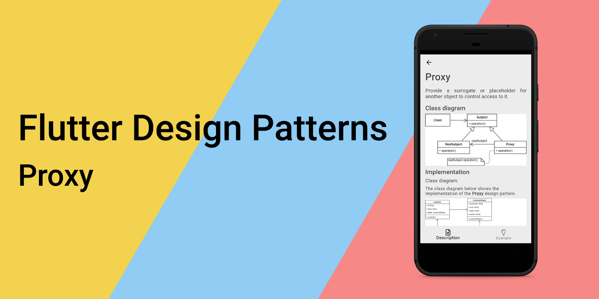
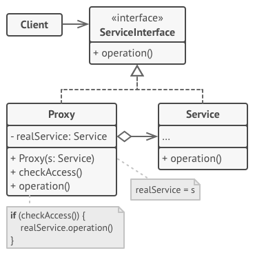
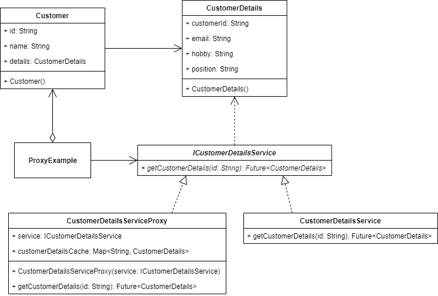

## 代理设计模式及其在Dart和Flutter中的实现概述



要查看所有设计模式的示例，请查看[Flutter Design Patterns应用程序](https://flutterdesignpatterns.com/)。

## 什么是代理设计模式？


**代理**，也称为**替代**，属于结构性设计模式的一种。这种设计模式的意图在[GoF书籍](https://en.wikipedia.org/wiki/Design_Patterns)中描述如下：


> _为另一个对象提供一个替代品或占位符以控制对它的访问。_

这个模式中的关键思想是通过一个单独的代理对象来访问已存在的对象时执行附加功能。例如，在访问对象之前应该验证用户的权限，或者对象的创建非常昂贵，因此推迟其创建直到实际需要它为止。此外，如果需要在类的主要逻辑之前或之后执行某些操作，代理使您能够在不更改该类的情况下执行这些操作。由于代理实现了与原始类相同的接口，因此可以将其传递给期望真实服务对象的任何客户端。

为了更好地理解代理设计模式，让我们深入分析其结构、类型和更详细的实现！

## 分析

代理设计模式的一般结构如下：



- *ServiceInterface* - 为_Service_和_Proxy_定义了通用接口，代理服务可以替代真实服务；
- *Service* - 定义了真实对象，其中包含一些有用的业务逻辑。这是代理所代表的服务；
- *Proxy* - 实现了与真实服务相同的接口。还具有一个引用字段，指向服务对象，允许控制对它的访问。_Proxy_类可能负责创建和删除真实服务对象；
- *Client* - 应该通过相同的接口与服务和代理一起工作。这样，您可以将代理传递给任何期望真实服务对象的代码。

### 适用性

有许多使用代理模式的方式：

- 懒加载（虚拟代理） - 与其在应用程序启动时创建对象，不如将对象的初始化延迟到实际需要时；
- 访问控制（保护代理） - 代理只有在客户端的凭据与某些标准匹配时才能将请求传递给服务对象；
- 本地执行远程服务（远程代理） - 代理将客户端请求传递到网络上的远程服务，处理与网络一起工作的所有棘手细节；
- 记录请求（日志代理） - 代理可以在将请求传递给服务之前记录每个请求；
- 缓存请求结果（缓存代理） - 代理可以为重复请求实现缓存，这些请求总是产生相同的结果。代理可以使用请求的参数作为缓存键。

## 实现


对于代理设计模式的以下示例，我们将实现**缓存代理**。

在我看来，在任何从外部服务加载资源的应用程序中，提高性能并减少数据加载时间是一个相当常见的问题。可以通过实现缓存层来优化和至少部分解决这个问题。

假设我们有一个包含一些基本信息的客户列表，例如客户的ID和姓名。不会加载任何附加的客户数据，也不会使用它。然而，通过选择特定的客户并从客户详细信息服务加载其数据，可以访问它。为了减少发送到外部服务的请求数量，引入应用程序的缓存层并为未来的请求提供从缓存加载的已加载信息是有意义的。

要实现这一点，代理设计模式是一个不错的选择！让我们首先查看类图，然后为客户详细信息服务实现一个代理。

### 类图

下面的类图展示了代理设计模式的实现：



`Customer` 类用于存储有关客户的信息。其中一个属性是 `CustomerDetails`，它存储有关客户的附加数据，例如电子邮件、爱好和职位。

`ICustomerDetailsService` 定义了客户详细信息服务的接口：

- `getCustomerDetails()` - 返回特定客户的详细信息。

`CustomerDetailsService` 是实际的客户详细信息服务，它实现了 `ICustomerDetailsService` 接口。

`CustomerDetailsServiceProxy` 是一个代理服务，它包含缓存（字典对象）并仅在客户详细信息对象在缓存中不可用时才将请求发送到实际的 `CustomerDetailsService`。

`ProxyExample` 初始化并包含实际客户详细信息服务的代理对象。当用户选择查看有关客户的更多详细信息的选项时，对话框窗口会出现并加载有关客户的详细信息。如果详细信息对象已存储在缓存中，代理服务会立即返回该对象。否则，将向实际客户详细信息服务发送请求，并从那里返回详细信息对象。

### Customer

一个用于存储有关客户信息的简单类：其ID、姓名和详细信息。此外，构造函数在初始化 `Customer` 对象时生成随机的ID和姓名值。


```dart title="customer.dart"
class Customer {
  Customer()
      : id = faker.guid.guid(),
        name = faker.person.name();

  final String id;
  final String name;
  CustomerDetails? details;
}
```

### CustomerDetails

一个用于存储客户详细信息的简单类：包括ID以将详细信息与相应的客户映射、电子邮件地址、爱好和当前职位（职称）。


```dart title="customer_details.dart"
class CustomerDetails {
  const CustomerDetails({
    required this.customerId,
    required this.email,
    required this.hobby,
    required this.position,
  });

  final String customerId;
  final String email;
  final String hobby;
  final String position;
}
```

### ICustomerDetailsService

一个接口，定义了`getCustomerDetails()`方法，该方法将由客户详细信息服务及其代理来实现。

```dart title="icustomer_details_service.dart"
abstract interface class ICustomerDetailsService {
  Future<CustomerDetails> getCustomerDetails(String id);
}
```

### CustomerDetailsService

`ICustomerDetailsService`接口的具体实现，即真实的客户详细信息服务。`getCustomerDetails()`方法模拟了服务的实际行为，并生成了客户详细信息的随机值。

```dart title="customer_details_service.dart"
class CustomerDetailsService implements ICustomerDetailsService {
  const CustomerDetailsService();

  @override
  Future<CustomerDetails> getCustomerDetails(String id) => Future.delayed(
        const Duration(seconds: 2),
        () => CustomerDetails(
          customerId: id,
          email: faker.internet.email(),
          hobby: faker.sport.name(),
          position: faker.job.title(),
        ),
      );
}
```

### CustomerDetailsServiceProxy

`ICustomerDetailsService`接口的具体实现，即真实客户详细信息服务的代理。在调用客户详细信息服务之前，代理服务会检查客户详细信息是否已经被获取并保存在缓存中。如果是，代理将从缓存中返回客户详细信息对象；否则，它会向真实客户服务发送请求，将其值保存到缓存中并返回。


```dart title="customer_details_service_proxy.dart"
class CustomerDetailsServiceProxy implements ICustomerDetailsService {
  CustomerDetailsServiceProxy(this.service);

  final ICustomerDetailsService service;
  final Map<String, CustomerDetails> customerDetailsCache = {};

  @override
  Future<CustomerDetails> getCustomerDetails(String id) async {
    if (customerDetailsCache.containsKey(id)) return customerDetailsCache[id]!;

    final customerDetails = await service.getCustomerDetails(id);
    customerDetailsCache[id] = customerDetails;

    return customerDetails;
  }
}
```

## 示例

首先，准备了一个Markdown文件，作为模式的描述：


`ProxyExample` 包含了真实客户详细信息服务的代理对象。当用户想要查看客户详细信息时，会触发 `showDialog()` 方法（通过 `showCustomerDetails()` 方法触发），该方法打开了类型为 `CustomerDetailsDialog` 的对话框窗口，并通过其构造函数传递代理对象以及所选客户的信息 - `Customer` 对象。


```dart title="proxy_example.dart"
class ProxyExample extends StatefulWidget {
  const ProxyExample();

  @override
  _ProxyExampleState createState() => _ProxyExampleState();
}

class _ProxyExampleState extends State<ProxyExample> {
  final _customerDetailsServiceProxy = CustomerDetailsServiceProxy(
    const CustomerDetailsService(),
  );
  final _customerList = List.generate(10, (_) => Customer());

  void _showCustomerDetails(Customer customer) => showDialog<void>(
        context: context,
        barrierDismissible: false,
        builder: (_) => CustomerDetailsDialog(
          service: _customerDetailsServiceProxy,
          customer: customer,
        ),
      );

  @override
  Widget build(BuildContext context) {
    return ScrollConfiguration(
      behavior: const ScrollBehavior(),
      child: SingleChildScrollView(
        padding: const EdgeInsets.symmetric(
          horizontal: LayoutConstants.paddingL,
        ),
        child: Column(
          children: <Widget>[
            Text(
              'Press on the list tile to see more information about the customer',
              style: Theme.of(context).textTheme.titleMedium,
              textAlign: TextAlign.center,
            ),
            const SizedBox(height: LayoutConstants.spaceL),
            for (var customer in _customerList)
              Card(
                child: ListTile(
                  leading: CircleAvatar(
                    backgroundColor: Colors.grey,
                    child: Text(
                      customer.name[0],
                      style: const TextStyle(color: Colors.white),
                    ),
                  ),
                  trailing: const Icon(Icons.info_outline),
                  title: Text(customer.name),
                  onTap: () => _showCustomerDetails(customer),
                ),
              ),
          ],
        ),
      ),
    );
  }
}
```

`CustomerDetailsDialog` 类在其状态初始化时使用传递的代理服务，因此加载所选客户的详细信息。

```dart title="customer_details_dialog.dart"
class CustomerDetailsDialog extends StatefulWidget {
  const CustomerDetailsDialog({
    required this.customer,
    required this.service,
  });

  final Customer customer;
  final ICustomerDetailsService service;

  @override
  _CustomerDetailsDialogState createState() => _CustomerDetailsDialogState();
}

class _CustomerDetailsDialogState extends State<CustomerDetailsDialog> {
  @override
  void initState() {
    super.initState();

    widget.service.getCustomerDetails(widget.customer.id).then(
          (CustomerDetails customerDetails) => setState(() {
            widget.customer.details = customerDetails;
          }),
        );
  }

  void _closeDialog() => Navigator.of(context).pop();

  @override
  Widget build(BuildContext context) {
    return AlertDialog(
      title: Text(widget.customer.name),
      content: SizedBox(
        height: 200.0,
        child: widget.customer.details == null
            ? Center(
                child: CircularProgressIndicator(
                  backgroundColor: lightBackgroundColor,
                  valueColor: AlwaysStoppedAnimation<Color>(
                    Colors.black.withOpacity(0.65),
                  ),
                ),
              )
            : CustomerDetailsColumn(
                customerDetails: widget.customer.details!,
              ),
      ),
      actions: <Widget>[
        Visibility(
          visible: widget.customer.details != null,
          child: PlatformButton(
            materialColor: Colors.black,
            materialTextColor: Colors.white,
            onPressed: _closeDialog,
            text: 'Close',
          ),
        ),
      ],
    );
  }
}
```

`CustomerDetailsDialog` 类并不关心客户详情服务的具体类型，只要它实现了 `ICustomerDetailsService` 接口。因此，可以通过代理服务发送请求来使用额外的缓存层，从而提高应用程序的性能，可能节省一些额外的网络数据，并减少发送到真实客户详情服务的请求数量。另外，如果您想直接调用真实的客户详情服务，只需通过 `CustomerDetailsDialog` 构造函数简单地传递它 - UI 代码无需额外更改，因为真实服务及其代理都实现了相同的接口。

如示例所示，当首次尝试加载特定客户的详细信息时，需要一些时间从服务中加载信息。但是，当再次访问相同的信息时，它是从代理服务中存储的缓存中提供的，因此请求不会发送到真实的客户详情服务 - 客户详细信息会立即提供。

Proxy 设计模式及其示例实现的所有代码更改都可以在[此处](https://github.com/mkobuolys/flutter-design-patterns/pull/16)找到。

要查看此模式的实际应用，请查看[交互式 Proxy 示例](https://flutterdesignpatterns.com/pattern/proxy)。
