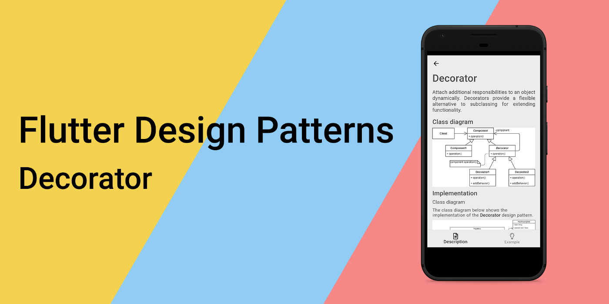
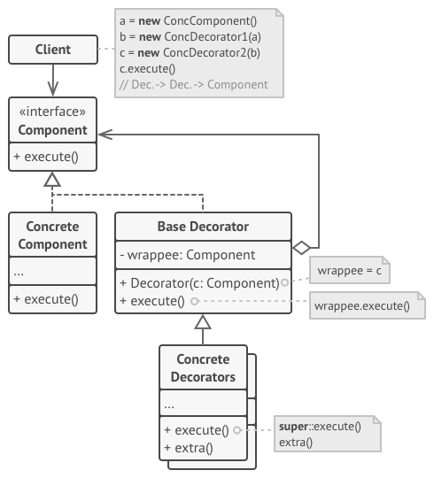
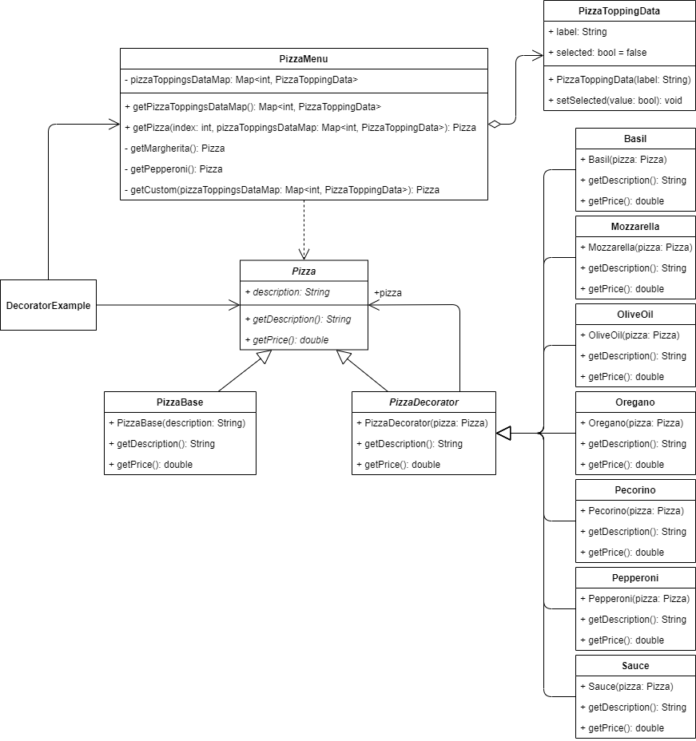
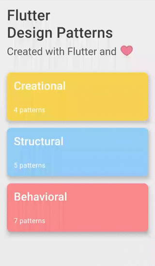

# 装饰者设计模式概述及在Dart和Flutter中的实现



要查看所有设计模式的实际应用，请查看[Flutter Design Patterns应用](https://flutterdesignpatterns.com/)。

## 什么是装饰者设计模式？


**装饰者**，又称**包装器**，是一种**结构型**设计模式，其在[GoF书籍](https://en.wikipedia.org/wiki/Design_Patterns)中的意图如下所述：

> _动态地为对象附加额外的责任。装饰者提供了一种灵活的扩展功能的替代方案，而不需要通过子类化来扩展功能。_

装饰者设计模式提供了一种方法，可以在不改变对象本身的情况下改变对象的外观 - 它通过将对象包装在装饰者类的对象中来扩展对象的功能，从而保持了原始对象的完整性而没有进行修改。因此，该模式有助于支持[SOLID原则](https://en.wikipedia.org/wiki/SOLID)之一 - 开闭原则（类应该关闭修改，但应该对扩展开放）。

这些装饰（装饰者类）彼此独立，因此它们可以组合和链接在一起以添加多个行为（反思创伤，嗯？）。此外，另一个优势是此行为可以在运行时添加，从而实现了代码的非常灵活的重用，不像使用类继承。此外，更改装饰者的顺序允许添加任何组合的责任。但是...

> 能力越大,责任越大

使用装饰者设计模式也可能增加代码的复杂性。要实现特定组件并使其在运行时可修改，您不仅需要实现组件，还需要添加无限数量的装饰者类来包装它。更多的类有时会令人不知所措，而且通过几个额外的类包装的组件的调试和测试也不会使开发变得更容易。

让我们继续进行分析和实现部分，以了解有关此模式以及如何实现它的详细信息！

## 分析

装饰者设计模式的一般结构如下所示：



- *组件（Component）* - 定义可以动态添加责任的对象的接口；
- *具体组件（Concrete Component）* - 定义可以添加额外责任的对象。它包含基本行为，可以通过装饰者进行修改；
- *基础装饰者（Base Decorator）* - 具有引用包装对象的字段，其类型应声明为组件接口，以便它可以包含具体组件和装饰者；
- *具体装饰者（Concrete Decorators）* - 动态添加组件的责任（额外行为）；
- *客户端（Client）* - 初始化具体组件并将其包装在多个层次的装饰者中，以动态扩展其默认行为。

### 适用性

装饰者设计模式应用于需要在对象动态添加额外责任（运行时）的情况，而不影响其他对象。由于所有装饰者对象都实现相同的接口，因此可以以各种组合使用它们，并相互替换。

此外，当通过子类化扩展变得不切实际甚至不可能时，此设计模式非常有用。例如，有时可以进行大量独立扩展，并且将产生大量子类以支持每种组合 - 对于这些情况，装饰者设计模式是更好的选择。

最后，装饰者设计模式可以简单地用于重构代码库，将具有硬编码扩展（编译时实现依赖关系）的组件拆分为单独的类。结果，代码变得更易读/易维护（较小的类中将有更少的代码），同时更加灵活。

## 实现


在Flutter社区中，创建食品交付/餐厅类型的应用程序相当流行。通过实现装饰者设计模式，我们将加入这个“炒作”，并为披萨交付应用程序构建原型，更具体地说，是用于从菜单中选择披萨的原型。

假设我们有一家制作3种披萨的小餐馆：

- 玛格丽特披萨 - 酱汁、莫扎里拉、罗勒、牛至、佩克里诺、橄榄油；
- 香肠披萨 - 酱汁、莫扎里拉、香肠、牛至；
- “自制披萨” - 从罗勒、莫扎里拉、橄榄油、牛至、佩克里诺、香肠和酱汁的配料列表中选择任何组合。

所有披萨都是相同大小的，披萨的配料价格不同。

玛格丽特披萨或香肠披萨非常清晰 - 食谱很明确，只需添加必要的配料并计算最终价格，非常简单。但是，对于自定义披萨来说，为所有可能的组合准备预定义的食谱将非常不切实际 - 通常从业务角度来看通常不是这样运作的。

对于这个问题，装饰者设计模式是一个很好的选择，因为我们可以将披萨配料作为单独的装饰者类，使用它们来包装披萨底部（基本组件），并根据选择的配料计算披萨的最终价格。让我们首先查看类图，然后实现该模式。

### 类图

下面的类图显示了装饰者设计模式的实现：



`Pizza` 定义了包装器（装饰者）和被包装对象的通用接口：

- `getDescription()` - 返回披萨的描述；
- `getPrice()` - 返回披萨的价格。

`PizzaBase` 表示扩展 `Pizza` 类并实现其抽象方法的组件对象。

`PizzaDecorator` 引用 `Pizza` 对象，并通过 `getDescription()` 和 `getPrice()` 方法将请求转发给它。

`Basil`、`Mozzarella`、`OliveOil`、`Oregano`、`Pecorino`、`Pepperoni` 和 `Sauce` 是扩展 `PizzaDecorator` 类的具体装饰者，通过添加自己的额外功能/计算来覆盖其默认行为。

`PizzaToppingData` 类存储有关用于 UI 中的披萨配料选择芯片的信息 - 其标签以及是否已选择。

`PizzaMenu` 类提供了 `getPizzaToppingsDataMap()` 方法来检索披萨配料选择芯片数据。此外，定义了 `getPizza()` 方法，根据 UI 中的选定索引或选定的披萨配料返回特定的 `Pizza` 对象。

`DecoratorExample` 初始化并包含 `PizzaMenu` 类对象，以根据用户在 UI 中的选择检索选定的 `Pizza` 对象。

### Pizza

`Pizza` 接口是 `Pizza` 组件的界面，定义了具体组件和装饰器对象的通用契约。

```dart title="pizza.dart"
abstract interface class Pizza {
  String getDescription();
  double getPrice();
}
```

### PizzaBase

`PizzaBase` 是一个实现了 `Pizza` 接口的具体组件。该类的对象（它的行为）会被特定的装饰器类装饰。

```dart title="pizza_base.dart"
class PizzaBase implements Pizza {
  const PizzaBase(this.description);

  final String description;

  @override
  String getDescription() => description;

  @override
  double getPrice() => 3.0;
}
```

### PizzaDecorator

`PizzaDecorator` 是一个抽象装饰器类，它维护对组件类的引用，并将请求转发给它。

```dart title="pizza_decorator.dart"
abstract class PizzaDecorator implements Pizza {
  const PizzaDecorator(this.pizza);

  final Pizza pizza;

  @override
  String getDescription() => pizza.getDescription();

  @override
  double getPrice() => pizza.getPrice();
}
```

### 具体的披萨装饰器

`Basil`、`Mozzarella`、`OliveOil`、`Oregano`、`Pecorino`、`Pepperoni` 和 `Sauce` 是 `Pizza` 组件的具体装饰器类。这些类中的每一个都包装了披萨对象，并在 `getPrice()` 方法中为最终价格添加额外的价值，在 `getDescription()` 方法中扩展了最终披萨的描述。

- Basil:

```dart title="basil.dart"
class Basil extends PizzaDecorator {
  const Basil(super.pizza);

  @override
  String getDescription() => '${pizza.getDescription()}\n- Basil';

  @override
  double getPrice() => pizza.getPrice() + 0.2;
}
```

- Mozzarella:

```dart title="mozzarella.dart"
class Mozzarella extends PizzaDecorator {
  const Mozzarella(super.pizza);

  @override
  String getDescription() => '${pizza.getDescription()}\n- Mozzarella';

  @override
  double getPrice() => pizza.getPrice() + 0.5;
}
```

- Olive Oil:

```dart title="olive_oil.dart"
class OliveOil extends PizzaDecorator {
  const OliveOil(super.pizza);

  @override
  String getDescription() => '${pizza.getDescription()}\n- Olive Oil';

  @override
  double getPrice() => pizza.getPrice() + 0.1;
}
```

- Oregano:

```dart title="oregano.dart"
class Oregano extends PizzaDecorator {
  const Oregano(super.pizza);

  @override
  String getDescription() => '${pizza.getDescription()}\n- Oregano';

  @override
  double getPrice() => pizza.getPrice() + 0.2;
}
```

- Pecorino:

```dart title="pecorino.dart"
class Pecorino extends PizzaDecorator {
  const Pecorino(super.pizza);

  @override
  String getDescription() => '${pizza.getDescription()}\n- Pecorino';

  @override
  double getPrice() => pizza.getPrice() + 0.7;
}
```

- Pepperoni:

```dart title="pepperoni.dart"
class Pepperoni extends PizzaDecorator {
  const Pepperoni(super.pizza);

  @override
  String getDescription() => '${pizza.getDescription()}\n- Pepperoni';

  @override
  double getPrice() => pizza.getPrice() + 1.5;
}
```

- Sauce:

```dart title="sauce.dart"
class Sauce extends PizzaDecorator {
  const Sauce(super.pizza);

  @override
  String getDescription() => '${pizza.getDescription()}\n- Sauce';

  @override
  double getPrice() => pizza.getPrice() + 0.3;
}
```

### PizzaToppingData

这是一个简单的类，包含了在UI中用于披萨配料选择芯片的数据。数据包括 `label` 属性和当前选择状态（芯片当前是否被选中），可以使用 `setSelected()` 方法来更改选择状态。

```dart title="pizza_topping_data.dart"
class PizzaToppingData {
  PizzaToppingData(this.label);

  final String label;
  bool selected = false;

  void setSelected({required bool isSelected}) => selected = isSelected;
}
```

### PizzaMenu

这是一个简单的类，通过 `getPizzaToppingsDataMap()` 方法为UI中的披萨配料选择提供了一个 `PizzaToppingData` 对象的映射。此外，该类定义了一个 `getPizza()` 方法，该方法返回一个 `Pizza` 对象，该对象是通过使用预定义的具体装饰器类构建的，根据披萨配方 - Margherita、Pepperoni 或自定义（基于所选的披萨配料）。


```dart title="pizza_menu.dart"
class PizzaMenu {
  final Map<int, PizzaToppingData> _pizzaToppingsDataMap = {
    1: PizzaToppingData('Basil'),
    2: PizzaToppingData('Mozzarella'),
    3: PizzaToppingData('Olive Oil'),
    4: PizzaToppingData('Oregano'),
    5: PizzaToppingData('Pecorino'),
    6: PizzaToppingData('Pepperoni'),
    7: PizzaToppingData('Sauce'),
  };

  Map<int, PizzaToppingData> getPizzaToppingsDataMap() => _pizzaToppingsDataMap;

  Pizza getPizza(int index, Map<int, PizzaToppingData> pizzaToppingsDataMap) =>
      switch (index) {
        0 => _getMargherita(),
        1 => _getPepperoni(),
        2 => _getCustom(pizzaToppingsDataMap),
        _ => throw Exception("Index of '$index' does not exist."),
      };

  Pizza _getMargherita() {
    Pizza pizza = const PizzaBase('Pizza Margherita');
    pizza = Sauce(pizza);
    pizza = Mozzarella(pizza);
    pizza = Basil(pizza);
    pizza = Oregano(pizza);
    pizza = Pecorino(pizza);
    pizza = OliveOil(pizza);

    return pizza;
  }

  Pizza _getPepperoni() {
    Pizza pizza = const PizzaBase('Pizza Pepperoni');
    pizza = Sauce(pizza);
    pizza = Mozzarella(pizza);
    pizza = Pepperoni(pizza);
    pizza = Oregano(pizza);

    return pizza;
  }

  Pizza _getCustom(Map<int, PizzaToppingData> pizzaToppingsDataMap) {
    Pizza pizza = const PizzaBase('Custom Pizza');

    if (pizzaToppingsDataMap[1]!.selected) pizza = Basil(pizza);
    if (pizzaToppingsDataMap[2]!.selected) pizza = Mozzarella(pizza);
    if (pizzaToppingsDataMap[3]!.selected) pizza = OliveOil(pizza);
    if (pizzaToppingsDataMap[4]!.selected) pizza = Oregano(pizza);
    if (pizzaToppingsDataMap[5]!.selected) pizza = Pecorino(pizza);
    if (pizzaToppingsDataMap[6]!.selected) pizza = Pepperoni(pizza);
    if (pizzaToppingsDataMap[7]!.selected) pizza = Sauce(pizza);

    return pizza;
  }
}
```

这个类（更具体地说，`getMargherita()`、`getPepperoni()` 和 `getCustom()` 方法）代表了装饰器设计模式的主要思想 - 实例化基本组件类，然后由具体的装饰器类包装，从而扩展基类及其行为。因此，可以在运行时使用包装器类添加或删除对象的职责，例如在 `getCustom()` 方法中使用的方式，该方法根据UI中所选的披萨配料数据使用适当的装饰器类。

## 示例

首先，准备并提供一个Markdown文件作为模式的描述：


`DecoratorExample` 包含 `PizzaMenu` 对象，该对象用于根据用户的选择获取特定的 `Pizza` 对象。此外，与装饰器设计模式及其实现相关的所有逻辑都被提取到了 `PizzaMenu` 类中，`DecoratorExample` widget 仅使用它来检索在UI中表示的必要数据。

```dart title="decorator_example.dart"
class DecoratorExample extends StatefulWidget {
  const DecoratorExample();

  @override
  _DecoratorExampleState createState() => _DecoratorExampleState();
}

class _DecoratorExampleState extends State<DecoratorExample> {
  final pizzaMenu = PizzaMenu();

  late final Map<int, PizzaToppingData> _pizzaToppingsDataMap;
  late Pizza _pizza;
  var _selectedIndex = 0;

  @override
  void initState() {
    super.initState();
    _pizzaToppingsDataMap = pizzaMenu.getPizzaToppingsDataMap();
    _pizza = pizzaMenu.getPizza(0, _pizzaToppingsDataMap);
  }

  void _onSelectedIndexChanged(int? index) {
    _setSelectedIndex(index!);
    _setSelectedPizza(index);
  }

  void _setSelectedIndex(int index) => setState(() => _selectedIndex = index);

  void _onCustomPizzaChipSelected(int index, bool? selected) {
    _setChipSelected(index, selected!);
    _setSelectedPizza(_selectedIndex);
  }

  void _setChipSelected(int index, bool selected) => setState(() {
        _pizzaToppingsDataMap[index]!.setSelected(isSelected: selected);
      });

  void _setSelectedPizza(int index) => setState(() {
        _pizza = pizzaMenu.getPizza(index, _pizzaToppingsDataMap);
      });

  @override
  Widget build(BuildContext context) {
    return ScrollConfiguration(
      behavior: const ScrollBehavior(),
      child: SingleChildScrollView(
        padding: const EdgeInsets.symmetric(
          horizontal: LayoutConstants.paddingL,
        ),
        child: Column(
          children: <Widget>[
            Row(
              children: <Widget>[
                Text(
                  'Select your pizza:',
                  style: Theme.of(context).textTheme.titleLarge,
                ),
              ],
            ),
            PizzaSelection(
              selectedIndex: _selectedIndex,
              onChanged: _onSelectedIndexChanged,
            ),
            if (_selectedIndex == 2)
              CustomPizzaSelection(
                pizzaToppingsDataMap: _pizzaToppingsDataMap,
                onSelected: _onCustomPizzaChipSelected,
              ),
            PizzaInformation(
              pizza: _pizza,
            ),
          ],
        ),
      ),
    );
  }
}
```

最终的结果如下所示：



正如您在示例中看到的，当选择任何预定义的披萨配方时，披萨的最终价格会重新计算，同时提供了其配料的描述。对于定制披萨，每次选择或取消选择一种配料时，都会重新计算价格，并且还会更新披萨的描述。

装饰器设计模式及其示例实现的所有代码更改都可以在[此处](https://github.com/mkobuolys/flutter-design-patterns/pull/17)找到.

要查看该模式的实际效果，请查看[interactive Decorator example](https://flutterdesignpatterns.com/pattern/decorator).
