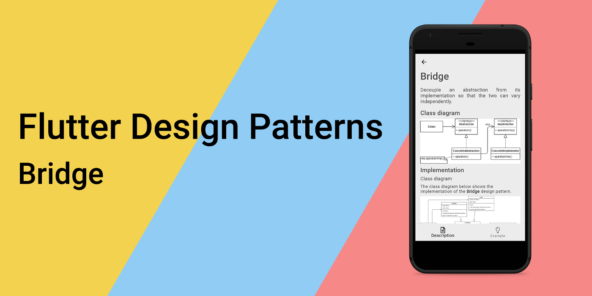
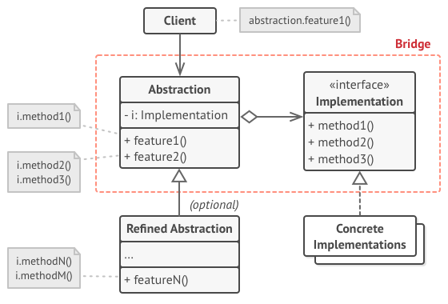
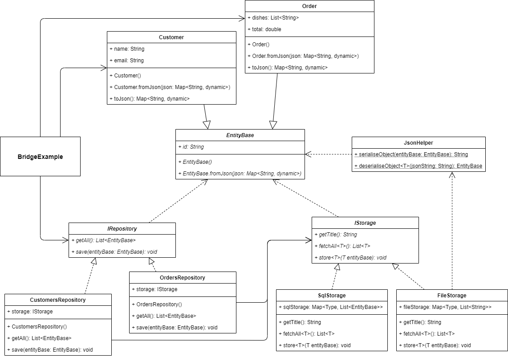
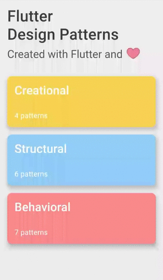

### Bridge 设计模式概述



想要查看所有设计模式的实际应用，请访问 [Flutter 设计模式应用程序](https://flutterdesignpatterns.com/)。

## 什么是 Bridge（桥接）设计模式？


**Bridge（桥接）**，也被称为 **Handle/Body（处理/体）**，属于结构型设计模式的一种。在 [GoF 的书籍](https://en.wikipedia.org/wiki/Design_Patterns)中，该设计模式的目的被描述为：

> _将抽象与其实现分离，使两者可以独立变化。_

通常，抽象要有几种可能的实现方式，使用的方法是继承 — 抽象定义接口，而具体的子类以不同的方式实现它。然而，这种方法并不灵活，因为它在编译时就将实现与抽象绑定，使得在运行时无法更改实现。如果我们想在运行时选择并交换实现呢？

Bridge 设计模式将抽象与其实现分离，使两者可以独立变化。在这种情况下，抽象使用另一个抽象作为其实现，而不是直接使用实现。这种抽象与其实现（更具体地说，是另一个抽象）之间的关系被称为桥接 — 它连接了抽象与其实现，让它们可以独立变化。

如果 _Abstraction（抽象）_ 和 _Implementation（实现）_ 这些术语听起来太学术化，那么可以这样想象：抽象（或接口）只是某个特定实体的高层层次。这一层只是一个接口，本身并不做任何实际工作 — 它应该将工作委托给实现层。这方面的一个很好的例子是 GUI（图形用户界面）和 OS（操作系统）。GUI 只是用户与操作系统交流的顶层层次，但它本身并不进行任何实际工作 — 它只是将用户命令（事件）传递给平台。重要的是，无论是 GUI 还是 OS 都可以彼此独立扩展，例如，桌面应用程序可能有不同的视图/面板/仪表板，同时支持多个 API（可以在 Windows、Linux 和 macOS 上运行） — 这两部分可以独立变化。听起来像是 Bridge 设计模式，对吗？

## 分析

Bridge 设计模式的总体结构如下所示：



- *Abstraction（抽象）* - 定义了抽象的接口，并维护一个类型为 _Implementation（实现）_ 的对象的引用；
- *Refined Abstraction（精化抽象）* - 实现了 _Abstraction_ 接口，并提供了控制逻辑的不同变体；
- *Implementation（实现）* - 为实现类定义了一个接口。_Abstraction_ 只能通过声明在这里的方法与 _Implementation_ 对象进行通信；
- *Concrete Implementations（具体实现）* - 实现了 _Implementation_ 接口，并包含了特定于平台的代码。

### 适用性

当你想要分割一个包含了功能多个变体的单一类时，应该使用 Bridge 设计模式。这种情况下，该模式允许将类拆分为几个类层次结构，它们可以独立变化 — 这简化了代码维护，并且较小的类减少了破坏现有代码的风险。这种方法的一个好例子是，当你想在持久化层中使用多种不同的方法，例如同时使用数据库和文件系统持久化。

此外，当抽象及其实现都需要通过子类化进行扩展时，也应该使用桥接设计模式 — 该模式允许结合不同的抽象和实现，并独立地扩展它们。

最后，当你需要在运行时切换实现时，桥接设计模式是救星。该模式允许你在抽象内部替换实现对象 — 你可以通过构造器注入它，或者仅将其作为字段/属性的新值赋值。

## 实现


在实现部分，我们将使用 Bridge 设计模式实现我们示例的持久化层。

假设你的应用程序使用外部 SQL 数据库（不是设备中的本地 SQLite 选项，而是云端的）。一切都很好，直到突然出现连接问题。这种情况下，有两个选择：不允许用户使用应用程序并提供一个有趣的“连接丢失”屏幕，或者你可以将数据存储在某种本地存储中，并在连接恢复后同步数据。显然，第二种方法更加用户友好，但如何实现呢？

在持久化层中，有多个针对每种实体类型的仓库。这些仓库共享一个公共接口 — 这就是我们的抽象。如果你想在运行时更改存储类型（使用本地或云端存储），这些仓库不能引用特定的存储实现，它们应该使用不同类型存储之间共享的某种抽象。好吧，我们可以在此基础上构建另一个抽象（接口），然后由特定存储实现。现在我们将我们的仓库抽象与存储的接口连接起来 — 就是这样，Bridge 设计模式就被引入到我们的应用程序中了！让我们先看一下类图，然后再探究一些实现细节。


### 类图

下面的类图展示了桥接设计模式的实现：



`EntityBase` 是一个抽象基类，用于所有实体类。该类包含一个 `id` 属性和一个命名构造函数 `EntityBase.fromJson()`，用于将 JSON 对象映射到类字段。

`Customer` 和 `Order` 是扩展 `EntityBase` 的具体实体类。`Customer` 类包含 `name` 和 `email` 属性，有一个 `Customer.fromJson()` 命名构造函数用于映射 JSON 对象到类字段，并有一个 `toJson()` 方法将类字段映射到 JSON 对象。`Order` 类包含 `dishes`（订单中的菜品列表）和 `total` 字段，提供了 `Order.fromJson()` 命名构造函数和 `toJson()` 方法。

`IRepository` 接口定义了仓库的通用接口：

- `getAll()` - 返回仓库中的所有记录；
- `save()` - 保存类型为 `EntityBase` 的实体到仓库。

`CustomersRepository` 和 `OrdersRepository` 是 `IRepository` 接口的具体实现。这些类还包含一个类型为 `IStorage` 的存储属性，通过构造函数注入仓库。

`IStorage` 接口定义了存储的通用接口：

- `getTitle()` - 返回存储的标题，用于 UI 中；
- `fetchAll<T>()` - 返回存储中所有类型为 `T` 的记录；
- `store<T>()` - 将类型为 `T` 的记录存储到存储中。

`FileStorage` 和 `SqlStorage` 是 `IStorage` 接口的具体实现。另外，`FileStorage` 类使用 `JsonHelper` 类的静态方法来序列化/反序列化 JSON 对象。

`BridgeExample` 初始化并包含客户和订单仓库，用于检索相应数据。此外，这些仓库的存储类型可以在 `FileStorage` 和 `SqlStorage` 之间在运行时进行更改。


### EntityBase

一个抽象类，存储 `id` 字段，并被所有实体类扩展。

```dart title="entity_base.dart"
abstract class EntityBase {
  EntityBase() : id = faker.guid.guid();

  final String id;

  EntityBase.fromJson(Map<String, dynamic> json) : id = json['id'] as String;
}
```

### Customer

一个简单的类，用于存储客户信息：其 `name` 和 `email`。此外，构造函数在初始化 `Customer` 对象时生成随机值。

```dart title="customer.dart"
class Customer extends EntityBase {
  Customer()
      : name = faker.person.name(),
        email = faker.internet.email();

  final String name;
  final String email;

  Customer.fromJson(super.json)
      : name = json['name'] as String,
        email = json['email'] as String,
        super.fromJson();

  Map<String, dynamic> toJson() => {
        'id': id,
        'name': name,
        'email': email,
      };
}
```

### Order

一个简单的类，用于存储订单信息：它包含的 `dishes`（菜品）列表和订单的 `total`（总价）。同样，构造函数在初始化 `Order` 对象时生成随机值。 ### JsonHelper

```dart title="order.dart"
class Order extends EntityBase {
  Order()
      : dishes = List.generate(
          random.integer(3, min: 1),
          (_) => faker.food.dish(),
        ),
        total = random.decimal(scale: 20, min: 5);

  final List<String> dishes;
  final double total;

  Order.fromJson(super.json)
      : dishes = List.from(json['dishes'] as List),
        total = json['total'] as double,
        super.fromJson();

  Map<String, dynamic> toJson() => {
        'id': id,
        'dishes': dishes,
        'total': total,
      };
}
```

### JsonHelper

一个辅助类，被 `FileStorage` 用于将类型为 `EntityBase` 的对象序列化为 JSON 映射对象，并从 JSON 字符串中反序列化它们。

```dart title="json_helper.dart"
class JsonHelper {
  const JsonHelper._();

  static String serialiseObject(EntityBase entityBase) {
    return jsonEncode(entityBase);
  }

  static T deserialiseObject<T extends EntityBase>(String jsonString) {
    final json = jsonDecode(jsonString)! as Map<String, dynamic>;

    return switch (T) {
      Customer => Customer.fromJson(json) as T,
      Order => Order.fromJson(json) as T,
      _ => throw Exception("Type of '$T' is not supported."),
    };
  }
}
```

### IRepository

一个接口，定义了派生仓库类应实现的方法。

```dart title="irepository.dart"
abstract interface class IRepository {
  List<EntityBase> getAll();
  void save(EntityBase entityBase);
}
```

### Concrete repositories

`CustomersRepository` - 一个特定的 `IRepository` 接口实现，用于存储客户数据。

```dart title="customers_repository.dart"
class CustomersRepository implements IRepository {
  const CustomersRepository(this.storage);

  final IStorage storage;

  @override
  List<EntityBase> getAll() => storage.fetchAll<Customer>();

  @override
  void save(EntityBase entityBase) {
    storage.store<Customer>(entityBase as Customer);
  }
}
```

`OrdersRepository` - 一个特定的 `IRepository` 接口实现，用于存储订单数据。

```dart title="orders_repository.dart"
class OrdersRepository implements IRepository {
  const OrdersRepository(this.storage);

  final IStorage storage;

  @override
  List<EntityBase> getAll() => storage.fetchAll<Order>();

  @override
  void save(EntityBase entityBase) {
    storage.store<Order>(entityBase as Order);
  }
}
```

### IStorage

一个接口，定义了派生存储类应实现的方法。

```dart title="istorage.dart"
abstract interface class IStorage {
  String getTitle();
  List<T> fetchAll<T extends EntityBase>();
  void store<T extends EntityBase>(T entityBase);
}
```

### Concrete storages

`FileStorage` - 一个特定的 `IStorage` 接口实现，用于将对象作为文件存储在存储中 - 此行为通过将对象存储为 JSON 字符串来模拟。

```dart title="file_storage.dart"
class FileStorage implements IStorage {
  final Map<Type, List<String>> fileStorage = {};

  @override
  String getTitle() => 'File Storage';

  @override
  List<T> fetchAll<T extends EntityBase>() {
    if (!fileStorage.containsKey(T)) return [];

    final files = fileStorage[T]!;

    return files.map<T>((f) => JsonHelper.deserialiseObject<T>(f)).toList();
  }

  @override
  void store<T extends EntityBase>(T entityBase) {
    if (!fileStorage.containsKey(T)) fileStorage[T] = [];

    fileStorage[T]!.add(JsonHelper.serialiseObject(entityBase));
  }
}
```

`SqlStorage` - 一个特定的 `IStorage` 接口实现，用于将对象作为实体存储在存储中 - 此行为通过使用 Map 数据结构并将同一类型的实体附加到列表中来模拟。

```dart title="sql_storage.dart"
class SqlStorage implements IStorage {
  final Map<Type, List<EntityBase>> sqlStorage = {};

  @override
  String getTitle() => 'SQL Storage';

  @override
  List<T> fetchAll<T extends EntityBase>() =>
      sqlStorage.containsKey(T) ? sqlStorage[T]! as List<T> : [];

  @override
  void store<T extends EntityBase>(T entityBase) {
    if (!sqlStorage.containsKey(T)) sqlStorage[T] = <T>[];

    sqlStorage[T]!.add(entityBase);
  }
}
```

## Example

首先，准备了一个 Markdown 文件并作为模式的描述提供：


`BridgeExample` 包含一个存储列表 —— `SqlStorage` 和 `FileStorage` 类的实例。同时，它还初始化了 `Customer` 和 `Order` 仓库。在这些仓库中，可以通过触发 `CustomersRepository` 的 `onSelectedCustomerStorageIndexChanged()` 方法和 `OrdersRepository` 的 `onSelectedOrderStorageIndexChanged()` 方法，来交换具体类型的存储。


```dart title="bridge_example.dart"
class BridgeExample extends StatefulWidget {
  const BridgeExample();

  @override
  _BridgeExampleState createState() => _BridgeExampleState();
}

class _BridgeExampleState extends State<BridgeExample> {
  final _storages = [SqlStorage(), FileStorage()];

  late IRepository _customersRepository;
  late IRepository _ordersRepository;

  late List<Customer> _customers;
  late List<Order> _orders;

  var _selectedCustomerStorageIndex = 0;
  var _selectedOrderStorageIndex = 0;

  void _onSelectedCustomerStorageIndexChanged(int? index) {
    if (index == null) return;

    setState(() {
      _selectedCustomerStorageIndex = index;
      _customersRepository = CustomersRepository(_storages[index]);
      _customers = _customersRepository.getAll() as List<Customer>;
    });
  }

  void _onSelectedOrderStorageIndexChanged(int? index) {
    if (index == null) return;

    setState(() {
      _selectedOrderStorageIndex = index;
      _ordersRepository = OrdersRepository(_storages[index]);
      _orders = _ordersRepository.getAll() as List<Order>;
    });
  }

  void _addCustomer() {
    _customersRepository.save(Customer());

    setState(
      () => _customers = _customersRepository.getAll() as List<Customer>,
    );
  }

  void _addOrder() {
    _ordersRepository.save(Order());

    setState(() => _orders = _ordersRepository.getAll() as List<Order>);
  }

  @override
  void initState() {
    super.initState();

    _customersRepository =
        CustomersRepository(_storages[_selectedCustomerStorageIndex]);
    _customers = _customersRepository.getAll() as List<Customer>;

    _ordersRepository = OrdersRepository(_storages[_selectedOrderStorageIndex]);
    _orders = _ordersRepository.getAll() as List<Order>;
  }

  @override
  Widget build(BuildContext context) {
    return ScrollConfiguration(
      behavior: const ScrollBehavior(),
      child: SingleChildScrollView(
        padding: const EdgeInsets.symmetric(
          horizontal: LayoutConstants.paddingL,
        ),
        child: Column(
          crossAxisAlignment: CrossAxisAlignment.start,
          children: <Widget>[
            Row(
              children: <Widget>[
                Text(
                  'Select customers storage:',
                  style: Theme.of(context).textTheme.titleLarge,
                ),
              ],
            ),
            StorageSelection(
              storages: _storages,
              selectedIndex: _selectedCustomerStorageIndex,
              onChanged: _onSelectedCustomerStorageIndexChanged,
            ),
            PlatformButton(
              materialColor: Colors.black,
              materialTextColor: Colors.white,
              onPressed: _addCustomer,
              text: 'Add',
            ),
            if (_customers.isNotEmpty)
              CustomersDatatable(customers: _customers)
            else
              Text(
                '0 customers found',
                style: Theme.of(context).textTheme.titleSmall,
              ),
            const Divider(),
            Row(
              children: <Widget>[
                Text(
                  'Select orders storage:',
                  style: Theme.of(context).textTheme.titleLarge,
                ),
              ],
            ),
            StorageSelection(
              storages: _storages,
              selectedIndex: _selectedOrderStorageIndex,
              onChanged: _onSelectedOrderStorageIndexChanged,
            ),
            PlatformButton(
              materialColor: Colors.black,
              materialTextColor: Colors.white,
              onPressed: _addOrder,
              text: 'Add',
            ),
            if (_orders.isNotEmpty)
              OrdersDatatable(orders: _orders)
            else
              Text(
                '0 orders found',
                style: Theme.of(context).textTheme.titleSmall,
              ),
          ],
        ),
      ),
    );
  }
}
```

具体的仓库不关心它使用的存储的具体类型，只要该存储实现了 `IStorage` 接口及其所有方法。因此，抽象（仓库）与实现者（存储）被分开 —— 存储的具体实现可以在运行时为仓库更改，且仓库不依赖于其实现细节。



正如你在示例中看到的，存储类型可以在运行时为每个仓库单独更改 —— 使用简单的类继承方法是不可能做到的。

所有关于桥接设计模式及其示例实现的代码更改可以在[这里](https://github.com/mkobuolys/flutter-design-patterns/pull/18)找到。

要看到模式在实践中的应用，请查看[交互式桥接示例](https://flutterdesignpatterns.com/pattern/bridge)。
