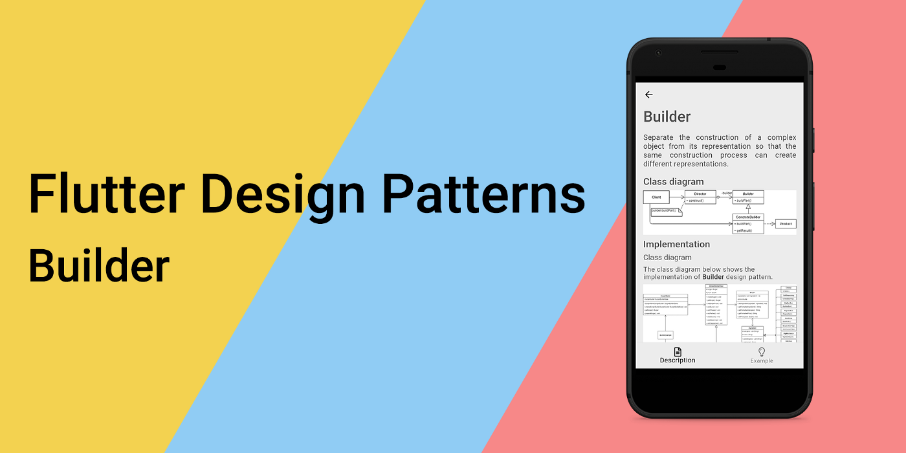
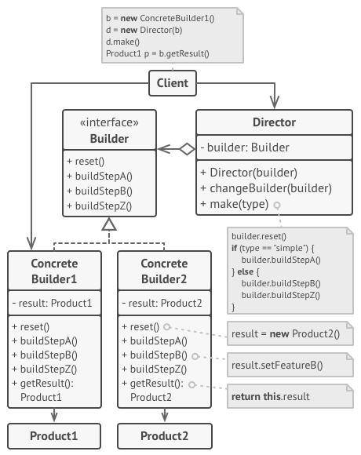
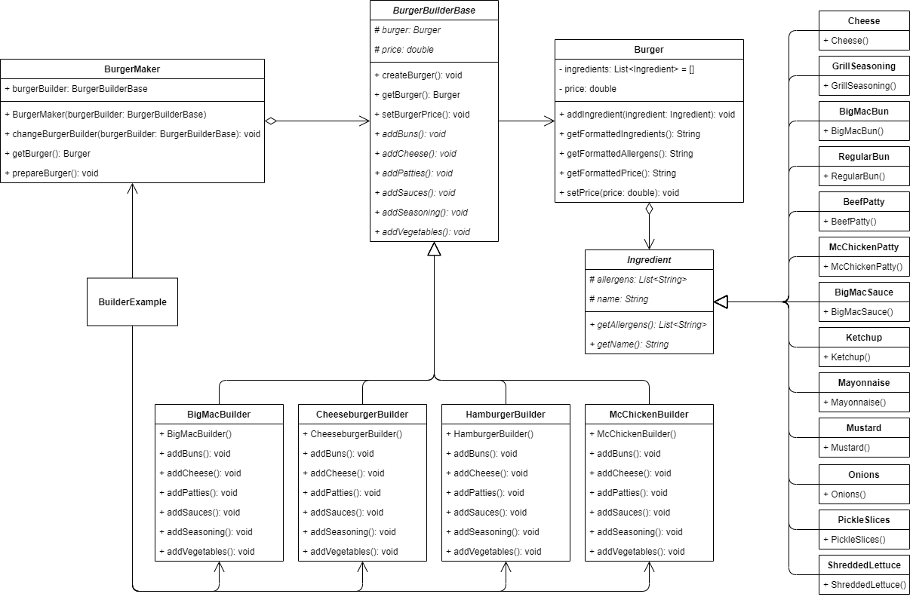
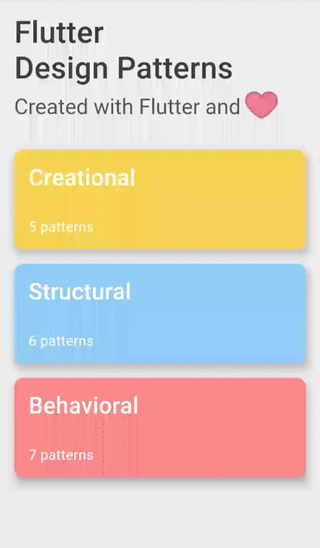

## 生成器设计模式及其在Dart和Flutter中的实现概述



要查看所有设计模式的实际应用，请查看[Flutter Design Patterns应用程序](https://flutterdesignpatterns.com/)。

## 什么是生成器设计模式？


**生成器**是一种**创建型**设计模式，其在[GoF书](https://en.wikipedia.org/wiki/Design_Patterns)中的意图描述如下：

> _将复杂对象的构建与其表示分离，以便相同的构建过程可以创建不同的表示。_

意图可以分为两部分：

> _将复杂对象的构建与其表示分离..._

你可能已经注意到，在本系列中概述的大多数设计模式中，可能以稍微不同的形式，例如_将抽象与其表示分离_，这在其中一个主要目的中，生成器设计模式的一个主要目标是将复杂对象的创建过程（逻辑）与对象（数据）本身分离。什么是复杂对象？嗯，没有特定的点或任何标准，可以说对象是复杂的。通常，当对象的创建不仅仅是调用其构造函数结束时，对象可以被认为是复杂的 - 此外，您应该设置一些额外的特定参数，并调用其他方法。

好了，到了这一点，我们有一个复杂的对象，我们可以使用一些额外的参数和/或方法来创建它，那么为什么我们需要在这之上有任何额外的抽象，为什么我们应该将这个创建过程与对象完全分离呢？

> _...以便相同的构建过程可以创建不同的表示。_

啊，这就是关键！为了更好地理解它，让我们说我们正在建造一座房子。要建造一座房子（对象），房子的建造步骤（构建逻辑）基本相同 - 您需要地基、地板、一些墙壁、门、窗户、屋顶等。尽管房子的建造过程是相同的，但每个步骤都可以调整，因此最终的结果看起来完全不同。这就是生成器设计模式的主要思想 - 抽象对象的创建过程，以便可以调整构建步骤以提供不同的表示（最终结果）。

生成器设计模式将对象构造代码从其自身类中移出到称为_生成器_的单独对象中。这些生成器中的每一个都遵循相同的接口，并实现单独的对象构造步骤。也就是说，如果您想要不同的对象表示，只需创建一个不同的_生成器_类，并相应地实现这些构建步骤。此外，生成器设计模式中还有一个额外的层次 - _导演_。_导演_是一个简单的类，了解_生成器_接口，并定义了执行构建步骤的顺序。尽管这个类不是必需的，但它隐藏了客户端代码对产品构造的细节。

我知道，生成器设计模式的结构相当复杂，所以让我们转向分析和实现部分，以更好地理解它！

## 分析

生成器设计模式的一般结构如下：



- *生成器* - 定义一个通用于创建_Product_部件的所有类型的生成器的抽象接口;
- *具体生成器* - 提供构建步骤的特定实现。还定义并跟踪其创建的_Product_;
- *导演* - 使用_生成器_接口构建对象，定义构建步骤的调用顺序;
- *产品* - 代表正在构建的复杂对象，公开组装部件成最终结果的接口/方法;
- *客户端* - 将特定的_生成器_对象与_导演_关联起来。稍后，通过调用_导演_类的实例创建_Product_对象。

### 适用性

当您注意到同一类的多个构造函数彼此引用时，应使用生成器设计模式。例如，您具有带有多个可选参数的构造函数。其中一些参数具有默认值，因此您创建了几个较短的构造函数，参数较少，但仍然引用主要构造函数。通过使用生成器设计模式，您仅逐步构建对象，只使用实际需要的那些步骤 - 您不再需要处理具有可选参数的多个构造函数的问题。

正如前面提到的，当您希望创建某种产品的不同表示时，应使用此模式。也就是说，当构建步骤相似但在细节上不同的情况下，可以应用该模式。生成器接口定义这些步骤（其中一些甚至可能具有默认实现），而具体生成器实现这些步骤以构建产品的特定表示。

最后，当创建复杂对象的算法应该独立于组成对象的部分以及它们如何组装时，生成器设计模式非常有用。简而言之，它只是将对象的创建逻辑简单地提取出其自身类。因此，构建算法可以与实际产品提供的内容分开发展，修改此过程不需要更改对象的代码。

## 实现


这次，实现部分非常简单 - 我们将使用生成器设计模式来实现_McDonald's_汉堡的制作过程。

正如您可能已经知道的，_McDonald's_菜单包含多种汉堡（普通汉堡、芝士汉堡和_Big Mac_只是其中几种）。所有这些汉堡都使用完全相同的产品，只是配料表不同：

- 普通汉堡 - 面包、牛肉饼、番茄酱、芥末、烤肉调味料、洋葱、腌黄瓜片;
- 芝士汉堡 - 面包、牛肉饼、芝士、番茄酱、芥末、烤肉调味料、洋葱、腌黄瓜片;
- *Big Mac* - 面包、芝士、牛肉饼、_Big Mac_酱、烤肉调味料、洋葱、腌黄瓜片、切碎的生菜。

正如您所见，通过更改汉堡的制作过程（更改配料），我们完全改变了最终结果。此外，在任何时候都可能需要在菜单中添加新的汉堡。最后，应该实现用户友好的UI，您可以从菜单中选择汉堡，并查看其价格、配料和过敏原列表。

对于这个问题，生成器设计模式是一个很好的选择，因为我们可以定义不同的_生成器_类，用于构建特定的汉堡。此外，如果需要在任何时候将新汉堡添加到菜单中，我们只需引入另一个_生成器_类来处理这个变化。首先，让我们先检查类图，然后再实现这个模式。

### 类图

下面的类图展示了构建者设计模式的实现：



`Ingredient` 是一个抽象类，用作所有配料类的基类。该类包含 `allergens` 和 `name` 属性，以及 `getAllergens()` 和 `getName()` 方法，用于返回这些属性的值。

有许多具体的配料类：`BigMacBun`、`RegularBun`、`BeefPatty`、`McChickenPatty`、`BigMacSauce`、`Ketchup`、`Mayonnaise`、`Mustard`、`Onions`、`PickleSlices`、`ShreddedLettuce`、`Cheese` 和 `GrillSeasoning`。所有这些类都代表汉堡的特定配料，并包含一个默认构造函数来设置基类的 `allergens` 和 `name` 属性值。

`Burger` 是一个简单的类，代表构建者的产品。它包含 `ingredients` 列表和 `price` 属性以存储相应的值。此外，该类包含几个方法：

- `addIngredient()` - 向汉堡中添加配料；
- `getFormattedIngredients()` - 返回汉堡的格式化配料列表（用逗号分隔）；
- `getFormattedAllergens()` - 返回汉堡的格式化过敏原列表（用逗号分隔）；
- `getFormattedPrice()` - 返回汉堡的格式化价格；
- `setPrice()` - 为汉堡设置价格。

`BurgerBuilderBase` 是一个抽象类，用作所有汉堡构建者类的基类。它包含 `burger` 和 `price` 属性，分别用于存储最终产品 - 汉堡 - 及其价格。此外，该类存储一些具有默认实现的方法：

- `createBurger()` - 初始化 `Burger` 类对象；
- `getBurger()` - 返回构建的汉堡结果；
- `setBurgerPrice()` - 为汉堡对象设置价格。

`BurgerBuilderBase` 还包含几个抽象方法，这些方法必须在汉堡构建者的具体实现类中实现：`addBuns()`、`addCheese()`、`addPatties()`、`addSauces()`、`addSeasoning()` 和 `addVegetables()`。

`BigMacBuilder`、`CheeseburgerBuilder`、`HamburgerBuilder` 和 `McChickenBuilder` 是扩展了抽象类 `BurgerBuilderBase` 并实现了其抽象方法的具体构建者类。

`BurgerMaker` 是一个导向器类，管理汉堡的构建过程。它包含一个特定的构建者实现作为 `burgerBuilder` 属性，`prepareBurger()` 方法来构建汉堡以及 `getBurger()` 方法来返回汉堡。此外，还可以使用 `changeBurgerBuilder()` 方法更改构建者的实现。

`BuilderExample` 初始化并包含了 `BurgerMaker` 类。此外，它引用了所有特定的汉堡构建者，这些构建者可以在运行时使用 UI 下拉选择进行更改。


### Ingredient

一个抽象类，存储 allergens（过敏原）和 name（名称）字段，并由所有配料类扩展。

```dart title="ingredient.dart"
abstract class Ingredient {
  @protected
  late List<String> allergens;
  @protected
  late String name;

  List<String> getAllergens() => allergens;

  String getName() => name;
}
```

### Concrete ingredients

所有这些类通过扩展 Ingredient 类并指定过敏原列表及名称值来代表一个特定的配料。

- _Big Mac_ bun:

```dart title="big_mac_bun.dart"
class BigMacBun extends Ingredient {
  BigMacBun() {
    name = 'Big Mac Bun';
    allergens = ['Wheat'];
  }
}
```

- Regular bun:

```dart title="regular_bun.dart"
class RegularBun extends Ingredient {
  RegularBun() {
    name = 'Regular Bun';
    allergens = ['Wheat'];
  }
}
```

- Cheese:

```dart title="cheese.dart"
class Cheese extends Ingredient {
  Cheese() {
    name = 'Cheese';
    allergens = ['Milk', 'Soy'];
  }
}
```

- Grill seasoning:

```dart title="grill_seasoning.dart"
class GrillSeasoning extends Ingredient {
  GrillSeasoning() {
    name = 'Grill Seasoning';
    allergens = [];
  }
}
```

- Beef patty:

```dart title="beef_patty.dart"
class BeefPatty extends Ingredient {
  BeefPatty() {
    name = 'Beef Patty';
    allergens = [];
  }
}
```

- _McChicken_ patty:

```dart title="mc_chicken_patty.dart"
class McChickenPatty extends Ingredient {
  McChickenPatty() {
    name = 'McChicken Patty';
    allergens = [
      'Wheat',
      'Cooked in the same fryer that we use for Buttermilk Crispy Chicken which contains a milk allergen'
    ];
  }
}
```

- _Big Mac_ sauce:

```dart title="big_mac_sauce.dart"
class BigMacSauce extends Ingredient {
  BigMacSauce() {
    name = 'Big Mac Sauce';
    allergens = ['Egg', 'Soy', 'Wheat'];
  }
}
```

- Ketchup:

```dart title="ketchup.dart"
class Ketchup extends Ingredient {
  Ketchup() {
    name = 'Ketchup';
    allergens = [];
  }
}
```

- Mayonnaise:

```dart title="mayonnaise.dart"
class Mayonnaise extends Ingredient {
  Mayonnaise() {
    name = 'Mayonnaise';
    allergens = ['Egg'];
  }
}
```

- Mustard:

```dart title="mustard.dart"
class Mustard extends Ingredient {
  Mustard() {
    name = 'Mustard';
    allergens = [];
  }
}
```

- Onions:

```dart title="onions.dart"
class Onions extends Ingredient {
  Onions() {
    name = 'Onions';
    allergens = [];
  }
}
```

- Pickle slices:

```dart title="pickle_slices.dart"
class PickleSlices extends Ingredient {
  PickleSlices() {
    name = 'Pickle Slices';
    allergens = [];
  }
}
```

- Shredded lettuce:

```dart title="shredded_lettuce.dart"
class ShreddedLettuce extends Ingredient {
  ShreddedLettuce() {
    name = 'Shredded Lettuce';
    allergens = [];
  }
}
```

### Burger

一个简单的类，用于存储有关汉堡的信息：其价格和所包含的配料列表。此外，类方法如 `getFormattedIngredients()`、`getFormattedAllergens()` 和 `getFormattedPrice()` 以人类可读格式返回这些值。

```dart title="burger.dart"
class Burger {
  final List<Ingredient> _ingredients = [];
  late double _price;

  void addIngredient(Ingredient ingredient) => _ingredients.add(ingredient);

  String getFormattedIngredients() =>
      _ingredients.map((x) => x.getName()).join(', ');

  String getFormattedAllergens() => <String>{
        for (final ingredient in _ingredients) ...ingredient.getAllergens()
      }.join(', ');

  String getFormattedPrice() => '\$${_price.toStringAsFixed(2)}';

  void setPrice(double price) => _price = price;
}
```

### BurgerBuilderBase

一个抽象类，存储 `burger` 和 `price` 属性，定义了一些默认方法来创建/返回汉堡对象并设置其价格。此外，该类定义了几个必须由派生汉堡构建器类实现的抽象方法。

```dart title="burger_builder_base.dart"
abstract class BurgerBuilderBase {
  @protected
  late Burger burger;
  @protected
  late double price;

  void createBurger() => burger = Burger();

  Burger getBurger() => burger;

  void setBurgerPrice() => burger.setPrice(price);

  void addBuns();
  void addCheese();
  void addPatties();
  void addSauces();
  void addSeasoning();
  void addVegetables();
}
```

### Concrete builders

`BigMacBuilder` - 使用以下配料制作 _Big Mac_：`BigMacBun`、`Cheese`、`BeefPatty`、`BigMacSauce`、`GrillSeasoning`、`Onions`、`PickleSlices` 和 `ShreddedLettuce`。

```dart title="big_mac_builder.dart"
class BigMacBuilder extends BurgerBuilderBase {
  BigMacBuilder() {
    price = 3.99;
  }

  @override
  void addBuns() {
    burger.addIngredient(BigMacBun());
  }

  @override
  void addCheese() {
    burger.addIngredient(Cheese());
  }

  @override
  void addPatties() {
    burger.addIngredient(BeefPatty());
  }

  @override
  void addSauces() {
    burger.addIngredient(BigMacSauce());
  }

  @override
  void addSeasoning() {
    burger.addIngredient(GrillSeasoning());
  }

  @override
  void addVegetables() {
    burger.addIngredient(Onions());
    burger.addIngredient(PickleSlices());
    burger.addIngredient(ShreddedLettuce());
  }
}
```

`CheeseburgerBuilder` - 使用以下配料制作奶酪汉堡：`RegularBun`、`Cheese`、`BeefPatty`、`Ketchup`、`Mustard`、`GrillSeasoning`、`Onions` 和 `PickleSlices`。

```dart title="cheeseburger_builder.dart"
class CheeseburgerBuilder extends BurgerBuilderBase {
  CheeseburgerBuilder() {
    price = 1.09;
  }

  @override
  void addBuns() {
    burger.addIngredient(RegularBun());
  }

  @override
  void addCheese() {
    burger.addIngredient(Cheese());
  }

  @override
  void addPatties() {
    burger.addIngredient(BeefPatty());
  }

  @override
  void addSauces() {
    burger.addIngredient(Ketchup());
    burger.addIngredient(Mustard());
  }

  @override
  void addSeasoning() {
    burger.addIngredient(GrillSeasoning());
  }

  @override
  void addVegetables() {
    burger.addIngredient(Onions());
    burger.addIngredient(PickleSlices());
  }
}
```

`HamburgerBuilder` - 使用以下配料制作普通汉堡：`RegularBun`、`BeefPatty`、`Ketchup`、`Mustard`、`GrillSeasoning`、`Onions` 和 `PickleSlices`。对于此构建器，`addCheese()` 方法不相关，因此没有提供实现（被跳过）。

```dart title="hamburger_builder.dart"
class HamburgerBuilder extends BurgerBuilderBase {
  HamburgerBuilder() {
    price = 1.0;
  }

  @override
  void addBuns() {
    burger.addIngredient(RegularBun());
  }

  @override
  void addCheese() {
    // Not needed
  }

  @override
  void addPatties() {
    burger.addIngredient(BeefPatty());
  }

  @override
  void addSauces() {
    burger.addIngredient(Ketchup());
    burger.addIngredient(Mustard());
  }

  @override
  void addSeasoning() {
    burger.addIngredient(GrillSeasoning());
  }

  @override
  void addVegetables() {
    burger.addIngredient(Onions());
    burger.addIngredient(PickleSlices());
  }
}
```

`McChickenBuilder` - 使用以下配料制作麦辣鸡汉堡：`RegularBun`、`McChickenPatty`、`Mayonnaise` 和 `ShreddedLettuce`。对于此构建器，`addCheese()` 和 `addSeasoning()` 方法不相关，因此没有提供实现（被跳过）。

```dart title="mc_chicken_builder.dart"
class McChickenBuilder extends BurgerBuilderBase {
  McChickenBuilder() {
    price = 1.29;
  }

  @override
  void addBuns() {
    burger.addIngredient(RegularBun());
  }

  @override
  void addCheese() {
    // Not needed
  }

  @override
  void addPatties() {
    burger.addIngredient(McChickenPatty());
  }

  @override
  void addSauces() {
    burger.addIngredient(Mayonnaise());
  }

  @override
  void addSeasoning() {
    // Not needed
  }

  @override
  void addVegetables() {
    burger.addIngredient(ShreddedLettuce());
  }
}
```

### BurgerMaker

一个指挥类，管理汉堡的构建过程并返回构建结果。特定的构建器实现通过构造函数注入到类中。

```dart title="burger_maker.dart"
class BurgerMaker {
  BurgerMaker(this.burgerBuilder);

  BurgerBuilderBase burgerBuilder;

  void changeBurgerBuilder(BurgerBuilderBase burgerBuilder) {
    this.burgerBuilder = burgerBuilder;
  }

  Burger getBurger() => burgerBuilder.getBurger();

  void prepareBurger() {
    burgerBuilder.createBurger();
    burgerBuilder.setBurgerPrice();

    burgerBuilder.addBuns();
    burgerBuilder.addCheese();
    burgerBuilder.addPatties();
    burgerBuilder.addSauces();
    burgerBuilder.addSeasoning();
    burgerBuilder.addVegetables();
  }
}
```

## Example

首先，准备并提供一个作为模式描述的 markdown 文件：


`BuilderExample` 初始化并包含 `BurgerMaker` 类对象。此外，它包含一个 `BurgerMenuItem` 对象/选择项列表，用于使用 UI 选择特定构建器。

```dart title="builder_example.dart"
class BuilderExample extends StatefulWidget {
  const BuilderExample();

  @override
  _BuilderExampleState createState() => _BuilderExampleState();
}

class _BuilderExampleState extends State<BuilderExample> {
  final _burgerMaker = BurgerMaker(HamburgerBuilder());
  final List<BurgerMenuItem> _burgerMenuItems = [];

  late BurgerMenuItem _selectedBurgerMenuItem;
  late Burger _selectedBurger;

  @override
  void initState() {
    super.initState();

    _burgerMenuItems.addAll([
      BurgerMenuItem(label: 'Hamburger', burgerBuilder: HamburgerBuilder()),
      BurgerMenuItem(
        label: 'Cheeseburger',
        burgerBuilder: CheeseburgerBuilder(),
      ),
      BurgerMenuItem(label: 'Big Mac\u00AE', burgerBuilder: BigMacBuilder()),
      BurgerMenuItem(
        label: 'McChicken\u00AE',
        burgerBuilder: McChickenBuilder(),
      )
    ]);

    _selectedBurgerMenuItem = _burgerMenuItems[0];
    _selectedBurger = _prepareSelectedBurger();
  }

  Burger _prepareSelectedBurger() {
    _burgerMaker.prepareBurger();

    return _burgerMaker.getBurger();
  }

  void _onBurgerMenuItemChanged(BurgerMenuItem? selectedItem) => setState(() {
        _selectedBurgerMenuItem = selectedItem!;
        _burgerMaker.changeBurgerBuilder(selectedItem.burgerBuilder);
        _selectedBurger = _prepareSelectedBurger();
      });

  @override
  Widget build(BuildContext context) {
    return ScrollConfiguration(
      behavior: const ScrollBehavior(),
      child: SingleChildScrollView(
        padding: const EdgeInsets.symmetric(
          horizontal: LayoutConstants.paddingL,
        ),
        child: Column(
          crossAxisAlignment: CrossAxisAlignment.start,
          children: <Widget>[
            Row(
              children: <Widget>[
                Text(
                  'Select menu item:',
                  style: Theme.of(context).textTheme.titleLarge,
                ),
              ],
            ),
            DropdownButton(
              value: _selectedBurgerMenuItem,
              items: _burgerMenuItems
                  .map<DropdownMenuItem<BurgerMenuItem>>(
                    (BurgerMenuItem item) => DropdownMenuItem(
                      value: item,
                      child: Text(item.label),
                    ),
                  )
                  .toList(),
              onChanged: _onBurgerMenuItemChanged,
            ),
            const SizedBox(height: LayoutConstants.spaceL),
            Row(
              children: <Widget>[
                Text(
                  'Information:',
                  style: Theme.of(context).textTheme.titleLarge,
                ),
              ],
            ),
            const SizedBox(height: LayoutConstants.spaceM),
            BurgerInformationColumn(burger: _selectedBurger),
          ],
        ),
      ),
    );
  }
}
```

指挥类 `BurgerMaker` 不关心构建器的具体实现 - 特定实现可以在运行时更改，因此提供不同的结果。此外，这种实现方式允许在不破坏现有代码的情况下轻松添加新的构建器（只要它扩展了 `BurgerBuilderBase` 类），以提供另一种不同的产品表示。



如你在示例中所见，当从下拉列表中选择特定构建器时，会创建一个新产品（汉堡），并在 UI 中提供其信息 - 价格、配料和过敏原。

所有有关 Builder 设计模式及其示例实现的代码更改可以在[此处](https://github.com/mkobuolys/flutter-design-patterns/pull/19)找到。

要查看该模式的实际应用，请查看[交互式 Builder 示例](https://flutterdesignpatterns.com/pattern/builder)。
