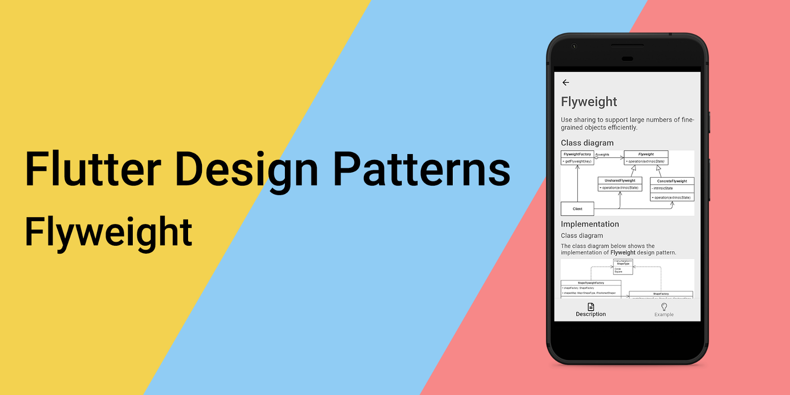
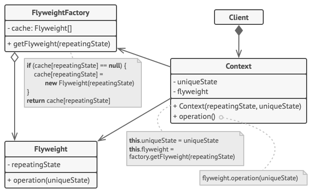
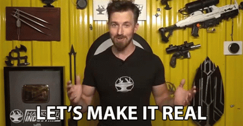
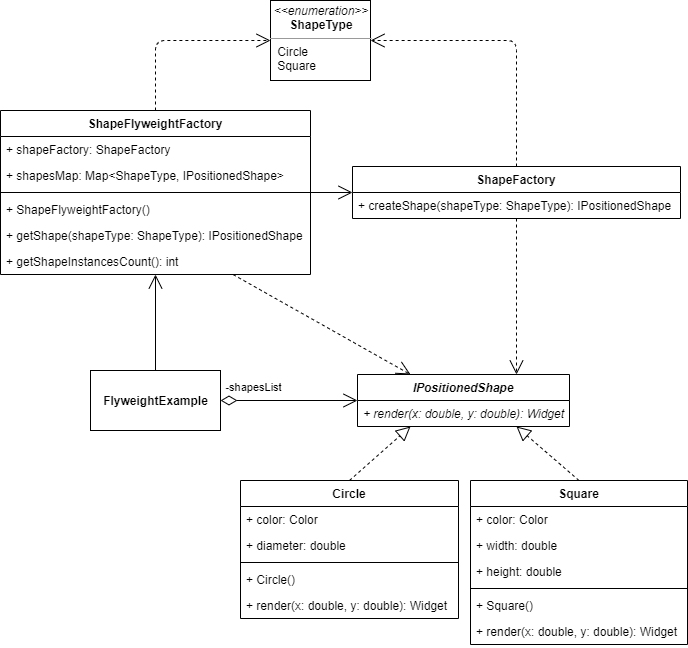
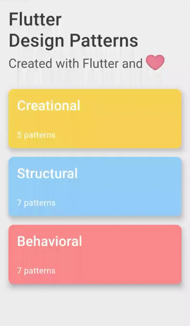
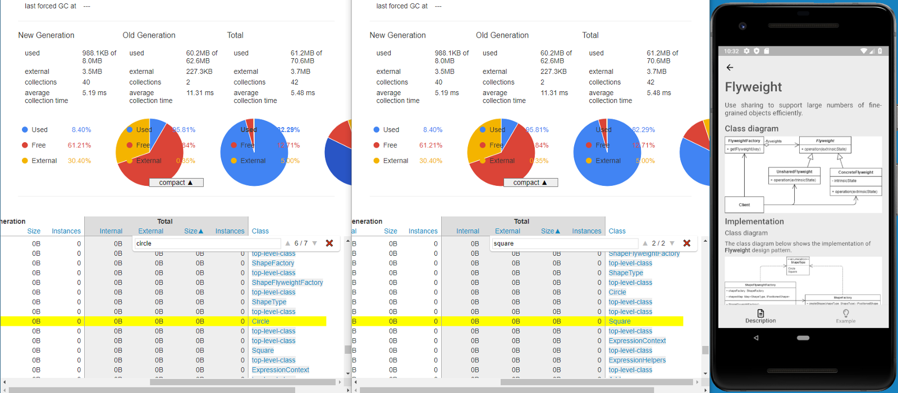
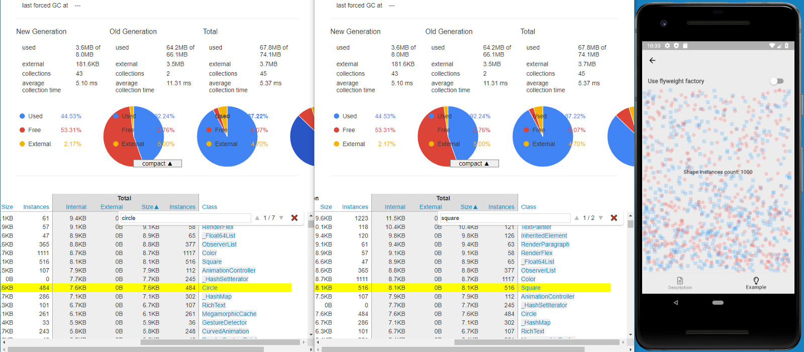
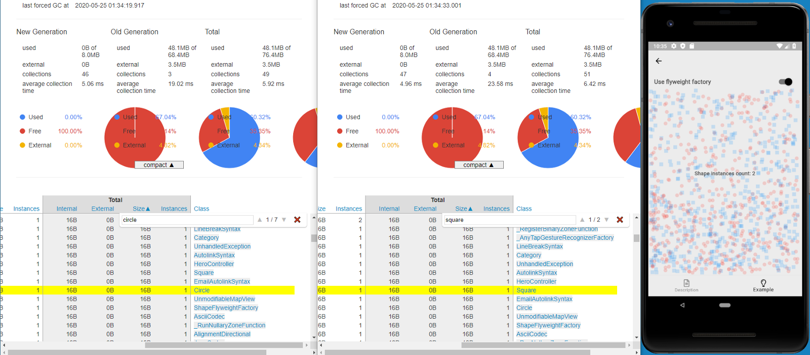

## Flyweight（享元）设计模式概述



要查看所有设计模式的实际应用，请查看[Flutter Design Patterns应用程序](https://flutterdesignpatterns.com/)。

## 什么是Flyweight设计模式

**Flyweight** 属于**结构型**设计模式。在 [GoF 书](https://en.wikipedia.org/wiki/Design_Patterns)中，这个设计模式的目标被描述为：

> _通过共享来有效地支持大量细粒度对象。_

以面向对象的文档编辑器为例。对于诸如表格、图片或图表这样的文档元素，通常会创建独立的对象。然而，对于文本元素（如单个字符），即便这种做法提高了灵活性，也并不可行。原因很简单 - 硬件的限制。一份文档通常包含成千上万的字符对象，这会消耗大量内存，并可能在文档编辑过程中导致意外崩溃。那么，这种面向对象的文档编辑器该如何实现呢？

答案在于 flyweight 对象 - 可以在多个上下文中同时使用的共享对象。这是如何工作的呢？如果我们重复使用相同的对象，当在一个地方改变该对象时，是否意味着所有其他地方也会受到影响？关键在于区分**内在**和**外在**状态。内在状态是恒定的（与上下文无关）因此可以共享，例如字符集中字符的编码。外在状态是可变的（与上下文有关）因此不能共享，例如文档中字符的位置。正是因为这个原因，这种概念在面向对象的编辑器中行得通 - 对字符集中的每个字符（例如，字母表中的每个字母）创建一个单独的 flyweight 对象，该对象将字符代码存储为内在状态，而将字符在文档中的坐标位置作为外在状态传递给 flyweight 对象。因此，每个字符只需在内存中存储一个 flyweight 对象实例，并可跨文档结构中不同的上下文共享。共享是关怀，对吧？

让我们深入分析和实施部分，以更好地了解这种模式及其实施方式！


## Flyweight 设计模式分析

Flyweight 设计模式的总体结构如下所示：



- *Flyweight* - 包含内在状态，而外在状态则传递给 flyweight 的方法。对象必须是可共享的（可在多种不同上下文中使用）；
- *FlyweightFactory* - 创建和管理 flyweight 对象。当客户端调用工厂时，会检查特定的 flyweight 对象是否已存在。如果存在，则直接返回给客户端；否则，创建一个新的 flyweight 对象实例并返回；
- *Context* - 包含外在状态，对所有原始对象而言是独一无二的；
- *Client* - 计算或存储 flyweight(s) 的外在状态，并维持对它/它们的引用。

### 适用性

仅当程序必须支持大量几乎填满可用 RAM 的对象时，应该使用 Flyweight 设计模式。该模式的有效性取决于其使用方式和位置。以下情况下使用最为有效：

- 应用程序使用大量对象；
- 对象消耗了目标设备上所有可用的 RAM；
- 对象包含可以提取并在多个对象之间共享的重复状态；
- 一旦移除外在状态，许多对象组可以被少数几个共享对象取代；
- 应用程序不依赖于对象身份。由于 flyweight 对象是共享的，概念上不同的对象可能被视为同一个对象。

## 实现



虽然这次的实现不会解决任何现实世界的问题，但我们将实现一个简单的表示屏幕，并稍后研究使用 Flyweight 设计模式如何降低内存消耗。

假设我们想使用两种不同的几何形状（圆形和正方形）绘制我们的自定义背景。此外，在背景中，我们想随机放置总共 1000 个形状。这将以两种不同的方式实现：

- 背景中的每个形状都将创建一个新的形状对象；
- 将使用一个 flyweight 工厂，为每个形状创建一个对象。

稍后，我们将使用 Dart 应用程序的分析器工具 - [Observatory](https://github.com/dart-archive/observatory) - 来调查这些实现中每种实现使用了多少内存。让我们先看一下类图，然后再实现该模式。

### Class diagram

下面的类图显示了 Flyweight 设计模式的实现：



`ShapeType` 是一个枚举类，定义了可能的形状类型 - Circle 和 Square。

`IPositionedShape` 定义了特定形状类的通用接口：

- `render()` - 渲染形状 - 返回定位的形状小部件。此外，**外在**状态（x 和 y 坐标）被传递给此方法以在确切位置渲染形状。

`Circle` 和 `Square` 是 `IPositionedShape` 接口的具体定位形状实现。这两种形状都有自己的**内在**状态：圆形定义了 `color` 和 `diameter` 属性，而正方形包含 `color`、`width` 属性以及返回与 `width` 相同值的 `height` getter。

`ShapeFactory` 是一个简单的工厂类，通过 `createShape()` 方法创建并返回特定的形状对象。

`ShapeFlyweightFactory` 是一个 flyweight 工厂，包含一个 flyweight 对象映射 - `shapesMap`。当通过 `getShape()` 方法请求具体的 flyweight 时，flyweight 工厂会检查它是否存在于映射中并从那里返回它。否则，将使用 `ShapeFactory` 创建一个新的形状实例，并持久化在映射对象中以供进一步使用。

`FlyweightExample` 初始化并包含 `ShapeFlyweightFactory` 对象。此外，它包含一个定位形状列表 - `shapesList` - 使用 `ShapeFlyweightFactory` 和 flyweight 定位形状对象构建。

### ShapeType

这是一个特殊的类别 - *枚举* - 用于定义不同的形状类型。

```dart title="shape_type.dart"
enum ShapeType {
  circle,
  square,
}
```

### IPositionedShape

一个接口定义了 `render()` 方法，由具体的形状类实现。Dart 语言不支持将接口作为类类型，因此我们通过创建一个抽象类并提供方法头（名称、返回类型、参数），而不提供默认实现来定义接口。

```dart title="ipositioned_shape.dart"
abstract interface class IPositionedShape {
  Widget render(double x, double y);
}
```

### Concrete shapes

`Circle` - 代表圆形的 `IPositionedShape` 接口的具体实现。

```dart title="circle.dart"
class Circle implements IPositionedShape {
  const Circle({
    required this.color,
    required this.diameter,
  });

  final Color color;
  final double diameter;

  @override
  Widget render(double x, double y) {
    return Positioned(
      left: x,
      bottom: y,
      child: Container(
        height: diameter,
        width: diameter,
        decoration: BoxDecoration(
          color: color,
          shape: BoxShape.circle,
        ),
      ),
    );
  }
}
```

`Square` - 代表正方形的 `IPositionedShape` 接口的具体实现。

```dart title="square.dart"
class Square implements IPositionedShape {
  const Square({
    required this.color,
    required this.width,
  });

  final Color color;
  final double width;

  double get _height => width;

  @override
  Widget render(double x, double y) {
    return Positioned(
      left: x,
      bottom: y,
      child: Container(
        height: _height,
        width: width,
        color: color,
      ),
    );
  }
}
```

### ShapeFactory

一个简单的工厂类，定义了 `createShape()` 方法，通过提供其类型来创建具体的形状。

```dart title="shape_factory.dart"
class ShapeFactory {
  const ShapeFactory();

  IPositionedShape createShape(ShapeType shapeType) => switch (shapeType) {
        ShapeType.circle => Circle(
            color: Colors.red.withOpacity(0.2),
            diameter: 10.0,
          ),
        ShapeType.square => Square(
            color: Colors.blue.withOpacity(0.2),
            width: 10.0,
          ),
      };
}
```

### ShapeFlyweightFactory

一个 flyweight 工厂类，跟踪所有的 flyweight 对象，并在需要时创建它们。

```dart title="shape_flyweight_factory.dart"
class ShapeFlyweightFactory {
  ShapeFlyweightFactory({
    required this.shapeFactory,
  });

  final ShapeFactory shapeFactory;
  final Map<ShapeType, IPositionedShape> shapesMap = {};

  IPositionedShape getShape(ShapeType shapeType) {
    if (!shapesMap.containsKey(shapeType)) {
      shapesMap[shapeType] = shapeFactory.createShape(shapeType);
    }

    return shapesMap[shapeType]!;
  }

  int getShapeInstancesCount() => shapesMap.length;
}
```

## Example

首先，准备并提供了一个作为模式描述的 markdown 文件：


`FlyweightExample` 初始化并包含 `ShapeFlyweightFactory` 类对象。此外，出于演示目的，这里也初始化了 `ShapeFactory` 对象。根据所选选项，使用 `ShapeFactory` 或 `ShapeFlyweightFactory` 来填充 `IPositionedShape` 对象列表，这些对象在示例屏幕的背景中被渲染。

```dart title="flyweight_example.dart"
class FlyweightExample extends StatefulWidget {
  const FlyweightExample();

  @override
  _FlyweightExampleState createState() => _FlyweightExampleState();
}

class _FlyweightExampleState extends State<FlyweightExample> {
  static const shapesCount = 1000;

  final shapeFactory = const ShapeFactory();

  late final ShapeFlyweightFactory _shapeFlyweightFactory;
  late List<IPositionedShape> _shapesList;

  var _shapeInstancesCount = 0;
  var _useFlyweightFactory = false;

  @override
  void initState() {
    super.initState();

    _shapeFlyweightFactory = ShapeFlyweightFactory(shapeFactory: shapeFactory);

    _buildShapesList();
  }

  void _buildShapesList() {
    var shapeInstancesCount = 0;
    _shapesList = <IPositionedShape>[];

    for (var i = 0; i < shapesCount; i++) {
      final shapeType = _getRandomShapeType();
      final shape = _useFlyweightFactory
          ? _shapeFlyweightFactory.getShape(shapeType)
          : shapeFactory.createShape(shapeType);

      shapeInstancesCount++;
      _shapesList.add(shape);
    }

    setState(() {
      _shapeInstancesCount = _useFlyweightFactory
          ? _shapeFlyweightFactory.getShapeInstancesCount()
          : shapeInstancesCount;
    });
  }

  ShapeType _getRandomShapeType() {
    const values = ShapeType.values;

    return values[Random().nextInt(values.length)];
  }

  void _toggleUseFlyweightFactory(bool value) {
    setState(() => _useFlyweightFactory = value);

    _buildShapesList();
  }

  @override
  Widget build(BuildContext context) {
    return Stack(
      children: <Widget>[
        for (var shape in _shapesList)
          PositionedShapeWrapper(
            shape: shape,
          ),
        Column(
          crossAxisAlignment: CrossAxisAlignment.start,
          children: <Widget>[
            SwitchListTile.adaptive(
              title: const Text(
                'Use flyweight factory',
                style: TextStyle(
                  fontWeight: FontWeight.bold,
                ),
              ),
              activeColor: Colors.black,
              value: _useFlyweightFactory,
              onChanged: _toggleUseFlyweightFactory,
            ),
          ],
        ),
        Center(
          child: Text(
            'Shape instances count: $_shapeInstancesCount',
            style: const TextStyle(
              fontWeight: FontWeight.bold,
            ),
          ),
        ),
      ],
    );
  }
}
```

使用 `ShapeFlyweightFactory` 时，客户端 - `FlyweightExample` 小部件 - 不需要关心 flyweight 对象的创建或管理。`IPositionedShape` 对象通过传递 `ShapeType` 从工厂请求，flyweight 工厂保留了所有需要形状的实例，并只返回它们的引用。因此，每种类型的形状对象只能创建一个实例，并在需要时重复使用。



从示例中，我们可以看到，为了构建屏幕背景，创建了 2 个或 1000 个形状实例。然而，要了解幕后发生了什么，我们可以使用 Dart Observatory 检查内存消耗。

当我们访问 Flyweight 设计模式的 Markdown 屏幕时，由于它们不在屏幕上可见，所以不会创建 Circle 和 Square 实例：



在渲染示例屏幕之前（未使用 flyweight 工厂），创建了总共 1000 个形状实例 - 在这种情况下，是 484 个圆和 516 个正方形：



当我们使用 flyweight 工厂时，每个特定形状只需要一个实例，该实例被初始化后随后共享（重用）：



一个形状实例使用 16 字节的内存，所以当我们初始化 1000 个形状时，总共需要约 16kB 的内存。然而，当使用 flyweight 工厂时，只需要 32 字节的内存就足以存储所有不同的形状实例 - 需要的内存减少了 500 倍！现在，如果将形状数量增加到 100 万，未使用 flyweight 工厂时需要约 15.2MB 的内存来存储它们，但使用 flyweight 工厂，相同的 32 字节就足够了。

所有有关 Flyweight 设计模式及其示例实现的代码更改可以在[这里](https://github.com/mkobuolys/flutter-design-patterns/pull/20)找到。

要查看模式实际操作，请查看[交互式 Flyweight 示例](https://flutterdesignpatterns.com/pattern/flyweight)。
