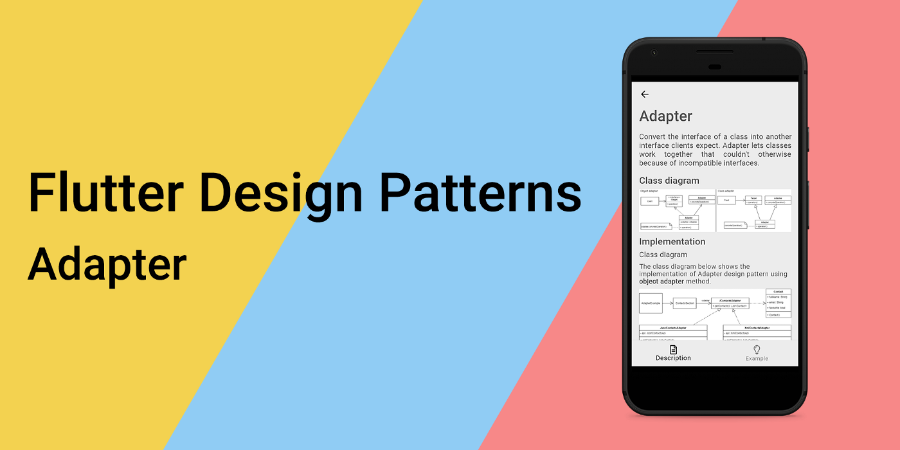
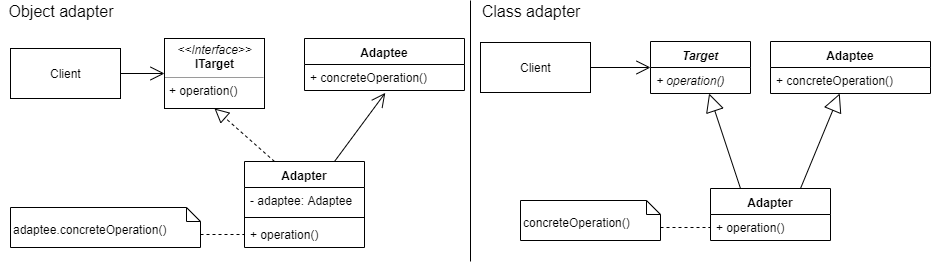
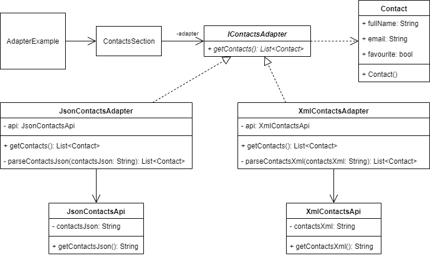
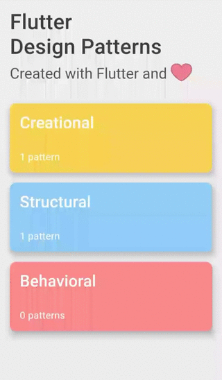

_适配器设计模式的概述及其在Dart和Flutter中的实现_



要查看所有设计模式的实际应用，请查看[Flutter 设计模式应用程序。](https://flutterdesignpatterns.com/).

## 什么是适配器设计模式？


**适配器**是一种**结构型**设计模式，也被称为**包装器**。作为软件开发人员，这是我们可以使用的最常见且有用的设计模式之一。这种设计模式的目的在GoF书籍中有所描述[GoF book](https://en.wikipedia.org/wiki/Design_Patterns)：

> _将一个类的接口转换成客户端所期望的另一种接口。适配器让那些因为接口不兼容而不能一起工作的类可以一起工作。_

假设您想使用某种第三方库，它具有您需要的功能。同时，您有一个类需要利用特定的接口，但是您的代码和库之间的接口不兼容。在这种情况下，您可以通过创建一个适配器类，该类“坐”在您的代码和您想要使用的库代码之间，来使用库的代码。此外，当您想确保您的软件中的某个特定代码片段可以通过用适配器包装它并向其暴露接口而被重用时，该模式也很有用。这使得您代码中未来的实现可以依赖于适配器接口，而不是直接依赖于具体类。听起来不错吗？那么，让我们进入分析，了解这个模式是如何工作的，以及如何实现它。

## 分析

下面的类图显示了适配器设计模式的一般结构：



更具体地说，适配器有两种不同结构的通用实现 —— 对象和类适配器（我们接下来会讨论这两者之间的区别）。尽管对象和类适配器在结构上不同，但它们共享实现模式的参与者（用于实现模式的元素或类）的相同思想：

- 目标（Target） 或 ITarget 定义了_Client_ 使用的特定于领域的接口；
- 客户端（Client） 与符合 目标（Target） 接口的对象协作；
- 被适配者（Adaptee） 定义了需要适配的现有接口（例如第三方库）；
- 适配器（Adapter） 将 被适配者（Adaptee） 的接口适配为 目标（Target） 接口。这是模式中的主要节点，它将 客户端（Client） 代码与希望使用的代码（被适配者（Adaptee））连接起来。


### 对象适配器与类适配器


首先，对象和类适配器都是适配器设计模式的有效实现，但它们的结构不同，优势和权衡也不同。对象适配器依赖于对象组合来实现目标（Target） 接口（通过委托给一个被适配者（Adaptee） 对象）。也就是说，适配器通过在 被适配者（Adaptee）类的属性或实例上调用具体操作来实现 目标（Target）操作。类适配器使用继承来实现目标（Target）接口（通过继承自一个被适配者（Adaptee）类）。这样，可以直接从目标（Target）操作的实现中调用被适配者（Adaptee）类的具体操作。问题是，该使用哪一个？

在这两种可能的实现之间，我个人的选择是对象适配器。原因如下：

1. 要使用类适配器方法实现适配器设计模式，您选择的编程语言必须支持多重继承。在Dart中，不支持多重继承。
2. 类适配器的一个优点是您可以轻松覆盖被适配者类的行为 —— 您扩展了被适配者类，对吧？然而，对象适配器方法更加灵活，因为它在运行时承诺使用一个被适配者类（客户端和被适配者代码松散耦合）。这意味着您可以创建一个单一的适配器，只要它们的接口（类型）匹配适配器所需的接口，就可以使用多个不同的被适配者。
3. 我更喜欢组合而不是继承。我心中所想的是，如果您尝试通过从一个类继承来重用代码，您就使子类依赖于父类。使用组合时，您通过提供可以轻松替换的接口实现（在这种情况下，可以在运行时在适配器（Adapter）类内部替换被适配者（Adaptee）的实现）来解耦您的代码。这只是里氏替换原则（[**SOLID**](https://en.wikipedia.org/wiki/SOLID)原则中的字母L）的一个缩影，它非常难以理解和应用，但值得努力。

### 适用性


The adapter design pattern could (and should!) be used when the interface of the third-party library (or any other code you want to use) does not match the one you are currently using in your application. This rule could also be applied when calling external data sources, APIs and you want to wrap and separate the data conversion code from the primary business logic in your program. The pattern is useful when you want to use multiple implementations (adaptees) that have similar functionality but use different APIs. In this case, all the “hard work” (implementation) could be done in the Adapter classes, whereas the domain-layer code will use the same interface of the adapters. Also, this code abstraction makes the unit testing of the domain-layer code a little bit easier.

## 实现


假设，在Flutter应用程序中，我们想从两个不同的来源收集联系人信息。不幸的是，这两个来源以两种不同的格式提供联系人信息 —— JSON和XML。此外，我们想要创建一个Flutter小部件，以列表形式展示这些信息。然而，为了使小部件通用，它不能绑定到特定的数据格式（JSON或XML），因此它接受这些联系人作为Contact对象的列表，并且不知道如何将JSON或XML字符串解析为所需的数据结构。因此我们有两个不兼容的接口 —— 我们的UI组件（小部件），它期望Contact对象的列表，以及两个API，它们以两种不同的格式返回联系人信息。您可能已经猜到了，我们将使用适配器设计模式来解决这个问题。

### 类图

下面的类图展示了使用 **对象适配器** 方法实现适配器设计模式的情况：



首先，存在两个API：`JsonContactsApi`和`XmlContactsApi`。这两个API以两种不同的格式 —— JSON 和 XML —— 返回联系人信息的方法不同。因此，应该创建两个不同的适配器，以将特定的联系人表示转换为`ContactsSection`组件（小部件）所需的格式——`Contact`对象列表。为了统一适配器的合约（接口），创建了抽象接口类`IContactsAdapter`，该接口要求在所有实现中实现`getContacts()`方法。`JsonContactsAdapter`实现了`IContactsAdapter`，使用`JsonContactsApi`检索联系人信息作为JSON字符串，然后将其解析为 `Contact`对象列表，并通过`getContacts()`方法返回。相应地，`XmlContactsAdapter`也以同样的方式实现，但它从`XmlContactsApi`接收XML格式的数据。

### Contact

Contact 是一个简单的 Dart 类（一些来自 Java 背景的人可能会称之为 POJO），用于存储联系人信息。

```dart title="contact.dart"
class Contact {
  final String fullName;
  final String email;
  final bool favourite;

  const Contact({
    required this.fullName,
    required this.email,
    required this.favourite,
  });
}
```
这个类在UI小部件`ContactsSection`和两种适配器中使用，以将API的解析数据以适合UI的格式返回。

### JsonContactsApi

一个虚假的 API，它以 JSON 字符串的形式返回联系人信息。

```dart title="json_contacts_api.dart"
class JsonContactsApi {
  static const _contactsJson = '''
  {
    "contacts": [
      {
        "fullName": "John Doe (JSON)",
        "email": "johndoe@json.com",
        "favourite": true
      },
      {
        "fullName": "Emma Doe (JSON)",
        "email": "emmadoe@json.com",
        "favourite": false
      },
      {
        "fullName": "Michael Roe (JSON)",
        "email": "michaelroe@json.com",
        "favourite": false
      }
    ]
  }
  ''';

  const JsonContactsApi();

  String getContactsJson() => _contactsJson;
}
```

### XmlContactsApi

一个虚假的 API，它以 XML 字符串的形式返回联系人信息。

```dart title="xml_contacts_api.dart"
class XmlContactsApi {
  static const _contactsXml = '''
  <?xml version="1.0"?>
  <contacts>
    <contact>
      <fullname>John Doe (XML)</fullname>
      <email>johndoe@xml.com</email>
      <favourite>false</favourite>
    </contact>
    <contact>
      <fullname>Emma Doe (XML)</fullname>
      <email>emmadoe@xml.com</email>
      <favourite>true</favourite>
    </contact>
    <contact>
      <fullname>Michael Roe (XML)</fullname>
      <email>michaelroe@xml.com</email>
      <favourite>true</favourite>
    </contact>
  </contacts>
  ''';

  const XmlContactsApi();

  String getContactsXml() => _contactsXml;
}
```

### IContactsAdapter

一个统一适配器并要求它们实现`getContacts()`方法的合约（接口）。

```dart title="icontacts_adapter.dart"
abstract interface class IContactsAdapter {
  List<Contact> getContacts();
}
```

### JsonContactsAdapter

一个实现了`getContacts()`方法的适配器。在该方法内部，从`JsonContactsApi`中检索联系人信息作为 JSON 字符串，并解析为所需的返回类型（`Contact`对象列表）。

```dart title="json_contacts_adapter.dart"
class JsonContactsAdapter implements IContactsAdapter {
  const JsonContactsAdapter({
    this.api = const JsonContactsApi(),
  });

  final JsonContactsApi api;

  @override
  List<Contact> getContacts() {
    final contactsJson = api.getContactsJson();
    final contactsList = _parseContactsJson(contactsJson);

    return contactsList;
  }

  List<Contact> _parseContactsJson(String contactsJson) {
    final contactsMap = json.decode(contactsJson) as Map<String, dynamic>;
    final contactsJsonList = contactsMap['contacts'] as List;
    final contactsList = contactsJsonList.map((json) {
      final contactJson = json as Map<String, dynamic>;

      return Contact(
        fullName: contactJson['fullName'] as String,
        email: contactJson['email'] as String,
        favourite: contactJson['favourite'] as bool,
      );
    }).toList();

    return contactsList;
  }
}
```

### XmlContactsAdapter

一个实现了`getContacts()`方法的适配器。在该方法内部，从`XmlContactsApi`中检索联系人信息作为 XML 字符串，并解析为所需的返回类型（`Contact`对象列表）。

```dart title="xml_contacts_adapter.dart"
class XmlContactsAdapter implements IContactsAdapter {
  const XmlContactsAdapter({
    this.api = const XmlContactsApi(),
  });

  final XmlContactsApi api;

  @override
  List<Contact> getContacts() {
    final contactsXml = api.getContactsXml();
    final contactsList = _parseContactsXml(contactsXml);

    return contactsList;
  }

  List<Contact> _parseContactsXml(String contactsXml) {
    final xmlDocument = XmlDocument.parse(contactsXml);
    final contactsList = <Contact>[];

    for (final xmlElement in xmlDocument.findAllElements('contact')) {
      final fullName = xmlElement.findElements('fullname').single.innerText;
      final email = xmlElement.findElements('email').single.innerText;
      final favouriteString =
          xmlElement.findElements('favourite').single.innerText;
      final favourite = favouriteString.toLowerCase() == 'true';

      contactsList.add(
        Contact(
          fullName: fullName,
          email: email,
          favourite: favourite,
        ),
      );
    }

    return contactsList;
  }
}
```

## Example

首先，准备了一个 markdown 文件，作为模式的描述：


示例本身使用了`ContactsSection`组件，它要求通过构造函数注入特定类型的`IContactsAdapter`适配器。

```dart title="adapter_example.dart"
class AdapterExample extends StatelessWidget {
  const AdapterExample();

  @override
  Widget build(BuildContext context) {
    return const ScrollConfiguration(
      behavior: ScrollBehavior(),
      child: SingleChildScrollView(
        padding: EdgeInsets.symmetric(
          horizontal: LayoutConstants.paddingL,
        ),
        child: Column(
          crossAxisAlignment: CrossAxisAlignment.start,
          children: <Widget>[
            ContactsSection(
              adapter: JsonContactsAdapter(),
              headerText: 'Contacts from JSON API:',
            ),
            SizedBox(height: LayoutConstants.spaceL),
            ContactsSection(
              adapter: XmlContactsAdapter(),
              headerText: 'Contacts from XML API:',
            ),
          ],
        ),
      ),
    );
  }
}
```

`ContactsSection`小部件使用注入的`IContactsAdapter`类型适配器。小部件只关心适配器的类型（接口），而不关心其具体实现。因此，我们可以提供不同类型的 `IContactsAdapter`适配器，这些适配器从不同的数据源加载联系人信息，而无需对 UI 进行任何更改。

```dart title="contacts_section.dart"
class ContactsSection extends StatefulWidget {
  final IContactsAdapter adapter;
  final String headerText;

  const ContactsSection({
    required this.adapter,
    required this.headerText,
  });

  @override
  _ContactsSectionState createState() => _ContactsSectionState();
}

class _ContactsSectionState extends State<ContactsSection> {
  final List<Contact> contacts = [];

  void _getContacts() {
    setState(() {
      contacts.addAll(widget.adapter.getContacts());
    });
  }

  @override
  Widget build(BuildContext context) {
    return Column(
      crossAxisAlignment: CrossAxisAlignment.start,
      children: <Widget>[
        Text(widget.headerText),
        const SizedBox(height: LayoutConstants.spaceM),
        AnimatedSwitcher(
          duration: const Duration(milliseconds: 500),
          child: _ContactsSectionContent(
            contacts: contacts,
            onPressed: _getContacts,
          ),
        ),
      ],
    );
  }
}

class _ContactsSectionContent extends StatelessWidget {
  final List<Contact> contacts;
  final VoidCallback onPressed;

  const _ContactsSectionContent({
    required this.contacts,
    required this.onPressed,
  });

  @override
  Widget build(BuildContext context) {
    return contacts.isEmpty
        ? PlatformButton(
            materialColor: Colors.black,
            materialTextColor: Colors.white,
            onPressed: onPressed,
            text: 'Get contacts',
          )
        : Column(
            children: <Widget>[
              for (var contact in contacts)
                ContactCard(
                  contact: contact,
                )
            ],
          );
  }
}
```

适配器实现的最终结果如下所示：



有关适配器设计模式及其示例实现的所有代码更改可在此处找到[here](https://github.com/mkobuolys/flutter-design-patterns/pull/3).

要查看该模式的实际应用，请查看交互式适配器示例。[interactive Adapter example](https://flutterdesignpatterns.com/pattern/adapter).
