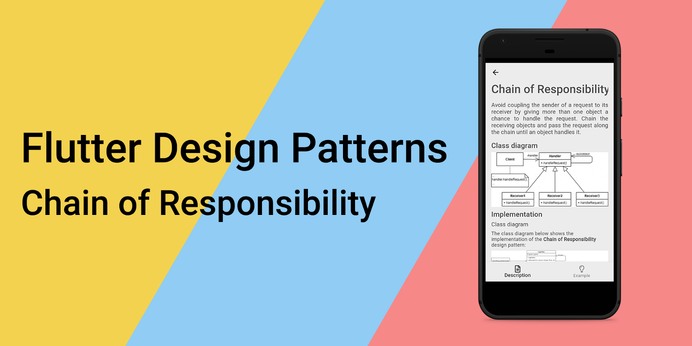
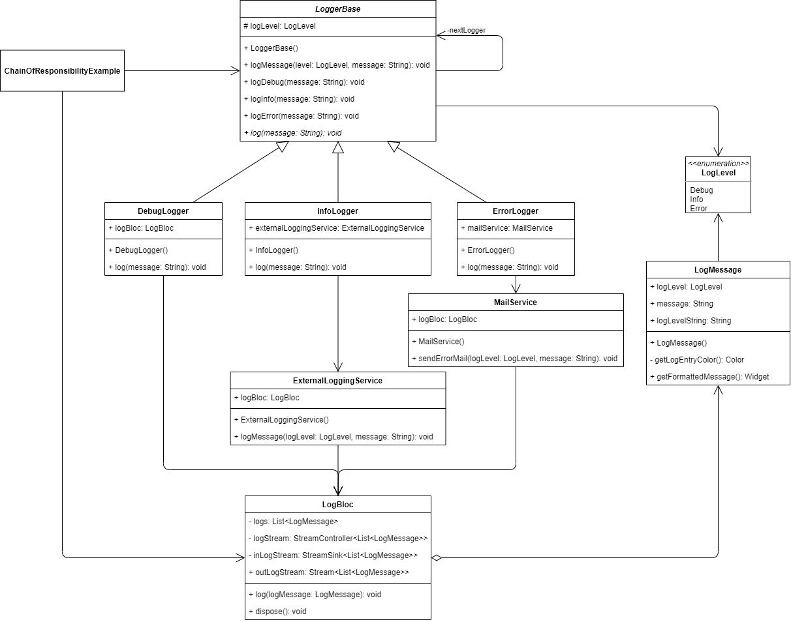
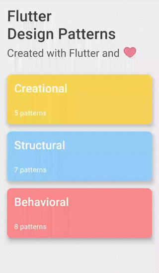

**链式责任设计模式概述及其在 Dart 和 Flutter 中的实现**



要查看所有设计模式的实际操作，请查看 [Flutter Design Patterns 应用](https://flutterdesignpatterns.com/)。

## 什么是链式责任设计模式？


**Chain of Responsibility (CoR)**，也称为**命令链**，是一种行为设计模式，其在 [GoF 书籍](https://en.wikipedia.org/wiki/Design_Patterns)中的意图描述如下：

> _通过给多个对象机会处理请求，避免将请求的发送者与接收者耦合起来。将接收对象连接起来，并沿着链传递请求，直到有对象处理它。_

简而言之：链式责任设计模式是一个有序的消息处理器列表，这些处理器知道如何处理特定类型的消息，或者将消息传递给下一个消息处理器。

首先，链式责任设计模式是一种行为模式，这意味着它的主要目的是重新设计基本工作流（行为），并将其分解为几个独立的部分或独立对象（回想一下 [Command](../2020-01-09-flutter-design-patterns-12-command/index.md) 或 [State](../2019-11-20-flutter-design-patterns-6-state/index.md) 设计模式作为例子）。假设你在代码中定义了某种工作流程，每个步骤都需要按顺序执行。一切运行良好，直到…

- 需要引入一些额外的步骤。_好吧，没什么大不了的，就加进去。_
- 根据请求，这些步骤中的一些是可选的。_好吧，加入一些条件块，没什么特别的。_
- 哎呀，我们忘了验证... _嗯，代码开始变得臃肿了。_
- 突然出现一个新功能需求：根据请求，步骤的顺序不同。_请，停下来..._

我希望你明白，这段代码很容易变得一团糟（更不用说违反了开闭原则 - [**SOLID**](https://en.wikipedia.org/wiki/SOLID) 原则中的字母 **O**）。CoR 模式的建议是将每个步骤分解成一个独立的组件 - **处理器** - 然后将这些处理器链接成一个链。每个处理器都包含对下一个处理器的引用，因此一旦接收到请求，它就会被处理器处理，并沿着链传递到下一个处理器，直到工作流程完成。结果，我们仍然有相同的顺序代码执行，但现在每个步骤都被分开了，额外的步骤可以添加而不改变现有代码。但等等，还有更多！

链式责任模式允许在运行时对链中的处理器进行重新排序、添加或移除 - 是不是很酷？此外，每个处理器都可以实现成一种方式，即决定是否将请求进一步传递到链上。

这里已经提到了很多好主意，让我们直接通过分析 CoR 设计模式及其实现来了解更多细节！

## 责任链设计模式分析

责任链设计模式的基本结构如下所示：


- **处理器（Handler）** - 定义处理请求的接口。当所有处理器都扩展了 **BaseHandler** 类时，这个接口是可选的，这时只需要一个抽象方法来处理请求即可。
- **基础处理器（BaseHandler）** - 一个抽象类，包含所有处理器类通用的样板代码，并维护链上下一个处理器对象的引用。此类还可能实现默认的处理行为，例如，如果有下一个处理器，则可以将请求传递给它。
- **具体处理器（ConcreteHandlers）** - 包含处理请求的实际代码。接收到请求后，处理器可以选择处理它或将其沿链传递。通常，一旦初始化，处理器就是不可变的。
- **客户端（Client）** - 组合处理器链并稍后向链上的一个 **ConcreteHandler** 对象发起请求。

### 适用性

当系统需要以不同的方式处理多种类型的请求，但请求类型和处理顺序在编译时未定义时，应使用责任链设计模式。该模式允许将多个处理器链接成一个链，并允许客户端沿该链传递请求。因此，每个处理器将接收请求，处理它，并/或进一步传递。此外，为了解决未知的处理顺序问题，处理器可以为处理器类中的后续引用字段提供设置器 - 这样您就可以在运行时添加、删除或重新排序处理器，从而更改请求的处理顺序。

此外，当一个请求必须由多个处理器按特定顺序处理时，应使用责任链模式。在这种情况下，可以在编译时定义链，并且所有请求都将按计划通过链。如果执行顺序无关紧要，可以随机构建链 - 所有处理器仍然会接收请求并处理它。

最后，需要记住的一点 - **无法保证请求一定会被处理**。由于责任链引入了发送方和接收方之间的松耦合，且请求可能由链中的任何处理器处理，因此无法保证请求实际上会被处理。在请求必须至少由一个处理器处理的情况下，您必须确保链被正确配置，例如，在链的末端添加某种监视器处理器，以通知未处理的请求和/或执行某些特定逻辑。


## Implementation


我们将使用责任链设计模式在应用程序中实现自定义的日志记录工作流程。

假设我们根据重要性需要三种不同的日志级别：

- 调试（Debug） - 仅在本地开发环境中需要；
- 信息（Info） - 我们希望在本地看到这些日志，但当应用部署时，也应该在外部日志服务中存储并可见；
- 错误（Error） - 这些日志必须在本地和外部日志服务中可见，同时，当出现此类日志时，我们还希望通过发送电子邮件通知我们的开发团队。

在这种情况下，我们的请求是一个带有内容和日志级别的日志消息。我们的处理器 - 调试、信息和错误日志记录器 - 每个都带有自定义逻辑。为了实现所需的工作流程，我们可以按以下顺序链接日志记录器：调试 -> 信息 -> 错误。如果日志记录器的日志级别低于或等于消息中定义的级别，就应记录该消息。就这么简单！

一幅图胜过千言万语，让我们先看一下类图，然后实现这个模式。

### 类图

下面的类图展示了责任链设计模式的实现：



`LogLevel` 是一个枚举类，定义了可能的日志级别 - 调试（Debug）、信息（Info）和错误（Error）。

`LogMessage` 类用于存储日志消息的信息：其日志级别和消息文本。它还提供了一个公共方法 `getFormattedMessage()` 来将日志条目格式化为 Widget 对象（为此，使用了一个私有辅助方法 `getLogEntryColor()` 和一个 getter `logLevelString`）。

`LoggerBase` 是一个抽象类，用作所有特定日志记录器的基类：

- `logMessage()` - 使用 `log()` 方法记录消息并沿链传递请求；
- `logDebug()` - 以调试级别记录消息；
- `logInfo()` - 以信息级别记录消息；
- `logError()` - 以错误级别记录消息；
- `log()` - 一个抽象方法，用于记录消息（必须由特定的日志记录器实现）。

此外，`LoggerBase` 包含对下一个日志记录器（`nextLogger`）的引用和日志记录器的日志级别（`logLevel`）。

`DebugLogger`、`InfoLogger` 和 `ErrorLogger` 是具体的日志记录器类，它们扩展了 `LoggerBase` 类并实现了抽象的 `log()` 方法。`InfoLogger` 使用 `ExternalLoggingService` 来记录消息，而 `ErrorLogger` 使用 `MailService`。

所有特定的日志记录器都使用或注入 `LogBloc` 类来模拟实际的日志记录，并将日志条目提供给 UI。

`LogBloc` 存储了一个日志列表，并通过流 `outLogStream` 对外暴露。它还定义了 `log()` 方法，以将新日志添加到列表中并通知 `outLogStream` 订阅者更新后的日志条目列表。

`ChainOfResponsibilityExample` 创建了一个日志记录器链，并使用 `LoggerBase` 中定义的公共方法来记录消息。它还初始化并包含 `LogBloc` 实例来存储日志条目，并稍后在 UI 中显示它们。


### LogLevel

用于定义不同日志级别的特殊类。此外，重写了 `<=` 运算符，以比较一个日志级别是否低于或等于另一个。

```dart title="log_level.dart"
enum LogLevel {
  debug,
  info,
  error;

  bool operator <=(LogLevel logLevel) => index <= logLevel.index;
}
```

### LogMessage

用于存储日志条目的信息：日志级别和消息。该类定义了一个私有 getter `logLevelString` 来返回特定日志级别的文本表示，以及一个私有方法 `getLogEntryColor()` 来根据日志级别返回日志条目颜色。`getFormattedMessage()` 方法返回格式化的日志条目作为 `Text` 小部件，用于 UI。

```dart title="log_message.dart"
class LogMessage {
  const LogMessage({
    required this.logLevel,
    required this.message,
  });

  final LogLevel logLevel;
  final String message;

  String get _logLevelString =>
      logLevel.toString().split('.').last.toUpperCase();

  Color _getLogEntryColor() => switch (logLevel) {
        LogLevel.debug => Colors.grey,
        LogLevel.info => Colors.blue,
        LogLevel.error => Colors.red,
      };

  Widget getFormattedMessage() => Text(
        '$_logLevelString: $message',
        style: TextStyle(color: _getLogEntryColor()),
        textAlign: TextAlign.justify,
        overflow: TextOverflow.ellipsis,
        maxLines: 2,
      );
}
```

### LogBloc

用于存储日志消息并通过公共流提供给 UI 的类。新的日志条目通过 `log()` 方法添加到日志列表，所有日志可以通过公共 `outLogStream` 访问。

```dart title="log_bloc.dart"
class LogBloc {
  final List<LogMessage> _logs = [];
  final _logStream = StreamController<List<LogMessage>>();

  StreamSink<List<LogMessage>> get _inLogStream => _logStream.sink;
  Stream<List<LogMessage>> get outLogStream => _logStream.stream;

  void log(LogMessage logMessage) {
    _logs.add(logMessage);
    _inLogStream.add(UnmodifiableListView(_logs));
  }

  void dispose() {
    _logStream.close();
  }
}
```

### ExternalLoggingService

代表实际的外部日志服务。它不是将日志消息发送到第三方日志服务，而是通过 `LogBloc` 将消息记录到 UI。

```dart title="external_logging_service.dart"
class ExternalLoggingService {
  const ExternalLoggingService(this.logBloc);

  final LogBloc logBloc;

  void logMessage(LogLevel logLevel, String message) {
    final logMessage = LogMessage(logLevel: logLevel, message: message);

    // Send log message to the external logging service

    // Log message
    logBloc.log(logMessage);
  }
}
```

### MailService

代表实际的邮件日志服务。它不是将日志消息作为电子邮件发送给用户，而是通过 `LogBloc` 将消息记录到 UI。

```dart title="mail_service.dart"
class MailService {
  const MailService(this.logBloc);

  final LogBloc logBloc;

  void sendErrorMail(LogLevel logLevel, String message) {
    final logMessage = LogMessage(logLevel: logLevel, message: message);

    // Send error mail

    // Log message
    logBloc.log(logMessage);
  }
}
```

### LoggerBase

用于基础日志记录器实现的抽象类。它存储日志级别和链中下一个日志记录器的引用（后继者）。该类实现了通用的 `logMessage()` 方法，如果消息的日志级别低于当前记录器的级别，则记录该消息，然后将消息转发给后继者（如果有的话）。抽象方法 `log()` 必须由扩展 `LoggerBase` 类的特定记录器实现。

```dart title="logger_base.dart"
abstract class LoggerBase {
  const LoggerBase({
    required this.logLevel,
    LoggerBase? nextLogger,
  }) : _nextLogger = nextLogger;

  @protected
  final LogLevel logLevel;
  final LoggerBase? _nextLogger;

  void logMessage(LogLevel level, String message) {
    if (logLevel <= level) log(message);

    _nextLogger?.logMessage(level, message);
  }

  void logDebug(String message) => logMessage(LogLevel.debug, message);
  void logInfo(String message) => logMessage(LogLevel.info, message);
  void logError(String message) => logMessage(LogLevel.error, message);

  void log(String message);
}
```

### Concrete loggers

`DebugLogger` - 一个特定实现，将日志级别设置为 `Debug`，并通过 `LogBloc` 将消息记录到 UI。

```dart title="debug_logger.dart"
class DebugLogger extends LoggerBase {
  const DebugLogger(
    this.logBloc, {
    super.nextLogger,
  }) : super(logLevel: LogLevel.debug);

  final LogBloc logBloc;

  @override
  void log(String message) {
    final logMessage = LogMessage(logLevel: logLevel, message: message);

    logBloc.log(logMessage);
  }
}
```

`InfoLogger` - 一个特定实现，将日志级别设置为 `Info`，并使用 `ExternalLoggingService` 记录消息。

```dart title="info_logger.dart"
class InfoLogger extends LoggerBase {
  InfoLogger(
    LogBloc logBloc, {
    super.nextLogger,
  })  : externalLoggingService = ExternalLoggingService(logBloc),
        super(logLevel: LogLevel.info);

  final ExternalLoggingService externalLoggingService;

  @override
  void log(String message) {
    externalLoggingService.logMessage(logLevel, message);
  }
}
```

`ErrorLogger` - 一个特定实现，将日志级别设置为 `Error`，并使用 `MailService` 记录消息。

```dart title="error_logger.dart"
class ErrorLogger extends LoggerBase {
  ErrorLogger(
    LogBloc logBloc, {
    super.nextLogger,
  })  : mailService = MailService(logBloc),
        super(logLevel: LogLevel.error);

  final MailService mailService;

  @override
  void log(String message) {
    mailService.sendErrorMail(logLevel, message);
  }
}
```

## Example

首先，准备了一个 Markdown 文件作为模式描述：


`ChainOfResponsibilityExample` 小部件初始化并包含日志记录器链对象（参见 `initState()` 方法）。此外，出于演示目的，也在此初始化了 `LogBloc` 对象，并通过流 `outLogStream` 使用它发送日志和检索日志列表。

```dart title="chain_of_responsibility_example.dart"
class ChainOfResponsibilityExample extends StatefulWidget {
  const ChainOfResponsibilityExample();

  @override
  _ChainOfResponsibilityExampleState createState() =>
      _ChainOfResponsibilityExampleState();
}

class _ChainOfResponsibilityExampleState
    extends State<ChainOfResponsibilityExample> {
  final logBloc = LogBloc();

  late final LoggerBase logger;

  @override
  void initState() {
    super.initState();

    logger = DebugLogger(
      logBloc,
      nextLogger: InfoLogger(
        logBloc,
        nextLogger: ErrorLogger(logBloc),
      ),
    );
  }

  @override
  void dispose() {
    logBloc.dispose();
    super.dispose();
  }

  String get randomLog => faker.lorem.sentence();

  @override
  Widget build(BuildContext context) {
    return ScrollConfiguration(
      behavior: const ScrollBehavior(),
      child: SingleChildScrollView(
        padding: const EdgeInsets.symmetric(
          horizontal: LayoutConstants.paddingL,
        ),
        child: Column(
          children: <Widget>[
            PlatformButton(
              materialColor: Colors.black,
              materialTextColor: Colors.white,
              onPressed: () => logger.logDebug(randomLog),
              text: 'Log debug',
            ),
            PlatformButton(
              materialColor: Colors.black,
              materialTextColor: Colors.white,
              onPressed: () => logger.logInfo(randomLog),
              text: 'Log info',
            ),
            PlatformButton(
              materialColor: Colors.black,
              materialTextColor: Colors.white,
              onPressed: () => logger.logError(randomLog),
              text: 'Log error',
            ),
            const Divider(),
            Row(
              children: <Widget>[
                Expanded(
                  child: StreamBuilder<List<LogMessage>>(
                    initialData: const [],
                    stream: logBloc.outLogStream,
                    builder: (context, snapshot) =>
                        LogMessagesColumn(logMessages: snapshot.data!),
                  ),
                ),
              ],
            ),
          ],
        ),
      ),
    );
  }
}
```

通过创建一个日志记录器链，客户端（ChainOfResponsibilityExample小部件）不需要关心哪个具体的日志记录器应该处理日志条目的详细信息，它只是将消息传递（记录）给一系列日志记录器。这样，发送方（客户端）和接收方（日志记录器）解耦，日志记录器的链本身可以在运行时以任何顺序或结构构建，例如，您可以在非本地环境中跳过调试日志记录器，仅使用信息 -> 错误链。



正如您在示例中所看到的，**debug** 级别的日志只由调试日志记录器处理，**info** 由调试和信息级别的处理程序处理，而 **error** 日志由所有三个日志记录器处理。
您可以在[here](https://github.com/mkobuolys/flutter-design-patterns/pull/21).找到有关责任链设计模式及其示例实现的所有代码更改。

要查看该模式的实际应用，请查看 [interactive Chain of Responsibility example](https://flutterdesignpatterns.com/pattern/chain-of-responsibility).
