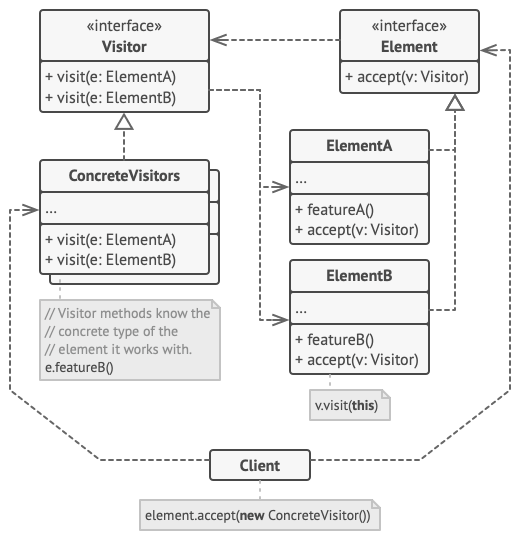
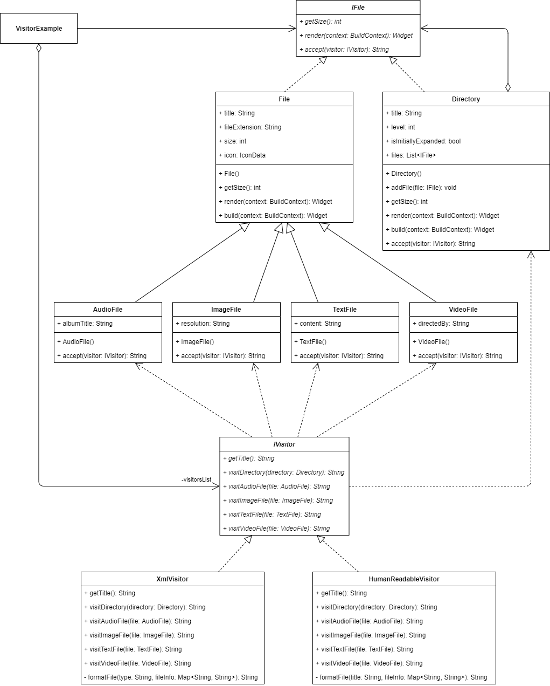

_访问者设计模式及其在 Dart 和 Flutter 中的实现概述_


要查看所有设计模式的实际应用，请查看 [Flutter 设计模式应用程序](https://flutterdesignpatterns.com/)。

## 什么是访问者设计模式？


**访问者**属于**行为型**设计模式的类别。这个设计模式的意图在 [GoF 书](https://en.wikipedia.org/wiki/Design_Patterns)中有描述：

> _代表要在对象结构的元素上执行的操作。访问者让你定义一个新的操作，而无需更改操作所作用的元素的类。_

假设我们有一个复杂的对象结构，可能是树或集合，它由几个不同的类组件组成。现在，我们想在不改变这些组件的类的情况下，为这些组件添加某种新功能——这甚至可能吗？

这里的关键思想是为每个特定的复杂对象类定义一个双重调度操作（在访问者设计模式的上下文中，该操作被称为 _accept_）——我知道，你可能会认为我对你说谎了，关于在不更改现有代码的情况下添加新操作，但请等等，这么做是有充分理由的！当客户端遍历对象结构时，每个元素上都会调用 _accept_ 方法，将请求委托给作为参数传递给该方法的特定 _visitor_ 对象。然后，调用访问者对象的特定方法（请求被委托），从而执行实际的请求。这就是双重调度操作的主要思想——客户端向组件发送请求，而组件将请求委托给特定访问者的方法。这意味着，只需在组件类中实现单个方法，然后通过添加新的访问者，就可以简单地定义对象结构上的新操作。而这一次，你可以实现任意多个不同的访问者类，而不需要更改现有代码！这多酷啊？

此外，访问者设计模式允许将相关操作聚集到单个类中，而不是将实现细节分散到整个对象结构中。这在你想要在遍历对象结构时累积状态时很有帮助——因为状态存储在访问者对象本身中，并且可以被所有特定访问者方法访问，所以无需将状态传递给执行累积的操作。

起初，所有的 _visitor_、_accept_、_double-dispatch_ 术语可能看起来令人困惑——别担心，当你看到访问者设计模式在实践中时，一切会变得更清晰。让我们进入分析和实现部分，以了解这个模式的细节并学习如何实现它！

## 分析

访问者设计模式的一般结构如下所示：



- *Visitor*——为对象结构中的每个 _concrete element_ 类声明一个访问操作。如果编程语言支持 [函数重载](https://en.wikipedia.org/wiki/Function_overloading)，访问操作可以有相同的名称（目前 Dart 不支持），但它们的参数类型必须不同。通常，操作的名称和签名是不同的，用于识别将访问请求发送给访问者的类（_concrete element_）；
- *Concrete visitors*——实现 _Visitor_ 声明的每个操作；
- *Element*——声明一个接受 _Visitor_ 作为参数的 _accept_ 方法；
- *Concrete elements*——实现接受方法。实现应依赖于将请求重定向到对应于当前元素类的特定访问者方法；
- *Client*——通常包含一个集合或复杂的对象结构，初始化 _concrete visitor_ 对象，然后遍历对象结构，用访问者访问每个元素。

### 适用性

访问者设计模式的主要目的是将算法与其操作的对象分离，从而清理业务逻辑。这样，你的应用类可以专注于它们的主要工作，而辅助行为被提取到一组访问者类中。此外，访问者允许通过在一个类中定义它们来保持相关操作的一致性。

此外，当你想对复杂对象结构的所有元素执行操作，并且你不想更改具体类的接口时，应该使用访问者设计模式。不同的访问方法实现在接受访问者的不同类上执行，因此可以更改特定实现细节或添加新的特定访问者实现，而不干扰对象结构及其组件的现有代码库。

最后，有一件重要的事情需要注意：访问者设计模式仅在对象结构很少更改时才有意义（一如既往，对此持保留态度）。如果你只想更改或添加新的访问者实现——那很好。然而，更改对象结构类需要重新定义所有访问者的接口，这可能变得很麻烦，并且违反了开放封闭原则（[**SOLID**](https://en.wikipedia.org/wiki/SOLID)原则中的 **O** 字母）。这个问题的一个简单解决方案是直接在这些类中定义操作，而不是将它们提取到访问者中。

## 实现


在实现部分，我们将在已经实现的复杂对象结构上使用访问者设计模式，该结构是在 [Composite](../2019-11-07-flutter-design-patterns-4-composite/index.md) 设计模式中介绍的。我认为，这将是一个很好的例子，展示不同设计模式如何相互补充，以及如何重用/扩展已有的代码库。

我们的复杂对象结构是一个文件系统，由目录和各种类型的文件（音频、视频、文本等）组成。假设这种结构已经使用 Composite 设计模式实现。现在，我们想添加一种可能性，以两种不同的格式导出这种文件结构：人类可读（只提供单个格式化列表中的每个文件）和 XML。

实现此功能的第一种可能方法是为每个特定文件类型定义导出方法。在这种情况下，这是错误的，原因如下：

- 对于每个特定的导出选项，我们需要在每个特定文件类中实现一个单独的导出方法。此外，将来添加新的导出选项时，我们将需要再次向每个文件类添加一些额外的代码。
- 这违反了[单一责任原则](https://en.wikipedia.org/wiki/Single-responsibility_principle)。导出功能只是在文件结构之上应用的辅助操作，因此每个特定文件都不应该关心并将实现细节存储在类本身内部。

正如你所猜测的，这些问题可以通过应用访问者设计模式轻松解决，并在一个单独的访问者类中定义每个特定的导出选项，该类负责处理单个位置的所有文件类型的所有特定实现细节。让我们先检查类图，然后实现该模式！

### Class diagram

下面的类图展示了访问者设计模式的实现：



`IFile` 定义了 `File` 和 `Directory` 类的通用接口：

- `getSize()` - 返回文件的大小；
- `render()` - 渲染组件的 UI；
- `accept()` - 将请求委托给访问者。

`File` 类实现了 `getSize()` 和 `render()` 方法，另外包含 `title`、`fileExtension`、`size` 和 `icon` 属性。

`AudioFile`、`ImageFile`、`TextFile` 和 `VideoFile` 是具体的文件类，实现了 `IFile` 接口的 `accept()` 方法，并包含了有关特定文件的一些额外信息。

`Directory` 实现了与 `File` 相同的所需方法，但它还包含 `title`、`level`、`isInitiallyExpanded` 属性和包含 `IFile` 对象的 `files` 列表。它还定义了 `addFile()` 方法，允许将 `IFile` 对象添加到目录（`files` 列表）中。与特定文件类似，这里也实现了 `accept()` 方法。

`IVisitor` 定义了特定访问者类的通用接口：

- `getTitle()` - 返回访问者在 UI 中使用的标题；
- `visitDirectory()` - 为 `Directory` 类定义一个访问方法；
- `visitAudioFile()` - 为 `AudioFile` 类定义一个访问方法；
- `visitImageFile()` - 为 `ImageFile` 类定义一个访问方法；
- `visitTextFile()` - 为 `TextFile` 类定义一个访问方法；
- `visitVideoFile()` - 为 `VideoFile` 类定义一个访问方法。

`HumanReadableVisitor` 和 `XmlVisitor` 是具体的访问者类，实现了对每种特定文件类型的访问方法。

`VisitorExample` 包含一个实现 `IVisitor` 接口的访问者列表和复合文件结构。选定的访问者用于将可见的文件结构格式化为文本，并提供给 UI。

### IFile

一个定义了特定文件和目录应实现的方法的接口。该接口还定义了一个 `accept()` 方法，用于实现访问者设计模式。

```dart title="ifile.dart"
abstract interface class IFile {
  int getSize();
  Widget render(BuildContext context);
  String accept(IVisitor visitor);
}
```

### File

`IFile` 接口的一个具体实现。在 `File` 类中，`getSize()` 方法简单地返回文件大小，`render()` 返回用于示例屏幕的文件的 UI 小部件。

```dart title="file.dart"
abstract class File extends StatelessWidget implements IFile {
  final String title;
  final String fileExtension;
  final int size;
  final IconData icon;

  const File({
    required this.title,
    required this.fileExtension,
    required this.size,
    required this.icon,
  });

  @override
  int getSize() => size;

  @override
  Widget render(BuildContext context) {
    return Padding(
      padding: const EdgeInsets.only(left: LayoutConstants.paddingS),
      child: ListTile(
        title: Text(
          '$title.$fileExtension',
          style: Theme.of(context).textTheme.bodyLarge,
        ),
        leading: Icon(icon),
        trailing: Text(
          FileSizeConverter.bytesToString(size),
          style: Theme.of(context)
              .textTheme
              .bodyMedium
              ?.copyWith(color: Colors.black54),
        ),
        dense: true,
      ),
    );
  }

  @override
  Widget build(BuildContext context) => render(context);
}
```

### Concrete file classes

所有特定文件类型类都实现了 `accept()` 方法，该方法将请求委托给特定访问者的方法。

`AudioFile` - 代表音频文件类型的特定文件类，包含一个额外的 `albumTitle` 属性。

```dart title="audio_file.dart"
class AudioFile extends File {
  const AudioFile({
    required this.albumTitle,
    required super.title,
    required super.fileExtension,
    required super.size,
  }) : super(icon: Icons.music_note);

  final String albumTitle;

  @override
  String accept(IVisitor visitor) => visitor.visitAudioFile(this);
}
```

`ImageFile` - 代表图像文件类型的特定文件类，包含一个额外的 `resolution` 属性。

```dart title="image_file.dart"
class ImageFile extends File {
  const ImageFile({
    required this.resolution,
    required super.title,
    required super.fileExtension,
    required super.size,
  }) : super(icon: Icons.image);

  final String resolution;

  @override
  String accept(IVisitor visitor) => visitor.visitImageFile(this);
}
```

`TextFile` - 代表文本文件类型的特定文件类，包含一个额外的 `content` 属性。

```dart title="text_file.dart"
class TextFile extends File {
  const TextFile({
    required this.content,
    required super.title,
    required super.fileExtension,
    required super.size,
  }) : super(icon: Icons.description);

  final String content;

  @override
  String accept(IVisitor visitor) => visitor.visitTextFile(this);
}
```

`VideoFile` - 代表视频文件类型的特定文件类，包含一个额外的 `directedBy` 属性。

```dart title="video_file.dart"
class VideoFile extends File {
  const VideoFile({
    required this.directedBy,
    required super.title,
    required super.fileExtension,
    required super.size,
  }) : super(icon: Icons.movie);

  final String directedBy;

  @override
  String accept(IVisitor visitor) => visitor.visitVideoFile(this);
}
```

### Directory

`IFile` 接口的一个具体实现。类似于 `File` 类，`render()` 返回用于示例屏幕的目录的 UI 小部件。然而，在这个类中，`getSize()` 方法通过对 `files` 列表中的每个项调用 `getSize()` 方法并将结果相加来计算目录大小。此外，该类实现了 `accept()` 方法，该方法将请求委托给目录的特定访问者方法。

```dart title="directory.dart"
class Directory extends StatelessWidget implements IFile {
  final String title;
  final int level;
  final bool isInitiallyExpanded;

  final List<IFile> _files = [];
  List<IFile> get files => _files;

  Directory({
    required this.title,
    required this.level,
    this.isInitiallyExpanded = false,
  });

  void addFile(IFile file) => _files.add(file);

  @override
  int getSize() {
    var sum = 0;

    for (final file in _files) {
      sum += file.getSize();
    }

    return sum;
  }

  @override
  Widget render(BuildContext context) {
    return Theme(
      data: ThemeData(
        colorScheme: ColorScheme.fromSwatch().copyWith(primary: Colors.black),
      ),
      child: Padding(
        padding: const EdgeInsets.only(left: LayoutConstants.paddingS),
        child: ExpansionTile(
          leading: const Icon(Icons.folder),
          title: Text('$title (${FileSizeConverter.bytesToString(getSize())})'),
          initiallyExpanded: isInitiallyExpanded,
          children: _files.map((IFile file) => file.render(context)).toList(),
        ),
      ),
    );
  }

  @override
  Widget build(BuildContext context) => render(context);

  @override
  String accept(IVisitor visitor) => visitor.visitDirectory(this);
}
```

### Formatting extensions

定义了一个扩展方法 `indentAndAddNewLine`，在字符串的开头添加 `nTab` 个制表符，在末尾添加一个新行符。

```dart title="formatting_extension.dart"
extension FormattingExtension on String {
  String indentAndAddNewLine(int nTabs) => '${'\t' * nTabs}$this\n';
}
```

### IVisitor

定义了所有特定访问者应实现的方法的接口。

```dart title="ivisitor.dart"
abstract interface class IVisitor {
  String getTitle();
  String visitDirectory(Directory directory);
  String visitAudioFile(AudioFile file);
  String visitImageFile(ImageFile file);
  String visitTextFile(TextFile file);
  String visitVideoFile(VideoFile file);
}
```

### Concrete visitors

`HumanReadableVisitor` - 实现了提供每种文件类型的文件信息的特定访问者，以人类可读格式。

```dart title="human_readable_visitor.dart"
class HumanReadableVisitor implements IVisitor {
  const HumanReadableVisitor();

  @override
  String getTitle() => 'Export as text';

  @override
  String visitAudioFile(AudioFile file) {
    final fileInfo = <String, String>{
      'Type': 'Audio',
      'Album': file.albumTitle,
      'Extension': file.fileExtension,
      'Size': FileSizeConverter.bytesToString(file.getSize()),
    };

    return _formatFile(file.title, fileInfo);
  }

  @override
  String visitDirectory(Directory directory) {
    final buffer = StringBuffer();

    for (final file in directory.files) {
      buffer.write(file.accept(this));
    }

    return buffer.toString();
  }

  @override
  String visitImageFile(ImageFile file) {
    final fileInfo = <String, String>{
      'Type': 'Image',
      'Resolution': file.resolution,
      'Extension': file.fileExtension,
      'Size': FileSizeConverter.bytesToString(file.getSize()),
    };

    return _formatFile(file.title, fileInfo);
  }

  @override
  String visitTextFile(TextFile file) {
    final fileContentPreview = file.content.length > 30
        ? '${file.content.substring(0, 30)}...'
        : file.content;

    final fileInfo = <String, String>{
      'Type': 'Text',
      'Preview': fileContentPreview,
      'Extension': file.fileExtension,
      'Size': FileSizeConverter.bytesToString(file.getSize()),
    };

    return _formatFile(file.title, fileInfo);
  }

  @override
  String visitVideoFile(VideoFile file) {
    final fileInfo = <String, String>{
      'Type': 'Video',
      'Directed by': file.directedBy,
      'Extension': file.fileExtension,
      'Size': FileSizeConverter.bytesToString(file.getSize()),
    };

    return _formatFile(file.title, fileInfo);
  }

  String _formatFile(String title, Map<String, String> fileInfo) {
    final buffer = StringBuffer();

    buffer.write('$title:\n');

    for (final entry in fileInfo.entries) {
      buffer.write('${entry.key}: ${entry.value}'.indentAndAddNewLine(2));
    }

    return buffer.toString();
  }
}
```

`XmlVisitor` - 实现了提供每种文件类型的文件信息的特定访问者，以 XML 格式。

```dart title="xml_visitor.dart"
class XmlVisitor implements IVisitor {
  const XmlVisitor();

  @override
  String getTitle() => 'Export as XML';

  @override
  String visitAudioFile(AudioFile file) {
    final fileInfo = <String, String>{
      'title': file.title,
      'album': file.albumTitle,
      'extension': file.fileExtension,
      'size': FileSizeConverter.bytesToString(file.getSize()),
    };

    return _formatFile('audio', fileInfo);
  }

  @override
  String visitDirectory(Directory directory) {
    final isRootDirectory = directory.level == 0;
    final buffer = StringBuffer();

    if (isRootDirectory) buffer.write('<files>\n');

    for (final file in directory.files) {
      buffer.write(file.accept(this));
    }

    if (isRootDirectory) buffer.write('</files>\n');

    return buffer.toString();
  }

  @override
  String visitImageFile(ImageFile file) {
    final fileInfo = <String, String>{
      'title': file.title,
      'resolution': file.resolution,
      'extension': file.fileExtension,
      'size': FileSizeConverter.bytesToString(file.getSize()),
    };

    return _formatFile('image', fileInfo);
  }

  @override
  String visitTextFile(TextFile file) {
    final fileContentPreview = file.content.length > 30
        ? '${file.content.substring(0, 30)}...'
        : file.content;

    final fileInfo = <String, String>{
      'title': file.title,
      'preview': fileContentPreview,
      'extension': file.fileExtension,
      'size': FileSizeConverter.bytesToString(file.getSize()),
    };

    return _formatFile('text', fileInfo);
  }

  @override
  String visitVideoFile(VideoFile file) {
    final fileInfo = <String, String>{
      'title': file.title,
      'directed_by': file.directedBy,
      'extension': file.fileExtension,
      'size': FileSizeConverter.bytesToString(file.getSize()),
    };

    return _formatFile('video', fileInfo);
  }

  String _formatFile(String type, Map<String, String> fileInfo) {
    final buffer = StringBuffer();

    buffer.write('<$type>'.indentAndAddNewLine(2));

    for (final entry in fileInfo.entries) {
      buffer.write(
        '<${entry.key}>${entry.value}</${entry.key}>'.indentAndAddNewLine(4),
      );
    }

    buffer.write('</$type>'.indentAndAddNewLine(2));

    return buffer.toString();
  }
}
```

## Example

首先，准备了一个 markdown 文件，并提供为模式的描述：


`VisitorExample` 小部件包含 `buildMediaDirectory()` 方法，该方法构建示例的文件结构。
它还包含不同访问者的列表，并将其提供给 `FilesVisitorSelection` 小部件，其中通过触发 `setSelectedVisitorIndex()` 方法选择特定访问者的索引。

```dart title="visitor_example.dart"
class VisitorExample extends StatefulWidget {
  const VisitorExample();

  @override
  _VisitorExampleState createState() => _VisitorExampleState();
}

class _VisitorExampleState extends State<VisitorExample> {
  final visitorsList = const [HumanReadableVisitor(), XmlVisitor()];

  late final IFile _rootDirectory;
  var _selectedVisitorIndex = 0;

  @override
  void initState() {
    super.initState();

    _rootDirectory = _buildMediaDirectory();
  }

  IFile _buildMediaDirectory() {
    final musicDirectory = Directory(title: 'Music', level: 1)
      ..addFile(
        const AudioFile(
          title: 'Darude - Sandstorm',
          albumTitle: 'Before the Storm',
          fileExtension: 'mp3',
          size: 2612453,
        ),
      )
      ..addFile(
        const AudioFile(
          title: 'Toto - Africa',
          albumTitle: 'Toto IV',
          fileExtension: 'mp3',
          size: 3219811,
        ),
      )
      ..addFile(
        const AudioFile(
          title: 'Bag Raiders - Shooting Stars',
          albumTitle: 'Bag Raiders',
          fileExtension: 'mp3',
          size: 3811214,
        ),
      );

    final moviesDirectory = Directory(title: 'Movies', level: 1)
      ..addFile(
        const VideoFile(
          title: 'The Matrix',
          directedBy: 'The Wachowskis',
          fileExtension: 'avi',
          size: 951495532,
        ),
      )
      ..addFile(
        const VideoFile(
          title: 'Pulp Fiction',
          directedBy: 'Quentin Tarantino',
          fileExtension: 'mp4',
          size: 1251495532,
        ),
      );

    final catPicturesDirectory = Directory(title: 'Cats', level: 2)
      ..addFile(
        const ImageFile(
          title: 'Cat 1',
          resolution: '640x480px',
          fileExtension: 'jpg',
          size: 844497,
        ),
      )
      ..addFile(
        const ImageFile(
          title: 'Cat 2',
          resolution: '1280x720px',
          fileExtension: 'jpg',
          size: 975363,
        ),
      )
      ..addFile(
        const ImageFile(
          title: 'Cat 3',
          resolution: '1920x1080px',
          fileExtension: 'png',
          size: 1975363,
        ),
      );

    final picturesDirectory = Directory(title: 'Pictures', level: 1)
      ..addFile(catPicturesDirectory)
      ..addFile(
        const ImageFile(
          title: 'Not a cat',
          resolution: '2560x1440px',
          fileExtension: 'png',
          size: 2971361,
        ),
      );

    final mediaDirectory = Directory(
      title: 'Media',
      level: 0,
      isInitiallyExpanded: true,
    )
      ..addFile(musicDirectory)
      ..addFile(moviesDirectory)
      ..addFile(picturesDirectory)
      ..addFile(Directory(title: 'New Folder', level: 1))
      ..addFile(
        const TextFile(
          title: 'Nothing suspicious there',
          content: 'Just a normal text file without any sensitive information.',
          fileExtension: 'txt',
          size: 430791,
        ),
      )
      ..addFile(
        const TextFile(
          title: 'TeamTrees',
          content:
              'Team Trees, also known as #teamtrees, is a collaborative fundraiser that managed to raise 20 million U.S. dollars before 2020 to plant 20 million trees.',
          fileExtension: 'txt',
          size: 1042,
        ),
      );

    return mediaDirectory;
  }

  void _setSelectedVisitorIndex(int? index) {
    if (index == null) return;

    setState(() => _selectedVisitorIndex = index);
  }

  void _showFilesDialog() {
    final selectedVisitor = visitorsList[_selectedVisitorIndex];
    final filesText = _rootDirectory.accept(selectedVisitor);

    showDialog<void>(
      context: context,
      barrierDismissible: false,
      builder: (_) => FilesDialog(filesText: filesText),
    );
  }

  @override
  Widget build(BuildContext context) {
    return ScrollConfiguration(
      behavior: const ScrollBehavior(),
      child: SingleChildScrollView(
        padding: const EdgeInsets.symmetric(
          horizontal: LayoutConstants.paddingL,
        ),
        child: Column(
          children: [
            FilesVisitorSelection(
              visitorsList: visitorsList,
              selectedIndex: _selectedVisitorIndex,
              onChanged: _setSelectedVisitorIndex,
            ),
            PlatformButton(
              materialColor: Colors.black,
              materialTextColor: Colors.white,
              onPressed: _showFilesDialog,
              text: 'Export files',
            ),
            const SizedBox(height: LayoutConstants.spaceL),
            _rootDirectory.render(context),
          ],
        ),
      ),
    );
  }
}
```

当通过 `showFilesDialog()` 方法导出文件信息并在模态框中提供时，示例小部件不关心具体选择的访问者，
只要它实现了 `IVisitor` 接口。选定的访问者只是通过将其作为参数传递给 `accept()` 方法来应用于整个文件结构，
因此检索格式化的文件结构文本并将其提供给打开的 `FilesDialog` 模态框。


如你在示例中看到的，通过选择特定的访问者（导出为文本或XML选项），文件结构以相应的文本格式导出并提供给用户。

访问者设计模式及其示例实现的所有代码更改都可以在[这里](https://github.com/mkobuolys/flutter-design-patterns/pull/22)找到。

要看到模式的实际操作，请查看[交互式访问者示例](https://flutterdesignpatterns.com/pattern/visitor)。
