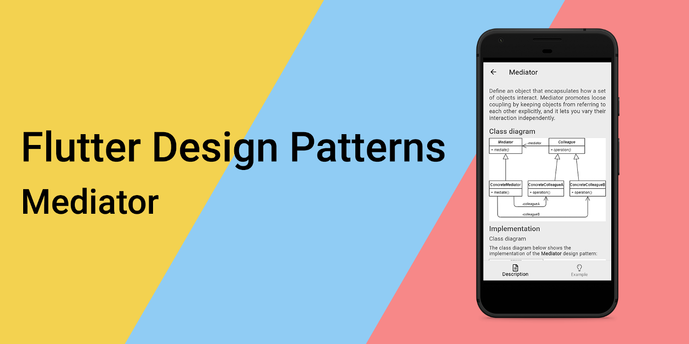
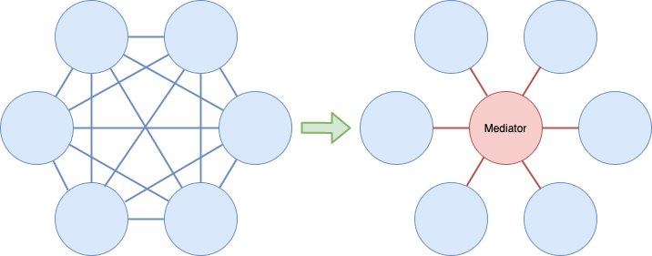
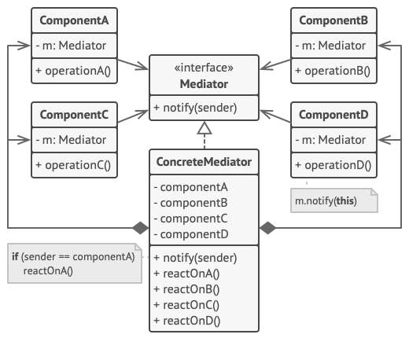
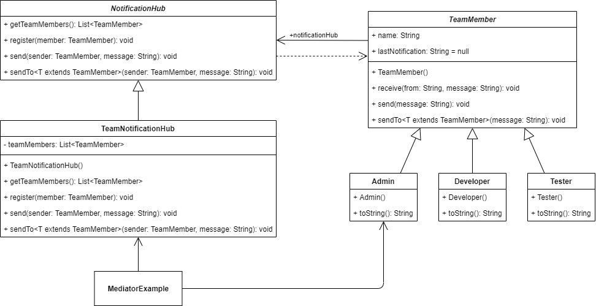
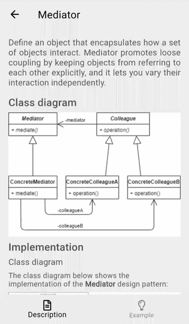
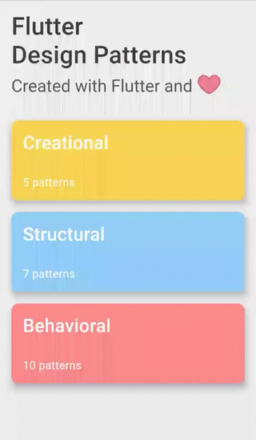

_对Mediator设计模式及其在Dart和Flutter中实现的概述_



要查看所有设计模式的实际操作，请查看[Flutter设计模式应用](https://flutterdesignpatterns.com/)。

## 什么是Mediator设计模式？


**Mediator**（中介者），也称为**Intermediary**（中介）或**Controller**（控制器），是一种**行为**设计模式，其在[GoF书籍](https://en.wikipedia.org/wiki/Design_Patterns)中的描述意图如下：

> _定义一个对象，封装一组对象如何交互。Mediator通过防止对象直接相互引用来促进松耦合，并且它允许你独立地变化它们的交互。_

简而言之：Mediator设计模式的主要目标是从左侧提供的通信对象依赖混乱转移到右侧提供的解耦对象：



在Mediator设计模式上下文中，通信对象称为**同事**，而控制和协调交互的对象称为**中介者**。

中介者就像一个电话交换机，保留与交互对象的引用，并维护所有将同事A与同事B“连接”所需的逻辑。结果，同事对象彼此之间没有显式知识，它们只引用它们的中介者 - 在OOP世界中，我们可以说对象是松散耦合的。这允许独立地重用单个同事对象，因为它们对其他对象的依赖较少。

Mediator设计模式的另一个优点是，它简化并抽象了对象如何交互的方式。首先，中介者用中介者与其同事之间的一对多（1:N）交互替换了多对多（N:M）关系。通常，1:N关系更易于理解和维护。此外，中介者对象抽象了交互逻辑 - 同事应该只知道通信行为，而不知道任何实现细节。这种抽象使得在不更改实际组件的情况下添加新的中介者成为可能。此外，将所有通信逻辑放在一个地方，当你需要调整或维护它时，会有很大帮助。

让我们通过分析Mediator设计模式及其实现的更多细节来直接深入了解！

## 分析

Mediator设计模式的一般结构如下所示：



- *Mediator* - 定义与组件通信的接口；
- *ConcreteMediator* - 通过包含对它们的引用来封装组件之间的关系；
- *(可选) Abstract Component或Component Interface* - 相似的通信组件可以实现相同的接口或扩展相同的基类。在这种情况下，_ConcreteMediator_可以存储一个扩展/实现此类的组件列表，而不是将多个引用作为单独的属性保存；
- *具体组件或同事* - 包含对中介者的引用。每个同事在其他情况下会与另一个同事（组件）通信时，都与其中介者通信。

### 适用性

当你想拥有松散耦合的类而不是紧密耦合的类时，应该使用Mediator设计模式，因为：

a) 你想在其他地方重用组件。当一个组件对其他类过于依赖时，很难将其作为独立对象重用。

b) 你想对某些类进行更改，但它们会影响其他依赖项。通过使用Mediator设计模式，对象之间的关系逻辑被提取到一个单独的类中，因此可以实现更改而不直接影响其他组件的其余部分。

此外，当需要在运行时添加通信对象时，应考虑使用Mediator设计模式。由于中介者类负责通信逻辑和对象之间的所有依赖关系，因此可以稍后从代码中添加或删除这些依赖关系，就像向聊天室添加新用户一样。

然而，通过将所有通信逻辑移动到专用类中，有一种风险会最终拥有一个[上帝对象](https://en.wikipedia.org/wiki/God_object)。为了避免这种情况，请确保中介者类仅负责通信部分。如果你注意到任何其他计算、数据操作或额外操作（我想Eminem会为这句话感到自豪），它们应该被提取到专用类中。

## 实现


我们将使用Mediator设计模式来实现一个工程团队的通知中心。

假设我们想要一个解决方案来向其他团队成员发送通知。团队内部有3个主要角色：管理员即上帝、开发者和测试员（QA工程师）。有时管理员想向整个团队或特定角色的成员发送通知。同样，任何其他团队成员也应该能够向整个团队发送快速通知。

如果你思考这个问题，你会很快注意到团队成员之间存在多对多关系 - 每个工程师都应该知道其他人只是为了发送通知。因此，我们将实现一种集中化的方式来发送通知 - 一个通知中心。你可以将其视为聊天室 - 每个团队成员加入中心，然后他们使用它来发送通知，只需调用发送方法。然后，中心将消息分发给其他人 - 分发给所有人或按特定角色分发。

通过使用这种解决方案，团队成员不需要知道其他人，它们完全解耦。此外，如果有新的团队成员，只需将他/她添加到通知中心，你就可以确保所有通知都会被送达。

### 类图

下面的类图展示了Mediator设计模式的实现：



`TeamMember`是一个基类，用作所有特定团队成员类的基类。该类包含`name`、`lastNotification`和`notificationHub`属性，并提供几种方法：

- `receive()` - 从通知中心接收通知；
- `send()` - 发送通知；
- `sendTo<T>()` - 向特定团队成员发送通知。

`Admin`、`Developer`和`Tester`是具体的团队成员类，它们扩展了抽象类`TeamMember`并覆盖了默认的`toString()`方法。

`NotificationHub`为所有特定的通知中心定义了一个接口：

- `getTeamMembers()` - 返回中心的团队成员列表；
- `register()` - 向中心注册一个团队成员；
- `send()` - 向注册的团队成员发送通知；
- `sendTo<T>()` - 向特定的注册团队成员发送通知。

`TeamNotificationHub`是一个具体的通知中心，扩展了抽象类`NotificationHub`并实现了其抽象方法。此外，这个类包含了注册团队成员的列表 - `teamMembers`。

`MediatorExample`初始化并包含一个通知中心属性来发送和接收通知，并将团队成员注册到中心。

### TeamMember

一个为所有特定团队成员类实现方法的基类。方法`receive()`设置`lastNotification`值，`send()`和`sendTo<T>()`方法通过使用相应的`notificationHub`方法发送通知。


```dart title="team_member.dart"
base class TeamMember {
  TeamMember({
    required this.name,
  });

  final String name;

  NotificationHub? notificationHub;
  String? lastNotification;

  void receive(String from, String message) {
    lastNotification = '$from: "$message"';
  }

  void send(String message) {
    notificationHub?.send(this, message);
  }

  void sendTo<T extends TeamMember>(String message) {
    notificationHub?.sendTo<T>(this, message);
  }
}
```

### 具体团队成员类

所有特定的团队成员类都扩展了`TeamMember`并覆盖了默认的`toString()`方法。

`Admin` - 代表管理员角色的团队成员类。

```dart title="admin.dart"
final class Admin extends TeamMember {
  Admin({
    required super.name,
  });

  @override
  String toString() => '$name (Admin)';
}
```

`Developer` - a team member class representing the developer role.

```dart title="developer.dart"
final class Developer extends TeamMember {
  Developer({
    required super.name,
  });

  @override
  String toString() => '$name (Developer)';
}
```

`Tester` - a team member class representing the tester (QA) role.

```dart title="tester.dart"
final class Tester extends TeamMember {
  Tester({
    required super.name,
  });

  @override
  String toString() => '$name (QA)';
}
```

### NotificationHub

一个接口，定义了特定通知中心类要实现的方法。方法`getTeamMembers()`返回中心注册的团队成员列表，`register()`向中心注册新成员。
方法`send()`向中心注册的所有团队成员发送通知（发送者除外），而`sendTo<T>()`向特定类型的团队成员发送通知（发送者除外）。

```dart title="notification_hub.dart"
abstract interface class NotificationHub {
  List<TeamMember> getTeamMembers();
  void register(TeamMember member);
  void send(TeamMember sender, String message);
  void sendTo<T extends TeamMember>(TeamMember sender, String message);
}
```

### TeamNotificationHub

一个实现`NotificationHub`接口的特定通知中心。该类还包含私有属性`teamMembers` - 中心注册的团队成员列表。

```dart title="team_notification_hub.dart"
class TeamNotificationHub implements NotificationHub {
  TeamNotificationHub({
    List<TeamMember>? members,
  }) {
    members?.forEach(register);
  }

  final _teamMembers = <TeamMember>[];

  @override
  List<TeamMember> getTeamMembers() => _teamMembers;

  @override
  void register(TeamMember member) {
    member.notificationHub = this;

    _teamMembers.add(member);
  }

  @override
  void send(TeamMember sender, String message) {
    final filteredMembers = _teamMembers.where((m) => m != sender);

    for (final member in filteredMembers) {
      member.receive(sender.toString(), message);
    }
  }

  @override
  void sendTo<T extends TeamMember>(TeamMember sender, String message) {
    final filteredMembers =
        _teamMembers.where((m) => m != sender).whereType<T>();

    for (final member in filteredMembers) {
      member.receive(sender.toString(), message);
    }
  }
}
```

## 示例

首先，准备一个markdown文件，并作为模式的描述提供：



`MediatorExample`小部件初始化`TeamNotificationHub`，然后使用它在团队成员之间发送通知。

```dart title="mediator_example.dart"
class MediatorExample extends StatefulWidget {
  const MediatorExample();

  @override
  _MediatorExampleState createState() => _MediatorExampleState();
}

class _MediatorExampleState extends State<MediatorExample> {
  late final NotificationHub _notificationHub;
  final _admin = Admin(name: 'God');

  @override
  void initState() {
    super.initState();

    final members = [
      _admin,
      Developer(name: 'Sea Sharp'),
      Developer(name: 'Jan Assembler'),
      Developer(name: 'Dove Dart'),
      Tester(name: 'Cori Debugger'),
      Tester(name: 'Tania Mocha'),
    ];
    _notificationHub = TeamNotificationHub(members: members);
  }

  void _sendToAll() => setState(() => _admin.send('Hello'));

  void _sendToQa() => setState(() => _admin.sendTo<Tester>('BUG!'));

  void _sendToDevelopers() => setState(
        () => _admin.sendTo<Developer>('Hello, World!'),
      );

  void _addTeamMember() {
    final name = '${faker.person.firstName()} ${faker.person.lastName()}';
    final teamMember = faker.randomGenerator.boolean()
        ? Tester(name: name)
        : Developer(name: name);

    setState(() => _notificationHub.register(teamMember));
  }

  void _sendFromMember(TeamMember member) => setState(
        () => member.send('Hello from ${member.name}'),
      );

  @override
  Widget build(BuildContext context) {
    return ScrollConfiguration(
      behavior: const ScrollBehavior(),
      child: SingleChildScrollView(
        padding: const EdgeInsets.symmetric(
          horizontal: LayoutConstants.paddingL,
        ),
        child: Column(
          crossAxisAlignment: CrossAxisAlignment.stretch,
          children: <Widget>[
            PlatformButton(
              text: "Admin: Send 'Hello' to all",
              materialColor: Colors.black,
              materialTextColor: Colors.white,
              onPressed: _sendToAll,
            ),
            PlatformButton(
              text: "Admin: Send 'BUG!' to QA",
              materialColor: Colors.black,
              materialTextColor: Colors.white,
              onPressed: _sendToQa,
            ),
            PlatformButton(
              text: "Admin: Send 'Hello, World!' to Developers",
              materialColor: Colors.black,
              materialTextColor: Colors.white,
              onPressed: _sendToDevelopers,
            ),
            const Divider(),
            PlatformButton(
              text: "Add team member",
              materialColor: Colors.black,
              materialTextColor: Colors.white,
              onPressed: _addTeamMember,
            ),
            const SizedBox(height: LayoutConstants.spaceL),
            NotificationList(
              members: _notificationHub.getTeamMembers(),
              onTap: _sendFromMember,
            ),
          ],
        ),
      ),
    );
  }
}
```

具体的团队成员之间不包含对方的任何引用，它们是完全解耦的。为了通信，使用了处理发送和接收团队通知所需所有逻辑的通知中心。



如你在示例中看到的，你可以从不同的团队成员发送通知，并稍后将新成员添加到中心，他们也会被通知。

Mediator设计模式及其示例实现的所有代码更改可以在[这里](https://github.com/mkobuolys/flutter-design-patterns/pull/28)找到。

要查看模式的实际操作，请查看[交互式Mediator示例](https://flutterdesignpatterns.com/pattern/mediator)。
