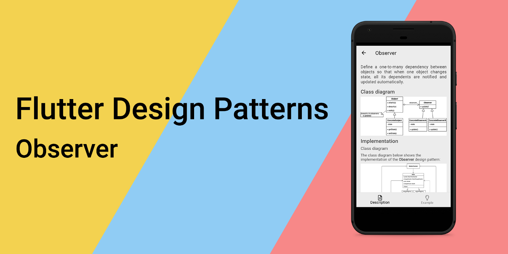
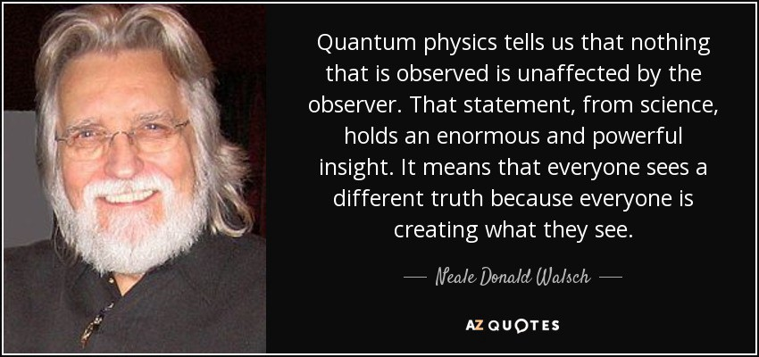
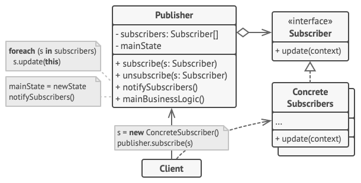
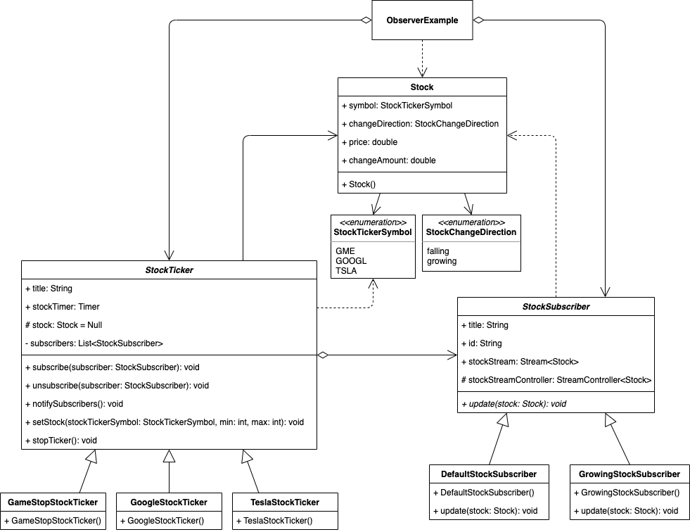
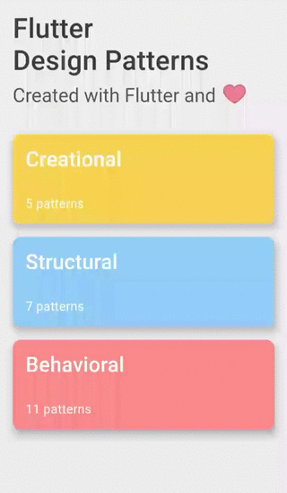

_观察者设计模式及其在 Dart 和 Flutter 中的实现概述_



:::tip
要查看所有设计模式的实际操作，请查看 [Flutter 设计模式应用程序](https://flutterdesignpatterns.com/)。
:::

## 什么是观察者设计模式？



**观察者**，也被称为 **Dependents** 或 **Publish-Subscribe**，属于行为设计模式的范畴。这种设计模式的意图在 [GoF 书籍](https://en.wikipedia.org/wiki/Design_Patterns)中被描述为：

> _在对象之间定义一对多的依赖关系，以便当一个对象改变状态时，所有依赖于它的对象都会自动接到通知并被更新。_

**剧透警告：**如果你曾经听说过响应式编程，甚至使用过相关的框架/库/工具，如 [ReactiveX](https://reactivex.io/)、[RxDart](https://pub.dev/packages/rxdart) 或仅仅是 Dart 中的基础流，这种设计模式对你来说不会是改变游戏规则的。但是，从底层了解响应式编程思想在 OOP 上下文中是如何实现的，仍然是值得的。

这种设计模式的动机来源于系统中有一系列紧密耦合对象的问题，其中一个对象的变化应该触发其他对象的变化（一对多关系）。实现这一点的一种不灵活的方式是定义一个实现其他依赖对象状态更新的对象。由于依赖混乱，这样的对象变得难以实现、维护、测试和重用。

更好的方法是实现一个发布-订阅机制，将更新事件发送给依赖对象，以便它们可以自行实现和维护更新逻辑。为了实现这一点，观察者设计模式引入了两个角色：**主题（Subject）**和**观察者（Observer）**。

主题是通知的发布者，也定义了观察者订阅/取消订阅这些通知的方式。一个主题可能有任意数量的依赖观察者 - 以一种更灵活的方式维护一对多关系的相同思想。当主题改变状态时，所有注册的观察者都会被通知并自动更新。这样，主题可以在不知道其观察者是谁的情况下触发依赖对象的更新 - 这使得主题和观察者之间的耦合松散。

让我们转到分析和实现部分，了解和学习这种模式的细节以及如何实现它！

## 分析

观察者设计模式的一般结构如下所示：



- *发布者（主题）* - 提供一个接口，用于附加和分离 _订阅者（观察者）_ 对象，包含观察者列表；
- *(可选) 具体发布者* - 存储 _具体订阅者_ 感兴趣的状态，并在状态改变时向其观察者发送通知。当只需要一种类型的 _发布者_ 时，这个类是可选的。在这种情况下，状态和通知逻辑由 _发布者_ 处理；
- *订阅者（观察者）* - 声明对象应该被通知主题中的变化的通知接口；
- *具体订阅者* - 实现 _订阅者（观察者）_ 接口，以保持其状态与主题的状态一致；
- *客户端* - 创建 _主题_ 和 _观察者_ 对象，将观察者附加到主题更新。

### 观察者 vs 中介者

如果你已经阅读了系列的上一篇或者熟悉中介者设计模式，你可能会有一种 *似曾相识* 的感觉 - 观察者设计模式不是同一回事吗？让我来解释。

中介者设计模式的主要目标是通过使用专门的中介对象处理通信部分，将对象之间的多对多关系替换为一对多关系。观察者允许在对象之间建立动态的单向连接，其中一些对象充当其他对象的下属。

如果你只有一个允许订阅其状态的中介者，这种实现基于观察者设计模式，但中介者设计模式也可以仅作为发布-订阅通信的一部分使用。现在，如果我们有多个发布者和多个订阅者（它们也可以是发布者），那么就不会有任何中介对象，只有一个分布式的观察者集合。

### 适用性

当一个对象的变化需要改变其他对象，但你不知道需要改变多少个对象以及如何改变时，应该使用观察者设计模式。该模式允许订阅此类对象事件并相应地改变依赖对象的状态。

此外，当一些对象必须观察其他对象，但只在有限的时间内时，也应该使用这种模式。订阅机制允许依赖对象按需监听更新事件，并在运行时改变这种行为。

## 实现


在实现部分，我们将使用观察者设计模式来实现一个股票市场原型。

在股票市场中，有成百上千种不同的股票。当然，并非所有的股票都与你相关，因此你可能只想订阅和跟踪特定的一些股票。

该原型允许订阅 3 种不同的股票 - GameStop (GME)、Alphabet Inc.，也就是 Google (GOOGL) 和 Tesla Motors (TSLA)。此外，有两种不同类型的订阅：

- 默认股票订阅 - 通知每次订阅的股票变化。
- 增长股票订阅 - 仅通知增长股票的变化。

使用观察者设计模式可以很容易地实现此类股票跟踪器。当然，原型仅支持 3 种不同的股票类型，但以后可以很容易地添加新的股票代码或甚至新的订阅类型，而不影响现有代码。让我们先检查类图，然后实现该模式！

### 类图

下面的类图展示了观察者设计模式的实现：



`StockTicker` 是所有特定股票代码类使用的基类。该类包含 `title`、`stockTimer` 和 `stock` 属性以及 `subscribers` 列表，并提供几种方法：

- `subscribe()` - 订阅股票代码；
- `unsubscribe()` - 从股票代码中取消订阅；
- `notifySubscribers()` - 通知订阅者关于股票变化；
- `setStock()` - 设置股票值；
- `stopTicker()` - 停止股票事件发出的定时器。

`GameStopStockTicker`、`GoogleStockTicker` 和 `TeslaStockTicker` 是扩展抽象类 `StockTicker` 的具体股票代码类。

`Stock` 类包含 `symbol`、`changeDirection`、`price` 和 `changeAmount` 属性，用于存储有关股票的信息。

`StockTickerSymbol` 是一个枚举类，定义了支持的股票代码符号 - GME、GOOGL 和 TSLA。

`StockChangeDirection` 是一个枚举类，定义了股票变化方向 - 增长和下跌。

`StockSubscriber` 是用作所有特定股票订阅者类的基类的抽象类。该类包含 `title`、`id` 和 `stockStreamController` 属性、`stockStream` 获取器，并定义了抽象的 `update()` 方法来更新订阅者状态。

`DefaultStockSubscriber` 和 `GrowingStockSubscriber` 是扩展抽象类 `StockSubscriber` 的具体股票订阅者类。

### StockTicker

为所有特定股票代码类实现方法的基类。`title` 属性在 UI 中用于股票代码选择，`stockTimer` 定期发出新的股票值，该值通过使用 `setStock()` 方法存储在股票属性中。该类还存储了可以订阅股票代码并通过使用 `subscribe()` 和 `unsubscribe()` 分别从中取消订阅的股票订阅者列表。通过调用 `notifySubscribers()` 方法通知股票代码订阅者值变化。可以通过调用 `stopTicker()` 方法停止股票定时器。

```dart title="stock_ticker.dart"
base class StockTicker {
  late final String title;
  late final Timer stockTimer;

  @protected
  Stock? stock;

  final _subscribers = <StockSubscriber>[];

  void subscribe(StockSubscriber subscriber) => _subscribers.add(subscriber);

  void unsubscribe(StockSubscriber subscriber) =>
      _subscribers.removeWhere((s) => s.id == subscriber.id);

  void notifySubscribers() {
    for (final subscriber in _subscribers) {
      subscriber.update(stock!);
    }
  }

  void setStock(StockTickerSymbol stockTickerSymbol, int min, int max) {
    final lastStock = stock;
    final price = faker.randomGenerator.integer(max, min: min) / 100;
    final changeAmount = lastStock != null ? price - lastStock.price : 0.0;

    stock = Stock(
      changeAmount: changeAmount.abs(),
      changeDirection: changeAmount > 0
          ? StockChangeDirection.growing
          : StockChangeDirection.falling,
      price: price,
      symbol: stockTickerSymbol,
    );
  }

  void stopTicker() => stockTimer.cancel();
}
```

### Concrete stock ticker classes

所有特定股票代码类扩展了抽象的 `StockTicker` 类。

`GameStopStockTicker` - GameStop 股票的股票代码，每 2 秒发出一个新的股票事件。

```dart title="gamestop_stock_ticker.dart"
final class GameStopStockTicker extends StockTicker {
  GameStopStockTicker() {
    title = StockTickerSymbol.GME.name;
    stockTimer = Timer.periodic(
      const Duration(seconds: 2),
      (_) {
        setStock(StockTickerSymbol.GME, 16000, 22000);
        notifySubscribers();
      },
    );
  }
}
```

`GoogleStockTicker` - Google 股票的股票代码，每 5 秒发出一个新的股票事件。

```dart title="google_stock_ticker.dart"
final class GoogleStockTicker extends StockTicker {
  GoogleStockTicker() {
    title = StockTickerSymbol.GOOGL.name;
    stockTimer = Timer.periodic(
      const Duration(seconds: 5),
      (_) {
        setStock(StockTickerSymbol.GOOGL, 200000, 204000);
        notifySubscribers();
      },
    );
  }
}
```

`TeslaStockTicker` - Tesla 股票的股票代码，每 3 秒发出一个新的股票事件。

```dart title="tesla_stock_ticker.dart"
final class TeslaStockTicker extends StockTicker {
  TeslaStockTicker() {
    title = StockTickerSymbol.TSLA.name;
    stockTimer = Timer.periodic(
      const Duration(seconds: 3),
      (_) {
        setStock(StockTickerSymbol.TSLA, 60000, 65000);
        notifySubscribers();
      },
    );
  }
}
```

### Stock

一个简单的类用于存储股票信息。`Stock` 类包含股票代码符号、股票变化方向、当前价格和变化量的数据。

```dart title="stock.dart"
class Stock {
  const Stock({
    required this.symbol,
    required this.changeDirection,
    required this.price,
    required this.changeAmount,
  });

  final StockTickerSymbol symbol;
  final StockChangeDirection changeDirection;
  final double price;
  final double changeAmount;
}
```

### StockTickerSymbol

一个特殊的类 - *枚举* - 用来定义支持的股票代码符号。

```dart title="stock_ticker_symbol.dart"
enum StockTickerSymbol {
  GME,
  GOOGL,
  TSLA,
}
```

### StockChangeDirection

一个特殊的类 - *枚举* - 用来定义股票变化方向。

```dart title="stock_change_direction.dart"
enum StockChangeDirection {
  falling,
  growing,
}
```

### StockSubscriber

一个抽象类，包含所有特定股票代码类的基本属性。属性 `title` 用于 UI 中的股票订阅者选择，`id` 唯一标识订阅者。
更新的股票值被添加到 `stockStreamController` 并通过 `stockStream` 发出。抽象方法 `update()` 被定义，所有具体的股票订阅者类必须实现。

```dart title="stock_subscriber.dart"
abstract class StockSubscriber {
  late final String title;

  final id = faker.guid.guid();

  @protected
  final StreamController<Stock> stockStreamController =
      StreamController.broadcast();

  Stream<Stock> get stockStream => stockStreamController.stream;

  void update(Stock stock);
}
```

### Concrete stock subscriber classes

`DefaultStockSubscriber` - 一个默认的股票订阅者，在更新时发出每一个股票变化。

```dart title="default_stock_subscriber.dart"
class DefaultStockSubscriber extends StockSubscriber {
  DefaultStockSubscriber() {
    title = 'All stocks';
  }

  @override
  void update(Stock stock) {
    stockStreamController.add(stock);
  }
}
```

`GrowingStockSubscriber` - 一个增长股票订阅者，仅在更新时发出增长的股票变化。

```dart title="growing_stock_subscriber.dart"
class GrowingStockSubscriber extends StockSubscriber {
  GrowingStockSubscriber() {
    title = 'Growing stocks';
  }

  @override
  void update(Stock stock) {
    if (stock.changeDirection == StockChangeDirection.growing) {
      stockStreamController.add(stock);
    }
  }
}
```

## Example

首先，一个 markdown 文件被准备并作为模式的描述提供：


`ObserverExample` 包含一个 `StockSubscriber` 列表以及一个 `StockTickerModel` 对象列表（带有用户是否订阅股票代码标志的特定 `StockTicker` 类）。

```dart title="observer_example.dart"
class ObserverExample extends StatefulWidget {
  const ObserverExample();

  @override
  _ObserverExampleState createState() => _ObserverExampleState();
}

class _ObserverExampleState extends State<ObserverExample> {
  final _stockSubscriberList = <StockSubscriber>[
    DefaultStockSubscriber(),
    GrowingStockSubscriber(),
  ];
  final _stockTickers = <StockTickerModel>[
    StockTickerModel(stockTicker: GameStopStockTicker()),
    StockTickerModel(stockTicker: GoogleStockTicker()),
    StockTickerModel(stockTicker: TeslaStockTicker()),
  ];
  final _stockEntries = <Stock>[];

  StreamSubscription<Stock>? _stockStreamSubscription;
  StockSubscriber _subscriber = DefaultStockSubscriber();
  var _selectedSubscriberIndex = 0;

  @override
  void initState() {
    super.initState();

    _stockStreamSubscription = _subscriber.stockStream.listen(_onStockChange);
  }

  @override
  void dispose() {
    for (final ticker in _stockTickers) {
      ticker.stockTicker.stopTicker();
    }

    _stockStreamSubscription?.cancel();

    super.dispose();
  }

  void _onStockChange(Stock stock) => setState(() => _stockEntries.add(stock));

  void _setSelectedSubscriberIndex(int? index) {
    for (final ticker in _stockTickers) {
      if (ticker.subscribed) {
        ticker.toggleSubscribed();
        ticker.stockTicker.unsubscribe(_subscriber);
      }
    }

    _stockStreamSubscription?.cancel();

    setState(() {
      _stockEntries.clear();
      _selectedSubscriberIndex = index!;
      _subscriber = _stockSubscriberList[_selectedSubscriberIndex];
      _stockStreamSubscription = _subscriber.stockStream.listen(_onStockChange);
    });
  }

  void _toggleStockTickerSelection(int index) {
    final stockTickerModel = _stockTickers[index];
    final stockTicker = stockTickerModel.stockTicker;

    if (stockTickerModel.subscribed) {
      stockTicker.unsubscribe(_subscriber);
    } else {
      stockTicker.subscribe(_subscriber);
    }

    setState(() => stockTickerModel.toggleSubscribed());
  }

  @override
  Widget build(BuildContext context) {
    return ScrollConfiguration(
      behavior: const ScrollBehavior(),
      child: SingleChildScrollView(
        padding: const EdgeInsets.symmetric(
          horizontal: LayoutConstants.paddingL,
        ),
        child: Column(
          children: <Widget>[
            StockSubscriberSelection(
              stockSubscriberList: _stockSubscriberList,
              selectedIndex: _selectedSubscriberIndex,
              onChanged: _setSelectedSubscriberIndex,
            ),
            StockTickerSelection(
              stockTickers: _stockTickers,
              onChanged: _toggleStockTickerSelection,
            ),
            Column(
              children: [
                for (final stock in _stockEntries.reversed)
                  StockRow(stock: stock)
              ],
            )
          ],
        ),
      ),
    );
  }
}
```

通过使用 `StockSubscriberSelection` 小部件，可以轻松更改特定订阅者类。同样，`StockTickerSelection` 允许在运行时轻松订阅/取消订阅特定的股票代码。



正如你在示例中看到的，订阅类型可以在运行时轻松更改，你可以随时开始和停止跟踪特定的股票。

所有关于观察者设计模式及其示例实现的代码更改可以在[这里](https://github.com/mkobuolys/flutter-design-patterns/pull/29)找到。

要查看模式的实际效果，请查看 [交互式观察者示例](https://flutterdesignpatterns.com/pattern/observer)。
