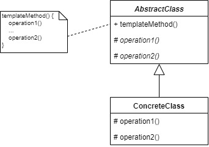

_模板方法设计模式及其在 Dart 和 Flutter 中的实现概述_


要查看所有设计模式的实际应用，请查看[Flutter 设计模式应用程序。](https://flutterdesignpatterns.com/).

## 模板方法设计模式是什么？

**模板方法** 是一种**行为型**设计模式，在 [GoF 书籍](https://en.wikipedia.org/wiki/Design_Patterns)中的描述是这样的：

> _在操作中定义一个算法的框架，将一些步骤推迟到子类中。模板方法允许子类重新定义算法的某些步骤，而不改变算法的结构。_

模板方法是代码重用的基本技术。假设你有一个由多个步骤组成的算法：

1. 从某种数据源读取数据；
2. 处理数据；
3. 提供计算结果。

在一个案例中，你希望从第三方 API 获取数据，处理数据并在控制台窗口中提供结果。在另一个案例中，你想从本地磁盘驱动器中的文件读取数据，处理数据并通过电子邮件发送格式化后的结果文档。尽管这两种案例之间存在差异，这些算法共享相同的结构 - 读取、处理数据和提供结果。这就是模板方法设计模式的用处 - 当你需要允许更改算法的每个步骤或某些步骤的细节时，同时强制执行步骤本身的结构和顺序。问题在于，如何定义这种模板？

## 分析

下面的类图展示了模板方法设计模式的一般结构：



- _AbstractClass_ - 包含一个 _templateMethod()_ 操作，定义了一个算法的框架。模板方法调用原始操作以及在 _AbstractClass_ 中或其他对象中定义的操作。
- *ConcreteClass* - 依赖于 _AbstractClass_ 来实现算法的不变步骤。

### 模板方法操作类型

模板方法调用的不同种类的操作包括：

- *原始操作* - 必须由子类实现的抽象操作；提供默认实现且必要时**可以**由子类重新定义的具体操作。
- *最终操作* - 子类**不能**重写的具体操作。
- *钩子操作* - 提供默认行为且必要时子类**可以**扩展的具体操作。钩子操作通常默认什么都不做。
- _模板方法_ 本身**可以**被声明为最终的，以便不能被子类重写。

_注意：模板方法需要指定哪些操作是钩子，哪些是抽象操作。为此，你可以通过为它们的名称添加前缀来标识应该被重写的操作，例如 MacApp 框架为模板方法名称添加 "Do-" 前缀。_

### 好莱坞原则


好莱坞原则简单来说是：

> _不要打电话给我们，我们会打电话给你！_

这个声明如何与模板方法相关？模板方法的基类被视为高级组件 - 客户端或算法的具体实现应该依赖于它。模板的子类是低级组件 - 它们自己不调用任何东西，只被高级模板方法调用。这描述了高级和低级组件之间的关系 - 抽象不应该依赖于细节，但细节应该依赖于抽象（依赖倒置原则，[**SOLID**](https://en.wikipedia.org/wiki/SOLID)原则中的字母**D**）。因此，模板方法设计模式可以说 _低级组件不会打电话给我们，我们会打电话给它们！_

### 适用性

当我们想要一次性实现算法的不变部分，并让派生类实现可能变化的步骤时，应该使用模板方法设计模式。此外，当我们想要提取类之间的通用逻辑以避免代码重复时，该模式也很有用（**DRY**原则 - **D**on't **R**epeat **Y**ourself）。

## 实现


假设在 Flutter 应用程序中，我们想要创建一个计算学生体质指数 (BMI) 的算法。该算法检索学生数据，应用学生过滤（如果需要），计算他们的 BMI 并提供结果。此外，我们想要从不同的数据源检索学生信息，并且我们想要有一个单独的算法，仅包括青少年学生进行计算。正如你所看到的，算法的结构是通用的，但实现细节（算法步骤）在不同的实现之间有所不同。为了实现这个算法，我们将使用模板方法设计模式。

### 类图

下面的类图展示了模板方法设计模式的实现：


类图中的主要类是 `StudentsBmiCalculator`。其主要目的是定义 BMI 计算算法的模板，该算法通过 `calculateBmiAndReturnStudentList()` 方法返回 `Student` 对象列表（为每个学生计算的 BMI）作为结果。这个抽象类被用作学生 BMI 计算算法具体实现的模板（基类） - `StudentsXmlBmiCalculator`、`StudentsJsonBmiCalculator` 和 `TeenageStudentsJsonBmiCalculator`。`StudentsXmlBmiCalculator` 使用 `XmlStudentsApi` 检索学生信息作为 XML 字符串，并通过重写的 `getStudentsData()` 方法返回 `Student` 对象列表。另外两个实现（`StudentsJsonBmiCalculator` 和 `TeenageStudentsJsonBmiCalculator`）使用 `JsonStudentsApi` 以 JSON 格式检索学生信息，并通过重写的 `getStudentsData()` 方法返回解析后的数据。然而，`TeenageStudentsJsonBmiCalculator` 还重新实现（重写）了 `doStudentsFiltering()` 钩子方法，以在计算 BMI 值之前过滤掉非青少年学生。`StudentsSection` UI 小部件使用 `StudentsBmiCalculator` 抽象来检索和展示 `TemplateMethodExample` 小部件中计算的结果。

_注意：将 XML 或 JSON 解析逻辑从具体计算类中的 `getStudentsData()` 方法中提取到单独的类中使用适配器设计模式会更有意义，但为了演示模板方法模式，并展示 `getStudentsData()` 在 `StudentsXmlBmiCalculator` 的派生类中的实现可能不同，我决定现在保留逻辑。_

### StudentsBmiCalculator

用于BMI计算算法的抽象（模板）类。

```dart title="students_bmi_calculator.dart"
abstract class StudentsBmiCalculator {
  const StudentsBmiCalculator();

  List<Student> calculateBmiAndReturnStudentList() {
    var studentList = getStudentsData();
    studentList = doStudentsFiltering(studentList);
    _calculateStudentsBmi(studentList);
    return studentList;
  }

  void _calculateStudentsBmi(List<Student> studentList) {
    for (final student in studentList) {
      student.bmi = _calculateBmi(student.height, student.weight);
    }
  }

  double _calculateBmi(double height, int weight) {
    return weight / math.pow(height, 2);
  }

  // Hook methods
  @protected
  List<Student> doStudentsFiltering(List<Student> studentList) {
    return studentList;
  }

  // Abstract methods
  @protected
  List<Student> getStudentsData();
}
```

以下是算法的几个步骤：

1. 检索学生数据 - `getStudentsData()`;
2. 进行学生筛选（如果需要） - `doStudentsFiltering()`;
3. 为每个学生计算BMI - `_calculateStudentsBmi()`;
4. 返回学生数据 - `return studentList`.

第一步是强制性的，并且应在每个具体的学生BMI计算器实现中实现 - 即`getStudentsData()`方法是抽象的，必须在派生类中重写（primitive 操作）。学生筛选步骤是可选的，但可以在派生类中重写。因此，`doStudentsFiltering()`方法具有默认实现，默认情况下不更改算法的工作流程（hook 操作）。其他步骤在算法的模板中定义，对所有实现都通用，并且不能更改（final 操作）。

### StudentsXmlBmiCalculator

一个使用`XmlStudentsApi`检索数据并实现`getStudentsData()`方法的BMI计算算法的具体实现。

```dart title="students_xml_bmi_calculator.dart"
class StudentsXmlBmiCalculator extends StudentsBmiCalculator {
  const StudentsXmlBmiCalculator({
    this.api = const XmlStudentsApi(),
  });

  final XmlStudentsApi api;

  @override
  @protected
  List<Student> getStudentsData() {
    final studentsXml = api.getStudentsXml();
    final xmlDocument = XmlDocument.parse(studentsXml);
    final studentsList = <Student>[];

    for (final xmlElement in xmlDocument.findAllElements('student')) {
      final fullName = xmlElement.findElements('fullname').single.innerText;
      final age = int.parse(xmlElement.findElements('age').single.innerText);
      final height =
          double.parse(xmlElement.findElements('height').single.innerText);
      final weight =
          int.parse(xmlElement.findElements('weight').single.innerText);

      studentsList.add(
        Student(
          fullName: fullName,
          age: age,
          height: height,
          weight: weight,
        ),
      );
    }

    return studentsList;
  }
}
```

### StudentsJsonBmiCalculator

一个具体的BMI计算算法实现，它使用`JsonStudentsApi`来检索数据并实现了`getStudentsData()`方法。

```dart title="students_json_bmi_calculator.dart"
class StudentsJsonBmiCalculator extends StudentsBmiCalculator {
  const StudentsJsonBmiCalculator({
    this.api = const JsonStudentsApi(),
  });

  final JsonStudentsApi api;

  @override
  @protected
  List<Student> getStudentsData() {
    final studentsJson = api.getStudentsJson();
    final studentsMap = json.decode(studentsJson) as Map<String, dynamic>;
    final studentsJsonList = studentsMap['students'] as List;
    final studentsList = studentsJsonList.map((json) {
      final studentJson = json as Map<String, dynamic>;

      return Student(
        fullName: studentJson['fullName'] as String,
        age: studentJson['age'] as int,
        height: studentJson['height'] as double,
        weight: studentJson['weight'] as int,
      );
    }).toList();

    return studentsList;
  }
}
```

### TeenageStudentsJsonBmiCalculator

使用`JsonStudentsApi`检索数据并实现`getStudentsData()`方法的BMI计算算法的具体实现。

```dart title="teenage_students_json_bmi_calculator.dart"
class TeenageStudentsJsonBmiCalculator extends StudentsBmiCalculator {
  const TeenageStudentsJsonBmiCalculator({
    this.api = const JsonStudentsApi(),
  });

  final JsonStudentsApi api;

  @override
  @protected
  List<Student> getStudentsData() {
    final studentsJson = api.getStudentsJson();
    final studentsMap = json.decode(studentsJson) as Map<String, dynamic>;
    final studentsJsonList = studentsMap['students'] as List;
    final studentsList = studentsJsonList.map((json) {
      final studentJson = json as Map<String, dynamic>;

      return Student(
        fullName: studentJson['fullName'] as String,
        age: studentJson['age'] as int,
        height: studentJson['height'] as double,
        weight: studentJson['weight'] as int,
      );
    }).toList();

    return studentsList;
  }

  @override
  @protected
  List<Student> doStudentsFiltering(List<Student> studentList) {
    return studentList
        .where((student) => student.age > 12 && student.age < 20)
        .toList();
  }
}
```

此外，`doStudentsFiltering()`钩子方法已被重写，以过滤掉非青少年学生。

### Student

一个简单的用于存储学生信息的类。

```dart title="student.dart"
class Student {
  final String fullName;
  final int age;
  final double height;
  final int weight;
  late final double bmi;

  Student({
    required this.fullName,
    required this.age,
    required this.height,
    required this.weight,
  });
}
```

### JsonStudentsApi

一个虚拟的API，以JSON字符串形式返回学生信息。

```dart title="json_students_api.dart"
class JsonStudentsApi {
  static const _studentsJson = '''
  {
    "students": [
      {
        "fullName": "John Doe (JSON)",
        "age": 12,
        "height": 1.62,
        "weight": 53
      },
      {
        "fullName": "Emma Doe (JSON)",
        "age": 15,
        "height": 1.55,
        "weight": 50
      },
      {
        "fullName": "Michael Roe (JSON)",
        "age": 18,
        "height": 1.85,
        "weight": 89
      },
      {
        "fullName": "Emma Roe (JSON)",
        "age": 20,
        "height": 1.66,
        "weight": 79
      }
    ]
  }
  ''';

  const JsonStudentsApi();

  String getStudentsJson() => _studentsJson;
}
```

### XmlStudentsApi

一个虚拟的API，以XML字符串形式返回学生信息。

```dart title="xml_students_api.dart"
class XmlStudentsApi {
  static const _studentsXml = '''
  <?xml version="1.0"?>
  <students>
    <student>
      <fullname>John Doe (XML)</fullname>
      <age>12</age>
      <height>1.62</height>
      <weight>53</weight>
    </student>
    <student>
      <fullname>Emma Doe (XML)</fullname>
      <age>15</age>
      <height>1.55</height>
      <weight>50</weight>
    </student>
    <student>
      <fullname>Michael Roe (XML)</fullname>
      <age>18</age>
      <height>1.85</height>
      <weight>89</weight>
    </student>
    <student>
      <fullname>Emma Roe (XML)</fullname>
      <age>20</age>
      <height>1.66</height>
      <weight>79</weight>
    </student>
  </students>
  ''';

  const XmlStudentsApi();

  String getStudentsXml() => _studentsXml;
}
```

## Example

首先，准备并提供一个Markdown文件作为模式说明的样本。


示例本身使用`StudentsSection`组件，该组件要求通过构造函数提供特定类型的BMI计算器`StudentsBmiCalculator`。对于此示例，我们注入了三种不同的BMI计算器实现（`StudentsXmlBmiCalculator`、`StudentsJsonBmiCalculator`和`TeenageStudentsJsonBmiCalculator`），它们都扩展了相同的模板（基类）`StudentsBmiCalculator`，分别用于三个不同的`StudentsSection`小部件。

```dart title="template_method_example.dart"
class TemplateMethodExample extends StatelessWidget {
  const TemplateMethodExample();

  @override
  Widget build(BuildContext context) {
    return const ScrollConfiguration(
      behavior: ScrollBehavior(),
      child: SingleChildScrollView(
        padding: EdgeInsets.symmetric(
          horizontal: LayoutConstants.paddingL,
        ),
        child: Column(
          crossAxisAlignment: CrossAxisAlignment.start,
          children: <Widget>[
            StudentsSection(
              bmiCalculator: StudentsXmlBmiCalculator(),
              headerText: 'Students from XML data source:',
            ),
            SizedBox(height: LayoutConstants.spaceL),
            StudentsSection(
              bmiCalculator: StudentsJsonBmiCalculator(),
              headerText: 'Students from JSON data source:',
            ),
            SizedBox(height: LayoutConstants.spaceL),
            StudentsSection(
              bmiCalculator: TeenageStudentsJsonBmiCalculator(),
              headerText: 'Students from JSON data source (teenagers only):',
            ),
          ],
        ),
      ),
    );
  }
}
```

`StudentsSection`使用注入的`StudentsBmiCalculator`类型的BMI计算器。只要它使用（扩展）了相同的模板（基类），小部件就不会关心BMI计算器的具体实现。这使我们能够提供不同的学生BMI计算算法/实现，而无需对UI代码进行任何更改。

```dart title="students_section.dart"
class StudentsSection extends StatefulWidget {
  final StudentsBmiCalculator bmiCalculator;
  final String headerText;

  const StudentsSection({
    required this.bmiCalculator,
    required this.headerText,
  });

  @override
  _StudentsSectionState createState() => _StudentsSectionState();
}

class _StudentsSectionState extends State<StudentsSection> {
  final List<Student> students = [];

  void _calculateBmiAndGetStudentsData() {
    setState(() {
      students.addAll(widget.bmiCalculator.calculateBmiAndReturnStudentList());
    });
  }

  @override
  Widget build(BuildContext context) {
    return Column(
      crossAxisAlignment: CrossAxisAlignment.start,
      children: <Widget>[
        Text(widget.headerText),
        const SizedBox(height: LayoutConstants.spaceM),
        AnimatedSwitcher(
          duration: const Duration(milliseconds: 500),
          child: _StudentsSectionContent(
            students: students,
            onPressed: _calculateBmiAndGetStudentsData,
          ),
        ),
      ],
    );
  }
}

class _StudentsSectionContent extends StatelessWidget {
  final List<Student> students;
  final VoidCallback onPressed;

  const _StudentsSectionContent({
    required this.students,
    required this.onPressed,
  });

  @override
  Widget build(BuildContext context) {
    return students.isEmpty
        ? PlatformButton(
            materialColor: Colors.black,
            materialTextColor: Colors.white,
            onPressed: onPressed,
            text: "Calculate BMI and get students' data",
          )
        : StudentsDataTable(
            students: students,
          );
  }
}
```

模板方法实现的最终结果如下：


所有关于模板方法设计模式及其示例实现的代码更改都可以在[此处](https://github.com/mkobuolys/flutter-design-patterns/pull/4)找到。

要查看该模式的实际运行情况，请查看[交互式模板方法示例](https://flutterdesignpatterns.com/pattern/template-method)。
