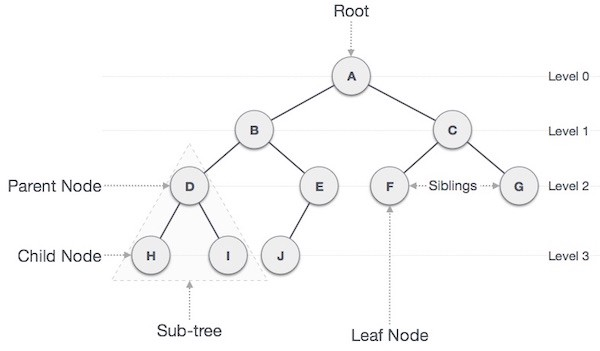

_组合设计模式概述及其在Dart和Flutter中的实现_


要查看所有设计模式的实际应用，请查看[Flutter 设计模式应用程序。](https://flutterdesignpatterns.com/).

## 什么是组合设计模式？


**组合设计模式**是**结构型**设计模式之一。它在[GoF书](https://en.wikipedia.org/wiki/Design_Patterns)中的目的描述如下：

> _将对象组合成树形结构，以表示部分-整体层次结构。组合允许客户端统一地对待单个对象和对象组合。_

要理解组合设计模式，您应该熟悉树数据结构：



简单来说，树数据结构由**节点**（元素）和**边**（节点之间的关系）组成。每个节点可以有多个**子节点**，但每个子节点只能有一个**父节点**。**根节点**是树的基础，没有父节点。**叶子节点**是树节点，没有任何子节点。在组合设计模式的上下文中，我们使用两种类型的节点 - **叶子**（一个组件，没有子组件）和**组合**（一个组件，包含一个或多个子组件）。基本上，任何层次化的数据都可以表示为树结构并存储。主要问题在于如何在代码中实现这种结构？一个非常不灵活的方法是以不同方式定义叶子和组合对象，并通过为其指定特定的逻辑、接口来将组合对象视为叶子对象的容器。这会导致客户端需要以不同的方式处理叶子和组合对象的问题，特别是当动态构建数据结构时，使代码变得非常复杂。这是为什么使用组合设计模式的主要原因之一 - 定义一个表示叶子和组合对象的抽象类（接口也可以），从而使客户端能够以相同的方式处理树结构的每个元素。

这听起来不是很熟悉吗？"在Flutter中，一切都是小部件！"，“Flutter小部件树”，不是吗？Flutter框架将应用的UI构建为小部件树，并允许您将小部件放入其他小部件或其容器中（包含_children_属性的小部件，例如`Column`，`Row`，`ListView`等）。这几乎是组合设计模式，嗯，加强版，并带有一些额外的Flutter魔法...

## 分析

组合设计模式的一般结构如下：


- *组件* - 声明组合中对象的接口。此接口允许客户端统一地对待叶子和组合对象。
- *叶子* - 表示组合中的叶子对象。此对象没有子元素（子组件），为组合中的原始对象定义行为，因为它们没有可以委派工作的对象。
- *组合* - 存储子元素（子组件）并在_Composite_接口中实现与子元素相关的操作。与_leaf_组件不同，_composite_对象将工作委派给其子元素，处理中间结果，然后将最终结果返回给客户端。
- *客户端* - 使用_Component_接口与组合结构中的对象交互。这使客户端能够以相同的方式处理树的简单和复杂元素。

### 适用性

组合设计模式应该用于表示对象的部分-整体层次结构，并且要求客户端能够忽略对象组合和个体对象之间的差异。在我看来，此模式的最难部分是确定何时何地可以在代码库中应用它。一个常规的经验法则是 - 如果您有一组组或集合，这很大程度上表明您可以使用组合设计模式。更容易检测的情况是 - 您使用了树结构。在这种情况下，您应该考虑在哪里可以应用该模式，以使与此数据结构的工作变得更容易。如果您在代码中检测到这些情况，那么只剩下实现细节，我将在下面描述。

## 实现

这次，设计模式的实现更具可视化效果（终于！），并在Flutter上下文中更有意义（是的，我考虑到了您的反馈，所以不要犹豫分享有关系列的见解 - 这可以帮助我大大提高内容的质量！）。假设我们想要表示文件系统的结构。文件系统由各种类型的目录和文件组成：音频、视频、图像、文本文件等。文件存储在目录中，同时目录也可以存储在其他目录中。例如，我们的文件结构可能如下所示：


此外，我们希望显示每个文件或目录的大小。对于具体文件，很容易显示其大小，但是目录大小取决于其中的项目，因此需要进行计算。为了实现这一点，组合设计模式是一个很好的选择！

### 类图

以下类图显示了组合设计模式的实现：


`IFile`定义了`File`（叶子）和`Directory`（组合）类的通用接口：

- `getSize()` - 返回文件的大小；
- `render()` - 渲染组件的UI。

`File`类实现了`getSize()`和`render()`方法，还包含了`title`、`size`和`icon`属性。`Directory`实现了相同的必需方法，但它还包含标题、`isInitiallyExpanded`和`files`列表，包含`IFile`对象，并定义了`addFile()`方法，允许将`IFile`对象添加到目录（文件列表）中。`AudioFile`、`ImageFile`、`TextFile`和`VideoFile`类扩展了`File`类，以指定文件类型。

### IFile

定义由叶子和组合组件实现的方法的接口。

```dart title="ifile.dart"
abstract interface class IFile {
  int getSize();
  Widget render(BuildContext context);
}
```

### File

实现了`IFile`接口的具体实现，与组合设计模式中的叶子类匹配。在`File`类中，`getSize()`方法简单地返回文件大小，而`render()`方法返回文件的UI小部件，该小部件在示例屏幕中使用。

```dart title="file.dart"
base class File extends StatelessWidget implements IFile {
  final String title;
  final int size;
  final IconData icon;

  const File({
    required this.title,
    required this.size,
    required this.icon,
  });

  @override
  int getSize() => size;

  @override
  Widget render(BuildContext context) {
    return Padding(
      padding: const EdgeInsets.only(left: LayoutConstants.paddingS),
      child: ListTile(
        title: Text(
          title,
          style: Theme.of(context).textTheme.bodyLarge,
        ),
        leading: Icon(icon),
        trailing: Text(
          FileSizeConverter.bytesToString(size),
          style: Theme.of(context)
              .textTheme
              .bodyMedium
              ?.copyWith(color: Colors.black54),
        ),
        dense: true,
      ),
    );
  }

  @override
  Widget build(BuildContext context) => render(context);
}
```

### 扩展`File`的具体类

所有这些类都扩展了`File`类，并通过为相应的文件类型提供唯一的图标来指定具体的文件类型。

```dart title="audio_file.dart"
final class AudioFile extends File {
  const AudioFile({
    required super.title,
    required super.size,
  }) : super(icon: Icons.music_note);
}
```

```dart title="image_file.dart"
final class ImageFile extends File {
  const ImageFile({
    required super.title,
    required super.size,
  }) : super(icon: Icons.image);
}
```

```dart title="text_file.dart"
final class TextFile extends File {
  const TextFile({
    required super.title,
    required super.size,
  }) : super(icon: Icons.description);
}
```

```dart title="video_file.dart"
final class VideoFile extends File {
  const VideoFile({
    required super.title,
    required super.size,
  }) : super(icon: Icons.movie);
}
```

### Directory

实现了`IFile`接口的具体实现，与组合设计模式中的`composite`类匹配。与`File`类类似，`render()`返回目录的UI小部件，该小部件在示例屏幕中使用。但是，在此类中， `getSize()`方法通过调用`files`列表中每个项目的`getSize()`方法并添加结果来计算目录大小。这是组合设计模式的主要思想，它允许组合类以相同的方式处理包含列表中的所有元素，只要它们实现了相同的接口。

```dart title="directory.dart"
class Directory extends StatelessWidget implements IFile {
  final String title;
  final bool isInitiallyExpanded;

  final List<IFile> files = [];

  Directory(this.title, {this.isInitiallyExpanded = false});

  void addFile(IFile file) => files.add(file);

  @override
  int getSize() {
    var sum = 0;

    for (final file in files) {
      sum += file.getSize();
    }

    return sum;
  }

  @override
  Widget render(BuildContext context) {
    return Theme(
      data: ThemeData(
        colorScheme: ColorScheme.fromSwatch().copyWith(primary: Colors.black),
      ),
      child: Padding(
        padding: const EdgeInsets.only(left: LayoutConstants.paddingS),
        child: ExpansionTile(
          leading: const Icon(Icons.folder),
          title: Text('$title (${FileSizeConverter.bytesToString(getSize())})'),
          initiallyExpanded: isInitiallyExpanded,
          children: files.map((IFile file) => file.render(context)).toList(),
        ),
      ),
    );
  }

  @override
  Widget build(BuildContext context) => render(context);
}
```

### FileSizeConverter

为了以更吸引人的格式表示文件大小，创建了`FileSizeConverter`助手类，该助手类提供了一个名为`bytesToString()`的静态方法，该方法将文件大小的值从字节转换为人类可读的文本。

```dart title="file_size_converter.dart"
class FileSizeConverter {
  const FileSizeConverter._();

  static String bytesToString(int bytes) {
    final sizes = ['B', 'KB', 'MB', 'GB', 'TB'];
    var len = bytes.toDouble();
    var order = 0;

    while (len >= 1024 && order++ < sizes.length - 1) {
      len /= 1024;
    }

    return '${len.toStringAsFixed(2)} ${sizes[order]}';
  }
}
```

## Example

首先，准备并提供了一个Markdown文件作为模式的描述：


`CompositeExample`小部件包含`buildMediaDirectory()`方法，用于构建示例的文件结构。这个方法演示了组合设计模式 - 即使组件的类型不同，它们可以以相同的方式处理，因为所有组件都实现了`IFile`接口。这允许我们将`Directory`对象放入其他目录中，与具体的`File`对象混合使用，从而构建`IFile`组件的树形结构。

```dart title="composite_example.dart"
class CompositeExample extends StatelessWidget {
  const CompositeExample();

  Widget _buildMediaDirectory() {
    final musicDirectory = Directory('Music')
      ..addFile(const AudioFile(title: 'Darude - Sandstorm.mp3', size: 2612453))
      ..addFile(const AudioFile(title: 'Toto - Africa.mp3', size: 3219811))
      ..addFile(
        const AudioFile(
          title: 'Bag Raiders - Shooting Stars.mp3',
          size: 3811214,
        ),
      );

    final moviesDirectory = Directory('Movies')
      ..addFile(const VideoFile(title: 'The Matrix.avi', size: 951495532))
      ..addFile(
        const VideoFile(title: 'The Matrix Reloaded.mp4', size: 1251495532),
      );

    final catPicturesDirectory = Directory('Cats')
      ..addFile(const ImageFile(title: 'Cat 1.jpg', size: 844497))
      ..addFile(const ImageFile(title: 'Cat 2.jpg', size: 975363))
      ..addFile(const ImageFile(title: 'Cat 3.png', size: 1975363));

    final picturesDirectory = Directory('Pictures')
      ..addFile(catPicturesDirectory)
      ..addFile(const ImageFile(title: 'Not a cat.png', size: 2971361));

    final mediaDirectory = Directory('Media', isInitiallyExpanded: true)
      ..addFile(musicDirectory)
      ..addFile(musicDirectory)
      ..addFile(moviesDirectory)
      ..addFile(picturesDirectory)
      ..addFile(Directory('New Folder'))
      ..addFile(
        const TextFile(title: 'Nothing suspicious there.txt', size: 430791),
      )
      ..addFile(const TextFile(title: 'TeamTrees.txt', size: 104));

    return mediaDirectory;
  }

  @override
  Widget build(BuildContext context) {
    return ScrollConfiguration(
      behavior: const ScrollBehavior(),
      child: SingleChildScrollView(
        padding: const EdgeInsets.symmetric(
          horizontal: LayoutConstants.paddingL,
        ),
        child: _buildMediaDirectory(),
      ),
    );
  }
}
```

组合设计模式的最终实现结果如下：


正如您在示例中所看到的，直接显示了每个文件的文件大小，而对于目录，它是通过将目录内每个文件的大小相加来计算的。

您可以在此处找到组合设计模式及其示例实现的所有代码更改[here](https://github.com/mkobuolys/flutter-design-patterns/pull/5)。

要查看该模式的实际运行效果，请查看交互式组合示例[interactive Composite example](https://flutterdesignpatterns.com/pattern/composite).