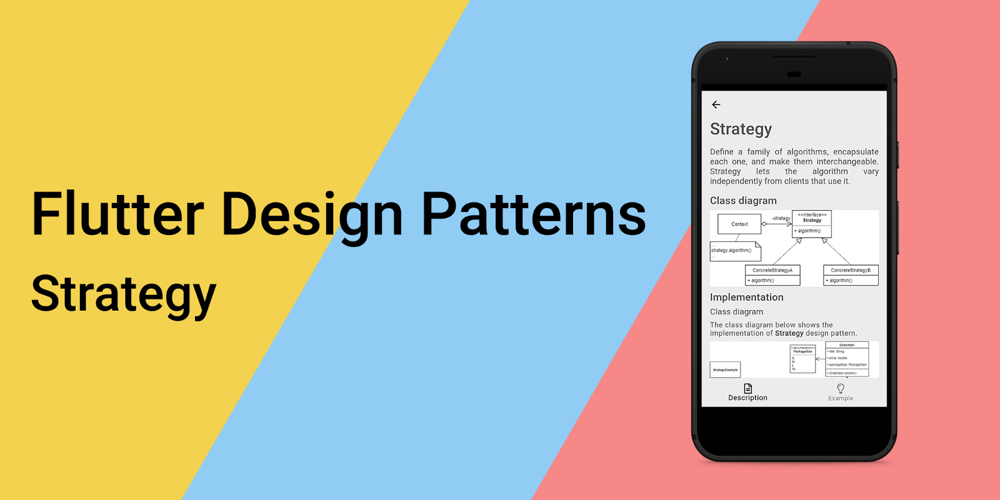
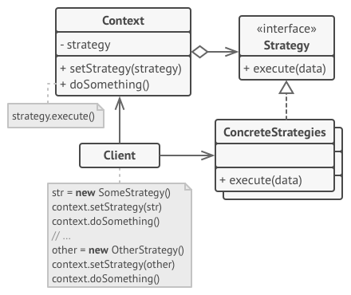
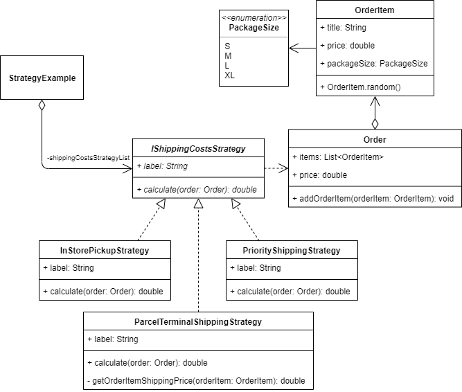

_策略设计模式概述及其在Dart和Flutter中的实现_



要查看所有设计模式的实际应用，请查看[Flutter 设计模式应用程序。](https://flutterdesignpatterns.com/).

## 什么是策略设计模式？


**策略模式**属于行为型设计模式之一。这个设计模式的意图在[GoF book](https://en.wikipedia.org/wiki/Design_Patterns)书籍中描述如下：

> _定义一组算法，将每个算法都封装起来，并使它们可以互换。策略模式让算法独立于使用它的客户端而变化。_

策略模式被认为是最实用的设计模式之一，你可以在日常编码中找到许多用途。这个模式的主要思想是将相关算法（或任何代码片段）提取到单独的类中，并为它们定义一个通用接口。这使得在编译时具有灵活性，可以通过定义新的类来添加新的算法，并且可以独立地更改现有算法。此外，提取的策略类可以在运行时动态更改代码。该模式的另一个优点是，它允许将各种算法的代码、内部数据和依赖项与其余代码隔离开来，客户端使用简单的接口来执行算法，并在运行时切换它们。策略设计模式的可能用例包括：

- 排序算法 - 每个算法（例如冒泡排序、快速排序等）都被提取到单独的类中，定义了一个提供_sort()_方法的通用接口；
- 支付策略 - 您希望在代码中定义不同的支付选项（手机支付、银行转账、现金、信用卡等），并根据用户的选择使用它们；
- RPG游戏中的伤害计算 - 游戏中有多种不同类型的攻击，例如使用不同的招式、连招、咒语、使用武器等。可以为每种攻击类型定义多种不同的算法，并根据上下文计算伤害值。

让我们详细分析策略设计模式及其实现！

## 分析

在下面的图片中，您可以看到策略设计模式的一般结构：



- 策略（Strategy） - 声明一个通用于所有支持算法的接口。它还声明了一个Context使用来执行特定策略的方法；
- 具体策略（Concrete Strategies） - 使用Strategy接口实现不同的算法，Context使用这个接口，不关心算法的具体实现；
- 上下文（Context） - 保存对Strategy对象的引用，但不依赖于算法的实现方式；
- 客户端（Client） - 创建一个特定的策略对象，并将其传递给Context。

### 适用性

策略设计模式的主要目的是封装一组算法（相关的算法），以便它们可以通过一个通用接口调用，因此可以根据具体情况进行替换。此外，当您想要在对象内部使用不同的计算逻辑和/或能够在不同算法之间切换时，应考虑使用这种模式。一个通用的经验法则是，如果您注意到不同的行为被合并到单个类中，或者代码中有多个条件语句用于根据某种上下文或业务规则选择特定的算法（多个if/else块、switch语句），这是您应该使用策略设计模式并将计算逻辑封装在单独的类（策略）中的一个明显指示器。这个想法促进了**开闭原则**（[**SOLID**](https://en.wikipedia.org/wiki/SOLID) 原则中的**O**）的实现，因为扩展代码以添加新行为（算法）不需要更改单个类内部的逻辑，而是允许创建一个新的策略类，因此软件实体（类、模块、函数等）应该对扩展开放，对修改关闭。

## 实现


以下示例和我们要解决的问题可能对一些使用Flutter构建电子商务移动应用程序的人来说看起来很相似。假设您的电子商店业务为客户提供多种不同的送货方式：

- 从实体店（或任何其他实体地点，例如仓库）提取已订购的物品；
- 使用包裹终端服务发送订单物品；
- 以最短的交货时间将订单物品直接送达客户 - 优先送货。

这三种类型包含不同的运费计算逻辑，应在运行时确定，例如当客户在UI中选择特定的运费选项时。乍一看，最明显的解决方案（因为我们不知道将选择哪种运输选项）是在单个类中定义这些算法，并根据客户选择执行特定的计算逻辑。然而，这种实现不够灵活，例如，如果将来要添加新的运输类型，您应该通过实现新的算法来调整类，同时在代码中添加更多的条件语句 - 这违反了开闭原则，因为您需要更改现有的代码以满足即将到来的业务需求。解决这个问题的更好方法是将每个算法提取到单独的类中，并定义一个通用接口，用于在运行时将特定的运费计算策略注入到您的代码中。策略设计模式显然是这个问题的明显选择，不是吗？

### 类图

下面的类图显示了策略设计模式的实现：



`IShippingCostsStrategy`定义了所有具体策略必须实现的通用接口：

- `label` - 策略的文本标签，用于在UI中使用；
- `calculate()` - 用于计算订单的运费的方法。它使用作为参数传递的`Order`类对象的信息。

`InStorePickupStrategy`、`ParcelTerminalShippingStrategy`和`PriorityShippingStrategy`是`IShippingCostsStrategy`接口的具体实现。每个策略提供了特定的运费计算算法，并在`calculate()`方法中定义了它。

`StrategyExample`小部件在`shippingCostsStrategyList`变量中存储了所有不同的运费计算策略。

### IShippingCostsStrategy

定义了必须由所有支持的算法实现的方法和属性的接口。

```dart title="ishipping_costs_strategy.dart"
abstract interface class IShippingCostsStrategy {
  late String label;
  double calculate(Order order);
}
```

### `IShippingCostsStrategy` 接口的具体实现

`InStorePickupStrategy`实现了需要客户在商店中提取订单的运输策略。因此，没有运输成本，`calculate()`方法返回0。

```dart title="in_store_pickup_strategy.dart"
class InStorePickupStrategy implements IShippingCostsStrategy {
  @override
  String label = 'In-store pickup';

  @override
  double calculate(Order order) => 0.0;
}
```

`ParcelTerminalShippingStrategy`实现了使用包裹终端服务送货的运输策略。在使用包裹终端时，每个订单项都单独发送，运费取决于包裹大小。通过将每个订单项的单独运费相加来计算最终的运费。

```dart title="parcel_terminal_shipping_strategy.dart"
class ParcelTerminalShippingStrategy implements IShippingCostsStrategy {
  @override
  String label = 'Parcel terminal shipping';

  @override
  double calculate(Order order) => order.items.fold<double>(
        0.0,
        (sum, item) => sum + _getOrderItemShippingPrice(item),
      );

  double _getOrderItemShippingPrice(OrderItem orderItem) =>
      switch (orderItem.packageSize) {
        PackageSize.S => 1.99,
        PackageSize.M => 2.49,
        PackageSize.L => 2.99,
        PackageSize.XL => 3.49,
      };
}
```

`PriorityShippingStrategy`实现了单个订单的运输策略，具有固定的运输成本。在这种情况下，`calculate()`方法返回特定的价格9.99。

```dart title="priority_shipping_strategy.dart"
class PriorityShippingStrategy implements IShippingCostsStrategy {
  @override
  String label = 'Priority shipping';

  @override
  double calculate(Order order) => 9.99;
}
```

### Order

一个简单的类，用于存储订单的信息。`Order`类包含一个订单项的列表，提供了一个将新的`OrderItem`添加到订单的方法，并定义了一个`price`的getter方法，该方法返回订单的总价格（不包括运费）。

```dart title="order.dart"
class Order {
  final List<OrderItem> items = [];

  double get price =>
      items.fold(0.0, (sum, orderItem) => sum + orderItem.price);

  void addOrderItem(OrderItem orderItem) => items.add(orderItem);
}
```

### OrderItem

一个简单的类，用于存储单个订单项的信息。`OrderItem`类包含属性，用于存储订单项的标题、价格和包裹（包裹）大小。此外，该类公开了一个带有命名构造函数`OrderItem.random()`的方法，允许使用随机属性值创建/生成`OrderItem`。

```dart title="order_item.dart"
class OrderItem {
  const OrderItem({
    required this.title,
    required this.price,
    required this.packageSize,
  });

  final String title;
  final double price;
  final PackageSize packageSize;

  factory OrderItem.random() {
    const packageSizeList = PackageSize.values;

    return OrderItem(
      title: faker.lorem.word(),
      price: random.integer(100, min: 5) - 0.01,
      packageSize: packageSizeList[random.integer(packageSizeList.length)],
    );
  }
}
```

### PackageSize

一种特殊类型的类 - 枚举 - 定义了订单项的不同包裹大小。
```dart title="order_item.dart"
enum PackageSize {
  S,
  M,
  L,
  XL,
}
```

## Example

首先，准备了一个Markdown文件，并提供了一个模式的描述：


`StrategyExample`实现了策略设计模式的示例小部件。它包含一个不同的运费策略列表（`shippingCostsStrategyList`）并将其提供给`ShippingOptions`小部件，通过触发`setSelectedStrategyIndex()`方法来选择特定策略的索引。然后，所选策略被注入到`OrderSummary`小部件中，计算订单的最终价格。

```dart title="strategy_example.dart"
class StrategyExample extends StatefulWidget {
  const StrategyExample();

  @override
  _StrategyExampleState createState() => _StrategyExampleState();
}

class _StrategyExampleState extends State<StrategyExample> {
  final List<IShippingCostsStrategy> _shippingCostsStrategyList = [
    InStorePickupStrategy(),
    ParcelTerminalShippingStrategy(),
    PriorityShippingStrategy(),
  ];
  var _selectedStrategyIndex = 0;
  var _order = Order();

  void _addToOrder() => setState(() => _order.addOrderItem(OrderItem.random()));

  void _clearOrder() => setState(() => _order = Order());

  void _setSelectedStrategyIndex(int? index) {
    if (index == null) return;

    setState(() => _selectedStrategyIndex = index);
  }

  @override
  Widget build(BuildContext context) {
    return ScrollConfiguration(
      behavior: const ScrollBehavior(),
      child: SingleChildScrollView(
        padding: const EdgeInsets.symmetric(
          horizontal: LayoutConstants.paddingL,
        ),
        child: Column(
          crossAxisAlignment: CrossAxisAlignment.stretch,
          children: <Widget>[
            OrderButtons(
              onAdd: _addToOrder,
              onClear: _clearOrder,
            ),
            const SizedBox(height: LayoutConstants.spaceM),
            Stack(
              children: <Widget>[
                AnimatedOpacity(
                  duration: const Duration(milliseconds: 500),
                  opacity: _order.items.isEmpty ? 1.0 : 0.0,
                  child: Row(
                    mainAxisAlignment: MainAxisAlignment.center,
                    children: <Widget>[
                      Text(
                        'Your order is empty',
                        style: Theme.of(context).textTheme.titleLarge,
                      ),
                    ],
                  ),
                ),
                AnimatedOpacity(
                  duration: const Duration(milliseconds: 500),
                  opacity: _order.items.isEmpty ? 0.0 : 1.0,
                  child: Column(
                    children: <Widget>[
                      OrderItemsTable(
                        orderItems: _order.items,
                      ),
                      const SizedBox(height: LayoutConstants.spaceM),
                      ShippingOptions(
                        selectedIndex: _selectedStrategyIndex,
                        shippingOptions: _shippingCostsStrategyList,
                        onChanged: _setSelectedStrategyIndex,
                      ),
                      OrderSummary(
                        shippingCostsStrategy:
                            _shippingCostsStrategyList[_selectedStrategyIndex],
                        order: _order,
                      ),
                    ],
                  ),
                ),
              ],
            ),
          ],
        ),
      ),
    );
  }
}
```

`ShippingOptions`小部件处理特定运输策略的选择。该小部件为`shippingOptions`列表中的每个策略提供单选按钮列表项。在选择特定的运输策略后，将触发`onChanged()`方法，并将所选索引传递给父小部件（`StrategyExample`）。这个实现允许我们在运行时更改特定的运费计算策略。

```dart title="shipping_options.dart"
class ShippingOptions extends StatelessWidget {
  final List<IShippingCostsStrategy> shippingOptions;
  final int selectedIndex;
  final ValueChanged<int?> onChanged;

  const ShippingOptions({
    required this.shippingOptions,
    required this.selectedIndex,
    required this.onChanged,
  });

  @override
  Widget build(BuildContext context) {
    return Card(
      child: Padding(
        padding: const EdgeInsets.all(LayoutConstants.paddingM),
        child: Column(
          crossAxisAlignment: CrossAxisAlignment.start,
          children: <Widget>[
            Text(
              'Select shipping type:',
              style: Theme.of(context).textTheme.titleMedium,
            ),
            for (var i = 0; i < shippingOptions.length; i++)
              RadioListTile<int>(
                title: Text(shippingOptions[i].label),
                value: i,
                groupValue: selectedIndex,
                onChanged: onChanged,
                dense: true,
                activeColor: Colors.black,
              ),
          ],
        ),
      ),
    );
  }
}
```

`OrderSummary` widget 使用了注入的类型为 `IShippingCostsStrategy` 的运费策略来计算最终订单的价格。这个 widget 只关心运费策略的类型，而不关心其具体实现。因此，我们可以提供不同的类型为`IShippingCostsStrategy`的运费计算策略，而无需对 UI 进行任何更改。
```dart title="order_summary.dart"
class OrderSummary extends StatelessWidget {
  final Order order;
  final IShippingCostsStrategy shippingCostsStrategy;

  const OrderSummary({
    required this.order,
    required this.shippingCostsStrategy,
  });

  double get shippingPrice => shippingCostsStrategy.calculate(order);
  double get total => order.price + shippingPrice;

  @override
  Widget build(BuildContext context) {
    return Card(
      child: Padding(
        padding: const EdgeInsets.all(LayoutConstants.paddingM),
        child: Column(
          crossAxisAlignment: CrossAxisAlignment.start,
          children: <Widget>[
            Text(
              'Order summary',
              style: Theme.of(context).textTheme.titleLarge,
            ),
            const Divider(),
            OrderSummaryRow(
              fontFamily: 'Roboto',
              label: 'Subtotal',
              value: order.price,
            ),
            const SizedBox(height: LayoutConstants.spaceM),
            OrderSummaryRow(
              fontFamily: 'Roboto',
              label: 'Shipping',
              value: shippingPrice,
            ),
            const Divider(),
            OrderSummaryRow(
              fontFamily: 'RobotoMedium',
              label: 'Order total',
              value: total,
            ),
          ],
        ),
      ),
    );
  }
}
```

策略设计模式的最终实现结果如下：


如你在示例中所见，运费计算策略可以在运行时更改，总订单价格随之重新计算。

所有关于策略设计模式及其示例实现的代码更改都可以在此处找到[here](https://github.com/mkobuolys/flutter-design-patterns/pull/6).

要查看该模式的实际运行效果，请查看交互式组合示例[interactive Strategy example](https://flutterdesignpatterns.com/pattern/strategy).
