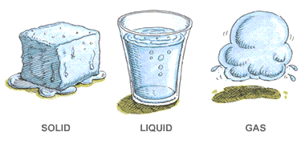
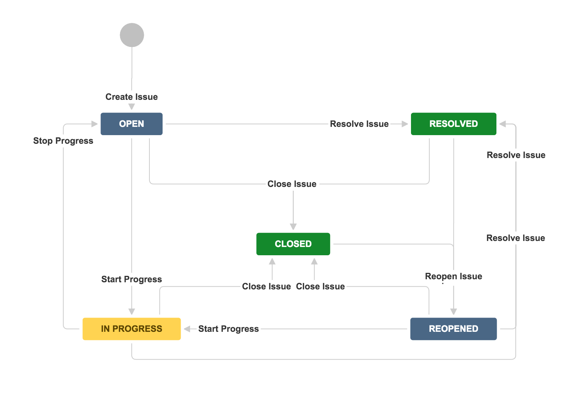
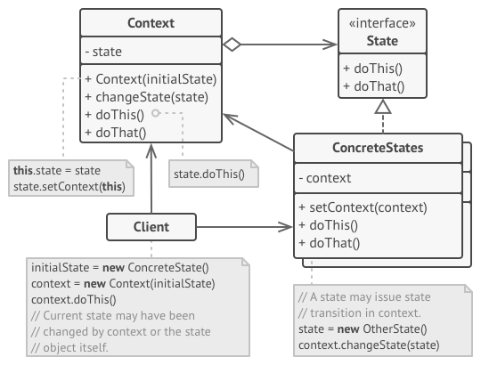
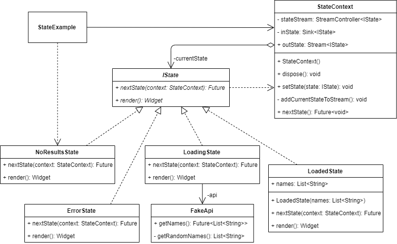
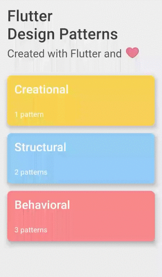

_状态设计模式概述及其在Dart和Flutter中的实现_

要查看所有设计模式的实际应用，请查看[Flutter 设计模式应用程序。](https://flutterdesignpatterns.com/).

## 什么是状态设计模式?



**状态（State）** 是一种 **行为型** 设计模式, 在 [GoF book](https://en.wikipedia.org/wiki/Design_Patterns) 中的描述如下:

> _允许对象在其内部状态改变时改变其行为。对象将看起来像是改变了其类._

为了理解状态设计模式背后的一般概念，你需要熟悉 [**有限状态机**](https://en.wikipedia.org/wiki/Finite-state_machine) 的概念. 以下是一个 JIRA 任务的有限状态机模型示例:



在任何给定的时刻，任务可以处于 **有限数量** 的 **状态** 中。每个状态都是独特的，并且表现不同。任何时候，任务都可以从 **一个状态** 切换到 **另一个状态**。唯一的限制 - 有一组有限的切换规则（**转换**），这些规则定义了可以从当前状态切换到的状态。即，一个处于 打开 状态的任务不能切换到 重新打开，关闭 不能切换到 进行中 或 已解决 等。

类似的方法可以应用于面向对象编程中的对象。在代码中简单实现有限状态机的方法是在单个类中使用多个条件运算符，并根据对象的当前状态选择适当的行为。然而，随着新状态的引入，这种代码变得非常难以维护，状态之间相互交织，类致力于特定状态的行为。我甚至还没有提到测试这种代码和其中实现的业务逻辑变得多么困难。

为了解决这些问题，状态设计模式是一个很好的选择，因为为每个状态创建了一个单独的状态类，它封装了状态的逻辑并改变程序或其上下文的行为。此外，它使添加新状态变得容易，状态转换变得明确。

接下来让我们通过分析来了解状态模式是如何工作的，以及如何实现它。

## 分析

状态设计模式的一般结构如下所示：



- *上下文（Context）* - 维护一个定义当前状态的 _ConcreteState_ 子类的实例。_上下文（Context）_ 类不了解 _ConcreteStates_ 的任何细节，并通过 _状态（State）_ 接口与状态对象进行通信。此外，_上下文（Context）_ 提供了一个设置方法来从 _ConcreteStates_ 类更改当前状态；
- *状态（State）* - 定义了封装特定状态行为和方法的接口。这些方法应该对所有的 _ConcreteStates_ 有意义，不应该定义任何特定实现的 _状态（State）_ 接口永远不会调用的方法；
- *具体状态（ConcreteStates）* - 每个类实现与 _上下文（Context）_ 的状态相关的行为。状态对象可以引用 _上下文（Context）_ 以获取所需的任何信息，或者通过替换与 _上下文（Context）_ 类链接的状态对象（通过公开的设置方法）来执行状态转换；
- *客户端（Client）* - 使用 _上下文（Context）_ 对象来引用当前状态并启动其转换，也可以在需要时为 _上下文（Context）_ 类设置初始状态。

### 策略模式 vs 状态模式

我想你可能已经注意到，**状态（State）** 设计模式的结构看起来与 **策略（Strategy）** 非常相似。这两种模式之间的主要区别 - 在状态模式中，特定的状态可能会相互了解，而特定的策略几乎从不了解其他策略的实现细节。基本上，这个关键区别改变了模式的含义及其在代码中的使用方式。

### 适用性

当你有一个对象，其行为取决于其当前状态，状态数量巨大，并且特定于状态的代码频繁变化时，应该使用状态设计模式。通过在单独的类中封装每个状态及其实现细节，你可以更容易地添加新状态，也可以独立于彼此更改现有状态。这个想法促进了系列中已经讨论的几个 [**SOLID**](https://en.wikipedia.org/wiki/SOLID) 原则：**单一职责原则**（每个状态都封装在其类中）和 **开闭原则**（可以引入新状态而不更改现有状态类）。基于有限状态机理念的几乎所有逻辑都可以使用状态设计模式来实现。一些可能的现实世界例子：在电子商务应用程序中管理订单状态，根据当前状态显示交通灯的适当颜色，Medium 中不同的文章状态（草稿，提交，发布等）。在实现部分，我将介绍状态设计模式的另一个相关用例 - 从 API 加载资源。

## 实现


以下实现（或至少其背后的想法）可以应用于几乎每个从任何外部源（例如 API）加载资源的 Flutter 应用程序。例如，当您使用 HTTP 异步加载资源并调用 REST API 时，通常需要一些时间来完成请求。如何处理这个问题并且在请求完成时不“冻结”应用程序？如果在此请求期间发生某种错误该怎么办？一个简单的方法是使用动画，加载/错误屏幕等。当您需要为不同类型的资源实现相同的逻辑时，这可能变得麻烦。对此，状态设计模式可能会有所帮助。首先，您需要明确所有资源共有的状态：

- **空（Empty）** - 没有结果；
- **加载中（Loading）** - 加载资源的请求正在进行中；
- **已加载（Loaded）** - 资源已从外部源加载；
- **错误（Error）** - 加载资源时发生错误。

为所有这些状态定义了一个公共状态接口和上下文，可以在应用程序中使用。

让我们深入了解状态设计模式及其在 Flutter 中的示例的实现细节！


### Class diagram

The class diagram below shows the implementation of the State design pattern:



`IState` defines a common interface for all the specific states:

- `nextState()` - changes the current state in `StateContext` object to the next state;
- `render()` - renders the UI of a specific state.

`NoResultsState`, `ErrorState`, `LoadingState` and `LoadedState` are concrete implementations of the `IState` interface. Each of the states defines its representational UI component via `render()` method, and also uses a specific state (or states, if the next state is chosen from several possible options based on the context) of type `IState` in `nextState()`, which will be changed by calling the `nextState()` method. In addition to this, `LoadedState` contains a list of names, which is injected using the state's constructor, and `LoadingState` uses the `FakeApi` to retrieve a list of randomly generated names.

`StateContext` saves the current state of type `IState` in private `currentState` property, and defines several methods:

- `setState()` - changes the current state;
- `nextState()` - triggers the `nextState()` method on the current state;
- `dispose()` - safely closes the `stateStream` stream.

The current state is exposed to the UI by using the outState stream.

`StateExample` widget contains the `StateContext` object to track and trigger state changes, and also uses the `NoResultsState` as the initial state for the example.

### 类图

下面的类图显示了状态设计模式的实现：


`IState` 为所有特定状态定义了一个共同的接口：

- `nextState()` - 在 `StateContext` 对象中将当前状态更改为下一个状态；
- `render()` - 渲染特定状态的 UI。

`NoResultsState`、`ErrorState`、`LoadingState` 和 `LoadedState` 是 `IState` 接口的具体实现。每个状态都通过 `render()` 方法定义其表示 UI 组件，并且在 `nextState()` 中使用特定的状态（或者如果下一个状态是基于上下文从几个可能选项中选择的状态，那么就使用状态或状态），这将通过调用 `nextState()` 方法更改。此外，`LoadedState` 包含使用状态构造函数注入的名称列表，`LoadingState` 使用 `FakeApi` 检索随机生成的名称列表。

`StateContext` 在私有 `currentState` 属性中保存当前状态类型的 `IState`，并定义了几种方法：

- `setState()` - 更改当前状态；
- `nextState()` - 触发当前状态的 `nextState()` 方法；
- `dispose()` - 安全关闭 `stateStream` 流。

当前状态通过使用 outState 流暴露给 UI。

`StateExample` 小部件包含 `StateContext` 对象来跟踪和触发状态更改，并且还使用 `NoResultsState` 作为示例的初始状态。


### IState

一个定义所有特定状态类必须实现的方法的接口。

```dart title="istate.dart"
abstract interface class IState {
  Future<void> nextState(StateContext context);
  Widget render();
}
```

### StateContext

一个类，它在 `currentState` 属性中保存当前状态，并通过 `outState` 流将其暴露给 UI。状态上下文还定义了一个 `nextState()` 方法，该方法被 UI 用于触发状态的更改。当前状态本身通过 `setState()` 方法更改/设置，该方法将下一个类型为 `IState` 的状态作为参数提供给它。

```dart title="state_context.dart"
class StateContext {
  final _stateStream = StreamController<IState>();
  Sink<IState> get _inState => _stateStream.sink;
  Stream<IState> get outState => _stateStream.stream;

  late IState _currentState;

  StateContext() {
    _currentState = const NoResultsState();
    _addCurrentStateToStream();
  }

  void dispose() {
    _stateStream.close();
  }

  void setState(IState state) {
    _currentState = state;
    _addCurrentStateToStream();
  }

  void _addCurrentStateToStream() {
    _inState.add(_currentState);
  }

  Future<void> nextState() async {
    await _currentState.nextState(this);

    if (_currentState is LoadingState) {
      await _currentState.nextState(this);
    }
  }
}
```

### `IState` 接口的具体实现

`ErrorState` 实现了当 API 中发生未处理的错误时应显示错误小部件的特定状态。

```dart title="error_state.dart"
class ErrorState implements IState {
  const ErrorState();

  @override
  Future<void> nextState(StateContext context) async {
    context.setState(const LoadingState());
  }

  @override
  Widget render() {
    return const Text(
      'Oops! Something went wrong...',
      style: TextStyle(
        color: Colors.red,
        fontSize: 24.0,
      ),
      textAlign: TextAlign.center,
    );
  }
}
```

`LoadedState` 实现了一种特定的状态，当资源从 API 成功加载且无错误发生时使用此状态，并且应将结果小部件提供给屏幕。

```dart title="loaded_state.dart"
class LoadedState implements IState {
  const LoadedState(this.names);

  final List<String> names;

  @override
  Future<void> nextState(StateContext context) async {
    context.setState(const LoadingState());
  }

  @override
  Widget render() {
    return Column(
      children: names
          .map(
            (name) => Card(
              child: ListTile(
                leading: CircleAvatar(
                  backgroundColor: Colors.grey,
                  foregroundColor: Colors.white,
                  child: Text(name[0]),
                ),
                title: Text(name),
              ),
            ),
          )
          .toList(),
    );
  }
}
```

`NoResultsState` 实现了一种特定的状态，用于当从 API 加载资源列表时没有错误发生，但列表为空的情况。此外，这种状态最初在 `StateExample` 小部件中使用。

```dart title="no_results_state.dart"
class NoResultsState implements IState {
  const NoResultsState();

  @override
  Future<void> nextState(StateContext context) async {
    context.setState(const LoadingState());
  }

  @override
  Widget render() {
    return const Text(
      'No Results',
      style: TextStyle(fontSize: 24.0),
      textAlign: TextAlign.center,
    );
  }
}
```

`LoadingState` 实现了一种特定的状态，用于从 `FakeApi` 加载资源时。此外，基于加载的结果，在 `nextState()` 方法中设置了下一个状态。

```dart title="loading_state.dart"
class LoadingState implements IState {
  const LoadingState({
    this.api = const FakeApi(),
  });

  final FakeApi api;

  @override
  Future<void> nextState(StateContext context) async {
    try {
      final resultList = await api.getNames();

      context.setState(
        resultList.isEmpty ? const NoResultsState() : LoadedState(resultList),
      );
    } on Exception {
      context.setState(const ErrorState());
    }
  }

  @override
  Widget render() {
    return const CircularProgressIndicator(
      backgroundColor: Colors.transparent,
      valueColor: AlwaysStoppedAnimation<Color>(
        Colors.black,
      ),
    );
  }
}
```

### FakeApi

使用了一个fake API 来随机生成人名列表。`getNames()` 方法可能返回一个名字列表，或者随机抛出一个异常（错误）。同样地，`getRandomNames()` 方法随机返回一个名字列表或者一个空列表。这种行为是为了演示目的而实现的，用来在用户界面中展示所有可能的不同状态。

```dart title="fake_api.dart"
class FakeApi {
  const FakeApi();

  Future<List<String>> getNames() => Future.delayed(
        const Duration(seconds: 2),
        () {
          if (random.boolean()) return _getRandomNames();

          throw Exception('Unexpected error');
        },
      );

  List<String> _getRandomNames() => List.generate(
        random.boolean() ? 3 : 0,
        (_) => faker.person.name(),
      );
}
```

## Example

首先，准备了一个 Markdown 文件，作为模式的描述：


`StateExample` 实现了 State 设计模式的示例小部件。它包含了 `StateContext`，订阅了当前状态流 `outState`，并通过执行状态的 `render()` 方法提供了相应的 UI 小部件。当前状态可以通过触发 `changeState()` 方法来更改（在 UI 中按下 _加载名字_ 按钮）。


```dart title="state_example.dart"
class StateExample extends StatefulWidget {
  const StateExample();

  @override
  _StateExampleState createState() => _StateExampleState();
}

class _StateExampleState extends State<StateExample> {
  final _stateContext = StateContext();

  Future<void> _changeState() async {
    await _stateContext.nextState();
  }

  @override
  void dispose() {
    _stateContext.dispose();
    super.dispose();
  }

  @override
  Widget build(BuildContext context) {
    return ScrollConfiguration(
      behavior: const ScrollBehavior(),
      child: SingleChildScrollView(
        padding: const EdgeInsets.symmetric(
          horizontal: LayoutConstants.paddingL,
        ),
        child: Column(
          children: <Widget>[
            PlatformButton(
              materialColor: Colors.black,
              materialTextColor: Colors.white,
              onPressed: _changeState,
              text: 'Load names',
            ),
            const SizedBox(height: LayoutConstants.spaceL),
            StreamBuilder<IState>(
              initialData: const NoResultsState(),
              stream: _stateContext.outState,
              builder: (context, snapshot) => snapshot.data!.render(),
            ),
          ],
        ),
      ),
    );
  }
}
```

`StateExample` 小部件只知道初始状态类 - `NoResultsState`，但不了解其他可能状态的任何细节，因为它们的处理是在 `StateContext` 类中定义的。这允许我们将业务逻辑与表现代码分离，并在不对 UI 组件进行任何更改的情况下，向应用程序添加类型为 IState 的新状态。

State 设计模式实现的最终结果如下所示：



正如你在示例中看到的，当前状态是通过单个 _加载名字_ 按钮更改的，状态本身知道其他状态，并在 `StateContext` 中设置下一个状态。

所有关于 State 设计模式及其示例实现的代码更改可以在[这里](https://github.com/mkobuolys/flutter-design-patterns/pull/7)找到。

要查看模式的实际效果，请查看[交互式 State 示例](https://flutterdesignpatterns.com/pattern/state)。
