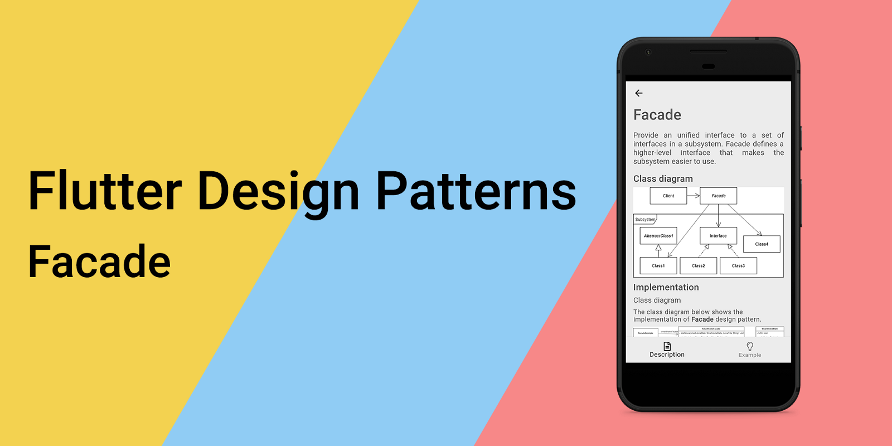
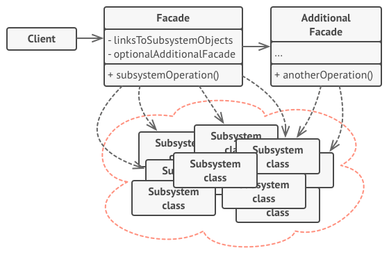
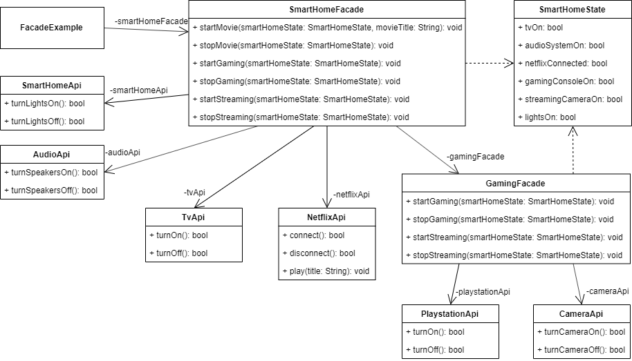
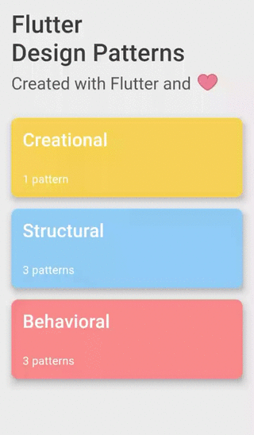

_Facade 设计模式概述及其在 Dart 和 Flutter 中的实现_




要查看所有设计模式的实际应用，请查看[Flutter 设计模式应用程序。](https://flutterdesignpatterns.com/).


## Facade 设计模式是什么？


**Facade** 属于 **结构型** 设计模式。在 [GoF 书籍](https://en.wikipedia.org/wiki/Design_Patterns)中，其目的被描述为：


> _为子系统中的一组接口提供统一的接口。Facade 定义了一个更高级别的接口，使子系统更易于使用。_

Facade 模式非常直接 — 它允许你创建一个简化的类，该类封装了复杂 API 或子系统的一系列方法/操作。客户端只能通过这个 facade 类与子系统通信，这个类将所有请求转发给适当的子系统对象。结果是，减少了客户端和子系统之间的依赖和引用（在它们之间促进了弱耦合），并且 facade 为子系统提供了一个对大多数客户来说足够简单的接口。

就是这么简单！当然，在分析和实现部分会提供更多信息，所以让我们深入了解细节。


## 分析

Facade 设计模式的一般结构如下：



- *Facade* — 知道哪些子系统类负责一个请求，并将请求委托给 _子系统_ 对象。Facade 提供了访问子系统功能特定部分的方法；
- *附加 Facade* — 当你想从主 facade 中提取一组操作时，可以创建附加 facade。这个附加 facade 是可选的，可以被客户端和其他 facade 使用；
- *子系统类* — 实现子系统功能并处理由 _Facade_ 对象分配的工作。子系统类不保留对 facade 的引用；
- *客户端* — 使用 facade 而不是直接调用 _系统类_（它们的对象）。

### 适用性

Facade 设计模式有两个主要用途：

1. 当你想为复杂系统提供一个简单的接口时。通常，随着子系统的演变变得更加复杂，对客户端来说使用起来也更困难。因此，此用例的第一部分是为子系统的最常用功能提供一个简化的类，以满足大多数客户的要求。第二部分是，Facade 设计模式允许通过要求它们仅通过 facade 通信来减少多个子系统之间的耦合。
2. 当现有的 API 非常大，你只想使用其中的一部分时。在这种情况下，Facade 设计模式包装了 API 所需的操作/方法，客户端可以使用这个“简化的 API”包装器 — facade — 而不是引用原始的庞大 API，该 API 包含不必要的方法，这些方法在程序/应用程序代码中未被使用。
## 实现


假设你想实现拥有智能家居的梦想。你已经从不同的供应商那里购买了许多智能设备，并将它们连接到你的网络上，但存在一个问题 — 每个设备都提供了自己的接口（称之为 API），因此单独管理不同设备来完成单个任务变得非常繁琐。

例如，你想在家中像电影院那样看电影。为此，你必须以类似的方式设置你的家庭环境：

- 关闭灯光；
- 打开电视；
- 打开音响系统；
- 连接到某种电影流媒体平台，例如 Netflix；
- 开始播放电影。

为了完成所有这些步骤，你必须调用几个 API 才能设置你的环境。如果只需对你的智能家居助手说一句“在家庭影院模式下开始播放《黑客帝国》”，或者在智能家居移动应用中打开一个开关来执行所有这些步骤作为单一操作，岂不是很好？为了实现这种功能，Facade 设计模式是一个很好的选择！

### 类图

下面的类图展示了 Facade 设计模式的实现：



提供了几个 API 用于与智能设备通信（开启和关闭它们）：`AudioApi`、`CameraApi`、`PlaystationApi`、`SmartHomeApi` 和 `TvApi`。`NetflixApi` 提供了连接到 Netflix 平台、断开连接和播放选定电影的方法。

Facade 类使用这些 API：

- `GamingFacade` — 使用 `PlaystationApi` 和 `CameraApi`，提供与游戏和流媒体动作相关的方法；
- `SmartHomeFacade` — 使用 `AudioApi`、`CameraApi`、`SmartHomeApi`、`TvApi` 和 `NetflixApi`。它提供了与游戏、流媒体动作（`GamingFacade` 在一起重用，与其他智能设备进行了一些额外的通信）以及从 Netflix 平台播放电影的相关动作。

这两个 facade 使用 `SmartHomeState` 类来保存智能设备的当前状态。

`FacadeExample` 小部件包含 `SmartHomeFacade`，通过 facade 提供的动作方法与智能设备进行通信。


### APIs

`AudioApi` — 用于打开/关闭智能扬声器的 API。

```dart title="audio_api.dart"
class AudioApi {
  const AudioApi();

  bool turnSpeakersOn() => true;

  bool turnSpeakersOff() => false;
}
```

`CameraApi` — 用于打开/关闭流媒体摄像头的 API。

```dart title="camera_api.dart"
class CameraApi {
  const CameraApi();

  bool turnCameraOn() => true;

  bool turnCameraOff() => false;
}
```

`NetflixApi` — 用于连接到 Netflix 平台、断开连接和播放电影的 API。

```dart title="netflix_api.dart"
class NetflixApi {
  const NetflixApi();

  bool connect() => true;

  bool disconnect() => false;

  void play(String title) {
    // ignore: avoid_print
    print("'$title' has started started playing on Netflix.");
  }
}
```

`PlaystationApi` — 用于打开/关闭游戏机（PlayStation）的 API。

```dart title="playstation_api.dart"
class PlaystationApi {
  const PlaystationApi();

  bool turnOn() => true;

  bool turnOff() => false;
}
```

`SmartHomeApi` — 用于打开/关闭智能灯光的 API。

```dart title="smart_home_api.dart"
class SmartHomeApi {
  const SmartHomeApi();

  bool turnLightsOn() => true;

  bool turnLightsOff() => false;
}
```

`TvApi` — 用于打开/关闭智能电视的 API。

```dart title="tv_api.dart"
class TvApi {
  const TvApi();

  bool turnOn() => true;

  bool turnOff() => false;
}
```

### Kittens break

如果你已经读到这里，你绝对值得这个!


### SmartHomeState

一个类，用于保存家中所有智能设备的当前状态。

```dart title="smart_home_state.dart"
class SmartHomeState {
  bool tvOn = false;
  bool audioSystemOn = false;
  bool netflixConnected = false;
  bool gamingConsoleOn = false;
  bool streamingCameraOn = false;
  bool lightsOn = true;
}
```

### GamingFacade

一个门面类，使用 PlayStation 和流媒体摄像头的 API，并提供了简化的方法来使用它们：

- `startGaming()` - uses the `PlaystationApi` to turn the gaming console on;
- `stopGaming()` - uses the `PlaystationApi` to turn the gaming console off;
- `startStreaming()` - uses the `CameraApi` to turn the streaming camera on and calls the `startGaming()` method;
- `stopStreaming()` - uses the `CameraApi` to turn the streaming camera off and calls the `stopGaming()` method.

```dart title="gaming_facade.dart"
class GamingFacade {
  const GamingFacade({
    this.playstationApi = const PlaystationApi(),
    this.cameraApi = const CameraApi(),
  });

  final PlaystationApi playstationApi;
  final CameraApi cameraApi;

  void startGaming(SmartHomeState smartHomeState) {
    smartHomeState.gamingConsoleOn = playstationApi.turnOn();
  }

  void stopGaming(SmartHomeState smartHomeState) {
    smartHomeState.gamingConsoleOn = playstationApi.turnOff();
  }

  void startStreaming(SmartHomeState smartHomeState) {
    smartHomeState.streamingCameraOn = cameraApi.turnCameraOn();
    startGaming(smartHomeState);
  }

  void stopStreaming(SmartHomeState smartHomeState) {
    smartHomeState.streamingCameraOn = cameraApi.turnCameraOff();
    stopGaming(smartHomeState);
  }
}
```

### SmartHomeFacade

一个门面类，使用智能电视、音频设备、Netflix 平台和智能家居设备的 API。此外，还使用了 `GamingFacade`。提供了几种简化智能家居操作的方法：

- `startMovie()` — 使用多个不同的 API 来关闭灯光，打开智能电视和扬声器，连接到 Netflix 平台并开始播放选定的电影；
- `stopMovie()` — 使用多个不同的 API 断开与 Netflix 的连接，关闭智能电视和扬声器，并将灯光打开；
- `startGaming()` — 使用 `SmartHomeApi` 关闭灯光，通过 `TvApi` 打开智能电视，并调用 `GamingFacade` 开始游戏会话；
- `stopGaming()` — 使用 `GamingFacade` 停止游戏会话，通过 `TvApi` 关闭智能电视，并通过 `SmartHomeApi` 打开灯光；
- `startStreaming()` — 使用 `SmartHomeApi` 打开灯光，通过 `TvApi` 打开智能电视，并调用 `GamingFacade` 开始流媒体会话；
- `stopStreaming()` — 使用 `GamingFacade` 停止流媒体会话，通过 `TvApi` 关闭智能电视，并通过 `SmartHomeApi` 打开灯光。

```dart title="smart_home_facade.dart"
class SmartHomeFacade {
  const SmartHomeFacade({
    this.gamingFacade = const GamingFacade(),
    this.tvApi = const TvApi(),
    this.audioApi = const AudioApi(),
    this.netflixApi = const NetflixApi(),
    this.smartHomeApi = const SmartHomeApi(),
  });

  final GamingFacade gamingFacade;
  final TvApi tvApi;
  final AudioApi audioApi;
  final NetflixApi netflixApi;
  final SmartHomeApi smartHomeApi;

  void startMovie(SmartHomeState smartHomeState, String movieTitle) {
    smartHomeState.lightsOn = smartHomeApi.turnLightsOff();
    smartHomeState.tvOn = tvApi.turnOn();
    smartHomeState.audioSystemOn = audioApi.turnSpeakersOn();
    smartHomeState.netflixConnected = netflixApi.connect();
    netflixApi.play(movieTitle);
  }

  void stopMovie(SmartHomeState smartHomeState) {
    smartHomeState.netflixConnected = netflixApi.disconnect();
    smartHomeState.tvOn = tvApi.turnOff();
    smartHomeState.audioSystemOn = audioApi.turnSpeakersOff();
    smartHomeState.lightsOn = smartHomeApi.turnLightsOn();
  }

  void startGaming(SmartHomeState smartHomeState) {
    smartHomeState.lightsOn = smartHomeApi.turnLightsOff();
    smartHomeState.tvOn = tvApi.turnOn();
    gamingFacade.startGaming(smartHomeState);
  }

  void stopGaming(SmartHomeState smartHomeState) {
    gamingFacade.stopGaming(smartHomeState);
    smartHomeState.tvOn = tvApi.turnOff();
    smartHomeState.lightsOn = smartHomeApi.turnLightsOn();
  }

  void startStreaming(SmartHomeState smartHomeState) {
    smartHomeState.lightsOn = smartHomeApi.turnLightsOn();
    smartHomeState.tvOn = tvApi.turnOn();
    gamingFacade.startStreaming(smartHomeState);
  }

  void stopStreaming(SmartHomeState smartHomeState) {
    gamingFacade.stopStreaming(smartHomeState);
    smartHomeState.tvOn = tvApi.turnOff();
    smartHomeState.lightsOn = smartHomeApi.turnLightsOn();
  }
}
```

## 示例

首先，准备了一个 markdown 文件，作为模式的描述：


`FacadeExample` 小部件包含 `SmartHomeState`，用于保存智能设备的当前状态，以及 `SmartHomeFacade` 来简化“智能操作”。


```dart title="facade_example.dart"
class FacadeExample extends StatefulWidget {
  const FacadeExample();

  @override
  _FacadeExampleState createState() => _FacadeExampleState();
}

class _FacadeExampleState extends State<FacadeExample> {
  final _smartHomeFacade = const SmartHomeFacade();
  final _smartHomeState = SmartHomeState();

  var _homeCinemaModeOn = false;
  var _gamingModeOn = false;
  var _streamingModeOn = false;

  bool get _isAnyModeOn =>
      _homeCinemaModeOn || _gamingModeOn || _streamingModeOn;

  void _changeHomeCinemaMode(bool activated) {
    if (activated) {
      _smartHomeFacade.startMovie(_smartHomeState, 'Movie title');
    } else {
      _smartHomeFacade.stopMovie(_smartHomeState);
    }

    setState(() => _homeCinemaModeOn = activated);
  }

  void _changeGamingMode(bool activated) {
    if (activated) {
      _smartHomeFacade.startGaming(_smartHomeState);
    } else {
      _smartHomeFacade.stopGaming(_smartHomeState);
    }

    setState(() => _gamingModeOn = activated);
  }

  void _changeStreamingMode(bool activated) {
    if (activated) {
      _smartHomeFacade.startStreaming(_smartHomeState);
    } else {
      _smartHomeFacade.stopStreaming(_smartHomeState);
    }

    setState(() => _streamingModeOn = activated);
  }

  @override
  Widget build(BuildContext context) {
    return ScrollConfiguration(
      behavior: const ScrollBehavior(),
      child: SingleChildScrollView(
        padding: const EdgeInsets.symmetric(
          horizontal: LayoutConstants.paddingL,
        ),
        child: Column(
          children: <Widget>[
            ModeSwitcher(
              title: 'Home cinema mode',
              activated: _homeCinemaModeOn,
              onChanged: !_isAnyModeOn || _homeCinemaModeOn
                  ? _changeHomeCinemaMode
                  : null,
            ),
            ModeSwitcher(
              title: 'Gaming mode',
              activated: _gamingModeOn,
              onChanged:
                  !_isAnyModeOn || _gamingModeOn ? _changeGamingMode : null,
            ),
            ModeSwitcher(
              title: 'Streaming mode',
              activated: _streamingModeOn,
              onChanged: !_isAnyModeOn || _streamingModeOn
                  ? _changeStreamingMode
                  : null,
            ),
            const SizedBox(height: LayoutConstants.spaceXL * 2),
            Column(
              children: <Widget>[
                Row(
                  mainAxisAlignment: MainAxisAlignment.spaceAround,
                  children: <Widget>[
                    DeviceIcon(
                      iconData: FontAwesomeIcons.tv,
                      activated: _smartHomeState.tvOn,
                    ),
                    DeviceIcon(
                      iconData: FontAwesomeIcons.film,
                      activated: _smartHomeState.netflixConnected,
                    ),
                    DeviceIcon(
                      iconData: Icons.speaker,
                      activated: _smartHomeState.audioSystemOn,
                    ),
                  ],
                ),
                const SizedBox(height: LayoutConstants.spaceXL),
                Row(
                  mainAxisAlignment: MainAxisAlignment.spaceAround,
                  children: <Widget>[
                    DeviceIcon(
                      iconData: FontAwesomeIcons.playstation,
                      activated: _smartHomeState.gamingConsoleOn,
                    ),
                    DeviceIcon(
                      iconData: FontAwesomeIcons.video,
                      activated: _smartHomeState.streamingCameraOn,
                    ),
                    DeviceIcon(
                      iconData: FontAwesomeIcons.lightbulb,
                      activated: _smartHomeState.lightsOn,
                    ),
                  ],
                ),
              ],
            ),
          ],
        ),
      ),
    );
  }
}
```


这个小部件只了解由智能家居外观提供的简化方法，但不关心它们的实现细节、类之间的依赖关系、其他外观以及用于执行单个动作的不同 API 的数量。这使得仅通过在 `ModeSwitcher` 小部件中打开/关闭开关，就能实现处理智能家居动作的复杂逻辑。此外，`SmartHomeFacade` 中智能设备处理方法的实现细节可以更改/改进，而不影响 UI 代码。

外观设计模式实现的最终结果如下所示：



如示例所示，只需打开/关闭开关即可与多个智能设备通信，并通过提供的外观方法更改它们的状态。

有关外观设计模式及其示例实现的所有代码更改都可以在[这里](https://github.com/mkobuolys/flutter-design-patterns/pull/8)找到。

要查看模式的实际运用，请查看[交互式外观示例](https://flutterdesignpatterns.com/pattern/facade)。
