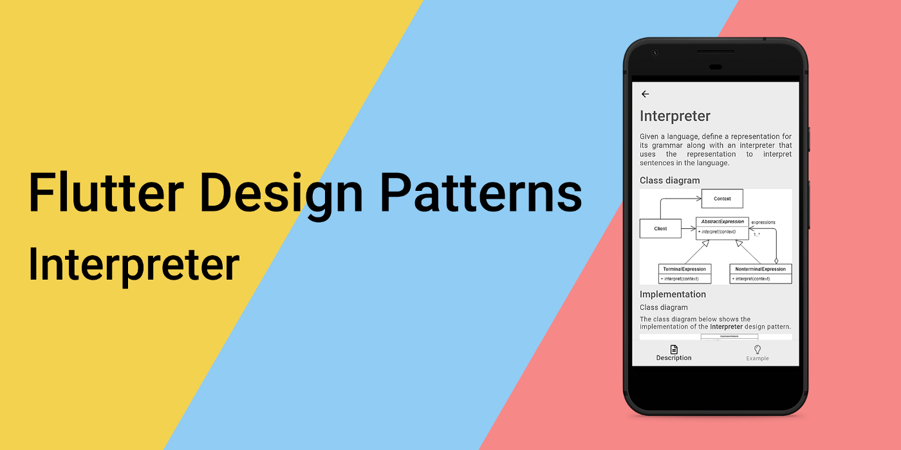
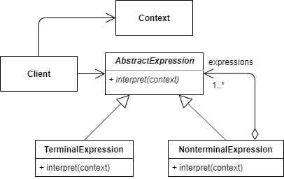
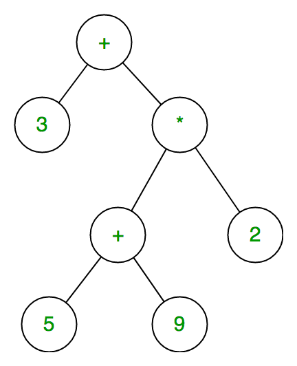
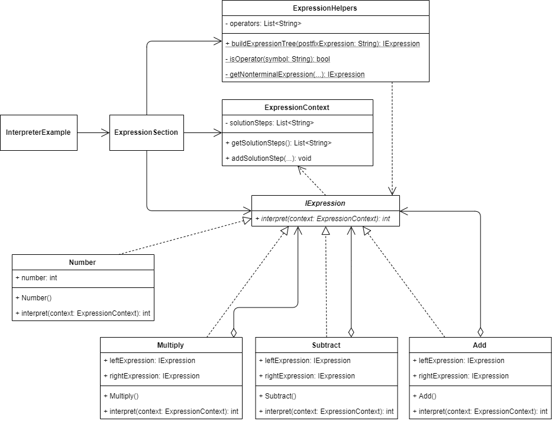
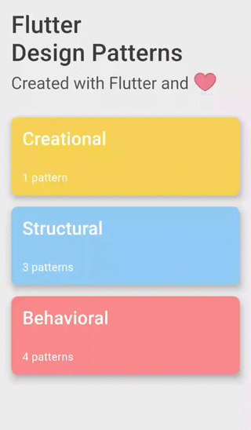

_解释器设计模式及其在 Dart 和 Flutter 中的实现概述_



要查看所有设计模式的实际应用，请查看 [Flutter 设计模式应用](https://flutterdesignpatterns.com/)。

## 什么是解释器设计模式？


**解释器**是一种**行为型**设计模式，[GoF 书籍](https://en.wikipedia.org/wiki/Design_Patterns)中描述其意图如下：

> _针对一种语言，定义其语法的表示，以及使用该表示来解释该语言中的句子。_

其背后的主要思想是，一种语言是一组有效的句子。这些句子中的每一个都可以通过遵循定义该语言的一组语法规则来构造。有时，需要解释这些句子的程序会处理许多类似请求的重复出现，这些请求是一组语法规则的组合，但所有这些请求都使用相同的语法规则组成。例如，算术表达式可能不同并提供不同的结果（加法、减法、乘法、除法），但它们都是由定义算术表达式语言的相同基本规则构成的。

那么解释器设计模式在哪里发挥作用呢？这种模式可以将这些基本规则中的每一个表示为代表单独语法规则的独立类，并通过构建这些规则的层次结构，可以定义该特定语言的任何句子。此外，为每个语法规则设置独立的类，使得更改语法本身并维护它变得容易，添加新的解释操作也变得容易。

初听起来可能有些复杂，但让我们来看看解释器设计模式的分析和实现部分，那里你可以找到一些具体的解释器设计模式示例及其使用。

## 分析

下面的类图展示了解释器设计模式的一般结构：



- *AbstractExpression* - 声明一个抽象的 _interpret()_ 操作，这是抽象语法树中所有节点的通用操作；
- *TerminalExpression* - 实现与语法中的终结符号相关的 _interpret()_ 操作；
- *NonterminalExpression* - 实现语法中非终结符号的 _interpret()_ 操作。此操作通常在代表其他表达式（语法规则）的变量上递归调用自身；
- *Context* - 包含解释器的全局信息，该信息在表达式实例之间共享；
- *Client* - 构建表示语法定义的语言中特定句子的抽象语法树，并调用 _interpret()_ 操作。

### 组合模式 vs 解释器模式

解释器设计模式与组合模式的相似性是显而易见的。解释器本身使用组合模式来构建和表示简单语言中的句子作为树。但这就是全部了 - 组合模式仅用于定义系统的静态属性，定义结构（它是结构型设计模式，对吧？），而解释器代表了语言本身，定义了行为，具有解释树中每个实体的额外逻辑，共享相同的上下文 - 这是主要区别，也是这种模式被视为行为型设计模式的原因。

### 适用性

解释器设计模式的使用通常专用于解释那些语句可以表示为抽象语法树的语言。通常，这种类型的语言具有在特定规则中定义的简单语法，例如 RegEx（正则表达式）、条形码、数学表达式/符号等。同时，当效率不是关键问题时也应使用解释器设计模式，因为为语言中较大的句子构建和解析表达式树相对效率较低（例如，与在解释它之前将表达式树翻译成其他形式的解析器和解释器相比）。

## Implementation


假设你想创建一个解析和求解后缀数学表达式的程序。后缀也称为[逆波兰表示法](https://en.wikipedia.org/wiki/Reverse_Polish_notation) (RPN)，是一种数学符号，其中每个运算符都跟随其所有操作数，例如 `69+242-*+`，等效于 `6+9+(4-2)*2`。

后缀表达式包含两种类型的符号 - 数字和运算符。用 [PEG](https://en.wikipedia.org/wiki/Parsing_expression_grammar) 术语来说，数字是**终结符**符号，运算符是**非终结符**符号。

后缀表达式的求值可以使用栈数据结构来实现，通过从左到右处理表达式：

```
for each token in the postfix expression:
  if token is an operator:
    operand_2 ← pop from the stack
    operand_1 ← pop from the stack
    result ← evaluate token with operand_1 and operand_2
    push result back onto the stack
  else if token is an operand:
    push token onto the stack
result ← pop from the stack
```

让我们稍微改变一下这个算法。通过从左到右处理后缀表达式，而不是在找到运算符符号时立即评估表达式，我们可以构建一个表达式树并稍后对其进行评估。这种表达式树看起来是这样的：



终结表达式（数字）在表达式树中没有任何子节点，但每个非终结表达式（算术运算）都有两个子节点 - 终结和/或非终结表达式。要评估这种类型的表达式树，程序只需从根开始，递归执行（解释）每个表达式，并累积最终结果。

我希望你已经注意到，解释器设计模式非常适合实现后缀数学表达式解析器的问题。那么，让我们直接跳到实现细节吧！

### 类图

下面的类图展示了解释器设计模式的实现：



`IExpression` 定义了终结符和非终结符表达式的通用接口，这些表达式实现了 `interpret()` 方法：

- `Number` - 数字的终结符表达式；
- `Multiply` - 乘法运算的非终结符表达式；
- `Subtract` - 减法运算的非终结符表达式；
- `Add` - 加法运算的非终结符表达式。

所有非终结符表达式都包含类型为 `IExpression` 的左右表达式，这些表达式用于 `interpret()` 方法中计算算术运算的结果。

`ExpressionContext` 类包含后缀表达式的解决步骤，被 `ExpressionSection` 小部件用来检索这些步骤，也被实现 `IExpression` 接口的类用来向上下文中添加特定的解决步骤。

`ExpressionSection` 使用 `ExpressionHelpers` 类构建后缀表达式的表达式树，使用 `ExpressionContext` 检索特定后缀表达式的解决步骤。

### IExpression

定义了 `interpret()` 方法的接口，需由终结符和非终结符表达式类实现。


```dart title="iexpression.dart"
abstract interface class IExpression {
  int interpret(ExpressionContext context);
}
```

### ExpressionContext

一个定义上下文的类，该上下文存储后缀表达式的解决步骤，并被 `Client` 和实现 `IExpression` 接口的类使用。

```dart title="expression_context.dart"
class ExpressionContext {
  final List<String> _solutionSteps = [];

  List<String> getSolutionSteps() => _solutionSteps;

  void addSolutionStep(String operatorSymbol, int left, int right, int result) {
    final solutionStep =
        '${_solutionSteps.length + 1}) $left $operatorSymbol $right = $result';

    _solutionSteps.add(solutionStep);
  }
}
```

### ExpressionHelpers

一个辅助类，由 `Client` 使用，用于从提供的后缀表达式输入构建表达式树。

```dart title="expression_helpers.dart"
class ExpressionHelpers {
  const ExpressionHelpers._();

  static final List<String> _operators = ['+', '-', '*'];

  static IExpression buildExpressionTree(String postfixExpression) {
    final expressionStack = ListQueue<IExpression>();

    for (final symbol in postfixExpression.split(' ')) {
      if (_isOperator(symbol)) {
        final rightExpression = expressionStack.removeLast();
        final leftExpression = expressionStack.removeLast();
        final nonterminalExpression =
            _getNonterminalExpression(symbol, leftExpression, rightExpression);

        expressionStack.addLast(nonterminalExpression);
      } else {
        final numberExpression = Number(int.parse(symbol));

        expressionStack.addLast(numberExpression);
      }
    }

    return expressionStack.single;
  }

  static bool _isOperator(String symbol) {
    return _operators.contains(symbol);
  }

  static IExpression _getNonterminalExpression(
    String symbol,
    IExpression leftExpression,
    IExpression rightExpression,
  ) =>
      switch (symbol) {
        '+' => Add(leftExpression, rightExpression),
        '-' => Subtract(leftExpression, rightExpression),
        '*' => Multiply(leftExpression, rightExpression),
        _ => throw Exception('Expression is not defined.'),
      };
}
```

### Number

定义后缀表达式中数字的终结符表达式类。

```dart title="number.dart"
class Number implements IExpression {
  const Number(this.number);

  final int number;

  @override
  int interpret(ExpressionContext context) => number;
}
```

### 非终结符表达式

`Add` 定义了加法运算，并将加法解决步骤添加到 `ExpressionContext` 中。该操作的结果 - 左右表达式的和。

```dart title="add.dart"
class Add implements IExpression {
  const Add(this.leftExpression, this.rightExpression);

  final IExpression leftExpression;
  final IExpression rightExpression;

  @override
  int interpret(ExpressionContext context) {
    final left = leftExpression.interpret(context);
    final right = rightExpression.interpret(context);
    final result = left + right;

    context.addSolutionStep('+', left, right, result);

    return result;
  }
}
```

`Subtract` 定义了减法运算，并将减法解决步骤添加到 `ExpressionContext` 中。该操作的结果 - 左右表达式的差。

```dart title="subtract.dart"
class Subtract implements IExpression {
  const Subtract(this.leftExpression, this.rightExpression);

  final IExpression leftExpression;
  final IExpression rightExpression;

  @override
  int interpret(ExpressionContext context) {
    final left = leftExpression.interpret(context);
    final right = rightExpression.interpret(context);
    final result = left - right;

    context.addSolutionStep('-', left, right, result);

    return result;
  }
}
```

`Multiply` 定义了乘法运算，并将乘法解决步骤添加到 `ExpressionContext` 中。该操作的结果 - 左右表达式的乘积。

```dart title="multiply.dart"
class Multiply implements IExpression {
  const Multiply(this.leftExpression, this.rightExpression);

  final IExpression leftExpression;
  final IExpression rightExpression;

  @override
  int interpret(ExpressionContext context) {
    final left = leftExpression.interpret(context);
    final right = rightExpression.interpret(context);
    final result = left * right;

    context.addSolutionStep('*', left, right, result);

    return result;
  }
}
```

## 示例

首先，准备了一个作为模式描述的 markdown 文件：


`InterpreterExample` 小部件包含后缀表达式的列表。对列表中的每个表达式，都创建了一个 `ExpressionSection` 小部件，并通过构造函数传递特定的后缀表达式。

```dart title="interpreter_example.dart"
class InterpreterExample extends StatefulWidget {
  const InterpreterExample();

  @override
  _InterpreterExampleState createState() => _InterpreterExampleState();
}

class _InterpreterExampleState extends State<InterpreterExample> {
  final List<String> _postfixExpressions = [
    '20 3 5 * - 2 3 * +',
    '1 1 1 1 1 + + + * 2 -',
    '123 12 1 - - 12 9 * -',
    '9 8 7 6 5 4 3 2 1 + - + - + - + -'
  ];

  @override
  Widget build(BuildContext context) {
    return ScrollConfiguration(
      behavior: const ScrollBehavior(),
      child: SingleChildScrollView(
        padding: const EdgeInsets.symmetric(
          horizontal: LayoutConstants.paddingL,
        ),
        child: Column(
          crossAxisAlignment: CrossAxisAlignment.start,
          children: <Widget>[
            for (var postfixExpression in _postfixExpressions)
              ExpressionSection(
                postfixExpression: postfixExpression,
              ),
          ],
        ),
      ),
    );
  }
}
```

`ExpressionSection` 使用提供的 `postfixExpression` 构建其表达式树，并在点击“解决”按钮时使用 `ExpressionHelpers` 类。

```dart title="expression_section.dart"
class ExpressionSection extends StatefulWidget {
  final String postfixExpression;

  const ExpressionSection({
    required this.postfixExpression,
  });

  @override
  _ExpressionSectionState createState() => _ExpressionSectionState();
}

class _ExpressionSectionState extends State<ExpressionSection> {
  final _expressionContext = ExpressionContext();
  final List<String> _solutionSteps = [];

  void _solvePrefixExpression() {
    final solutionSteps = <String>[];
    final expression =
        ExpressionHelpers.buildExpressionTree(widget.postfixExpression);
    final result = expression.interpret(_expressionContext);

    solutionSteps
      ..addAll(_expressionContext.getSolutionSteps())
      ..add('Result: $result');

    setState(() => _solutionSteps.addAll(solutionSteps));
  }

  @override
  Widget build(BuildContext context) {
    return Column(
      crossAxisAlignment: CrossAxisAlignment.start,
      children: <Widget>[
        Text(
          widget.postfixExpression,
          style: Theme.of(context).textTheme.titleLarge,
        ),
        const SizedBox(height: LayoutConstants.spaceM),
        AnimatedCrossFade(
          duration: const Duration(milliseconds: 250),
          firstChild: PlatformButton(
            materialColor: Colors.black,
            materialTextColor: Colors.white,
            onPressed: _solvePrefixExpression,
            text: 'Solve',
          ),
          secondChild: Column(
            crossAxisAlignment: CrossAxisAlignment.start,
            children: <Widget>[
              for (var solutionStep in _solutionSteps)
                Text(
                  solutionStep,
                  style: Theme.of(context).textTheme.titleSmall,
                )
            ],
          ),
          crossFadeState: _solutionSteps.isEmpty
              ? CrossFadeState.showFirst
              : CrossFadeState.showSecond,
        ),
        const SizedBox(height: LayoutConstants.spaceXL),
      ],
    );
  }
}
```

`buildExpressionTree()` 方法返回一个类型为 `IExpression` 的单个非终结符表达式，用于计算提供的后缀表达式的最终结果。小部件/方法本身不关心非终结符表达式的具体实现，它只是在表达式上调用 `interpret()` 方法以获取最终结果。此外，从 `ExpressionContext` 使用 `getSolutionSteps()` 方法检索获取最终结果的解决步骤列表，并在 UI 中呈现。

解释器设计模式实现的最终结果如下所示：



如示例所示，每个后缀表达式都在点击“解决”按钮时进行求值，所有解决步骤连同最终结果一起提供给 UI。

解释器设计模式及其示例实现的所有代码更改可在 [此处](https://github.com/mkobuolys/flutter-design-patterns/pull/9) 找到。

要查看模式的实际操作，请查看[交互式解释器示例](https://flutterdesignpatterns.com/pattern/interpreter)。
