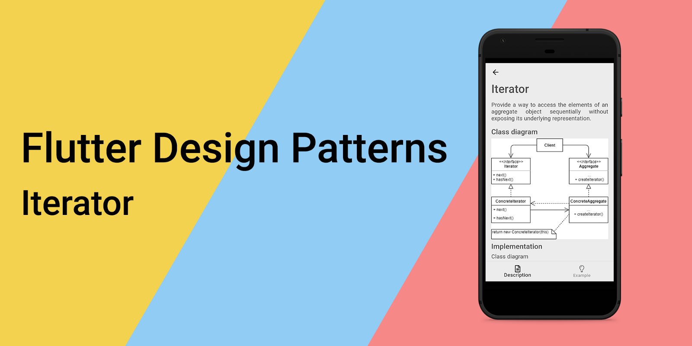
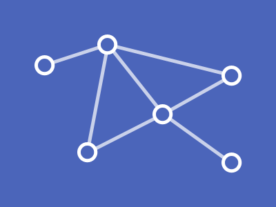
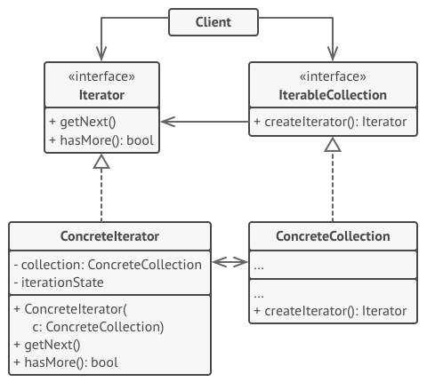
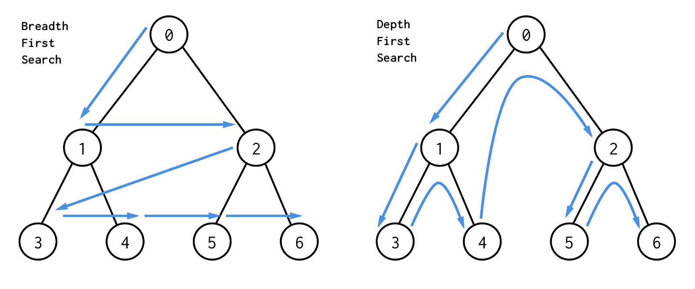
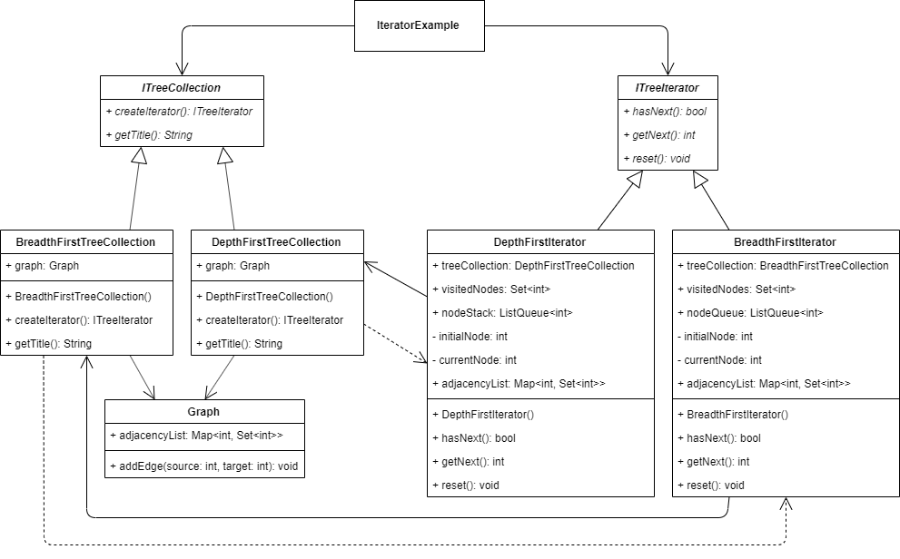
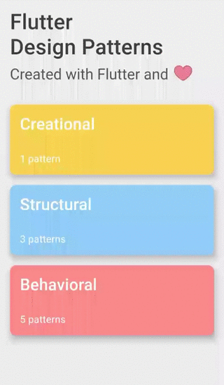

_迭代器设计模式概述及其在 Dart 和 Flutter 中的实现_



要查看所有设计模式的实际操作，请查看 [Flutter 设计模式应用程序](https://flutterdesignpatterns.com/)。

## 迭代器设计模式是什么？



**迭代器**是一种**行为型**设计模式，也被称为**游标**。在 [GoF 书籍](https://en.wikipedia.org/wiki/Design_Patterns)中，此设计模式的目的描述如下：

> _提供一种访问聚合对象中元素的方式，同时不暴露其底层表示。_

这个模式的关键思想是将访问和遍历的责任从列表对象（或任何其他集合）中移除，放入一个**迭代器**对象中。这个类定义了一个接口来遍历特定集合、访问其元素，并负责跟踪集合中迭代器的当前位置。此外，集合接口被定义为存储将被遍历的底层数据结构，并提供了一种方法来为该特定集合创建特定的迭代器。这些对集合及其迭代逻辑的抽象允许客户端使用不同的数据结构，并通过使用迭代器和集合接口来遍历它们，就好像它们都是相同的一样。

正如我已经提到的，你可能已经在不知不觉中使用过这种设计模式（至少是其实现），特别是如果你熟悉使用 Java 或 C#/.NET 进行开发。例如，所有 Java 集合都提供了一些内部实现的迭代器接口，用于遍历集合元素。在 C# 上下文中，有一些特殊的容器类型能够容纳一系列值，例如 _List_ 和 _ArrayList_，它们附带了遍历它们的可能性。

让我们继续分析和实现部分，以了解有关此模式的详细信息，并学习如何实现我们自定义的迭代器！

## 分析

迭代器设计模式的一般结构如下所示：



- *IterableCollection* - 定义用于创建 _Iterator_ 对象的接口；
- *ConcreteCollection* - 实现 _Iterator_ 创建接口，以在客户端每次请求时返回特定迭代器类的新实例。这个类也可以包含额外的代码/逻辑，例如用于存储应该迭代的数据结构；
- *Iterator* - 定义用于访问和遍历集合元素的接口；
- *ConcreteIterator* - 实现 _Iterator_ 接口。此类还应该跟踪遍历进度，例如集合遍历中的当前位置；
- *Client* - 通过它们的接口引用和使用集合和迭代器。

### 适用性

当您想要抽象集合的迭代逻辑并访问其元素，同时不暴露集合本身的内部结构时，应该使用迭代器设计模式。这促进了 [单一责任原则](https://en.wikipedia.org/wiki/Single-responsibility_principle) 以及 [DRY](https://en.wikipedia.org/wiki/Don't_repeat_yourself)（**不要重复自己**）原则的理念。

此外，当您想要以几种不同的方式遍历同一个集合时，这种模式非常有用，具体取决于您想要完成的目标。例如，您想要一个迭代器来遍历整个集合，另一个只迭代符合过滤标准的特定集合项，或者说，迭代集合中的每个第二个元素。在这种情况下，您不需要扩展单一接口来实现不同的迭代算法，您只需创建不同的迭代器类来实现相同的接口，并带有它们特定的迭代逻辑。

此外，当您想要以几种不同的方式遍历同一个集合时，这种模式非常有用，具体取决于您想要完成的目标。例如，您想要一个迭代器来遍历整个集合，另一个只迭代符合过滤标准的特定集合项，或者说，迭代集合中的每个第二个元素。在这种情况下，您不需要扩展单一接口来实现不同的迭代算法，您只需创建不同的迭代器类来实现相同的接口，并带有它们特定的迭代逻辑。

## 实现


首先，为了更好地理解实现部分，你应该熟悉树数据结构。如果你没有跟随这个系列，我在分析 [Composite](../2019-11-07-flutter-design-patterns-4-composite/index.md) 设计模式时已经解释过，但如果你已经读过这篇文章 - *给格兰芬多加10分*！

这次我们将研究[图论](https://en.wikipedia.org/wiki/Graph_theory)的一个基本部分 - 图遍历。图遍历定义为：

> _在计算机科学中，图遍历（也称为图搜索）是指访问（检查和/或更新）图中每个顶点的过程。这样的遍历按照顶点被访问的顺序进行分类。树遍历是图遍历的特殊情况。_

这次，我们将只关注树遍历的情况。有几种图/树遍历算法可供选择：

- **深度优先搜索 (DFS)** - 在访问兄弟顶点之前访问子顶点；即，它先遍历任何特定路径的深度，然后再探索其宽度；
- **广度优先搜索 (BFS)** - 在访问子顶点之前访问兄弟顶点。



假设你想使用不同的算法来试验树遍历。此外，这些算法的可视化应该提供给UI，以便你可以轻松地在不同算法之间切换，但对于这两种算法都使用相同的树数据结构。同时，你想隐藏每种算法迭代树数据结构的实现细节。为了实现这一点，迭代器设计模式是一个显而易见的选择。

### 类图

下面的类图展示了迭代器设计模式的实现：



`ITreeCollection` 定义了所有特定树集合的通用接口：

- `createIterator()` - 为特定的树集合创建一个迭代器；
- `getTitle()` - 返回树集合的标题，用于UI中。

`DepthFirstTreeCollection` 和 `BreadthFirstTreeCollection` 是 `ITreeCollection` 接口的具体实现。`DepthFirstTreeCollection` 创建了 `DepthFirstIterator`，而 `BreadthFirstTreeCollection` 创建了 `BreadthFirstIterator`。此外，这两个集合都存储了 Graph 对象来保存树的数据结构。

`ITreeIterator` 定义了树集合的所有特定迭代器的通用接口：

- `hasNext()` - 如果迭代器还没有到达集合的末尾，则返回 true，否则返回 false；
- `getNext()` - 返回集合的下一个值；
- `reset()` - 重置迭代器，并将其当前位置设置为开始位置。

`DepthFirstIterator` 和 `BreadthFirstIterator` 是 `ITreeIterator` 接口的具体实现。`DepthFirstIterator` 实现了遍历树集合的**深度优先**算法。相应地，`BreadthFirstIterator` 实现了**广度优先**算法。这两种算法的主要区别在于访问所有节点的顺序。因此，深度优先算法使用**栈**数据结构实现，而广度优先算法使用**队列**数据结构存储接下来要访问的节点（顶点）。

`IteratorExample` 引用了两个接口 - `ITreeCollection` 和 `ITreeIterator` - 来指定所需的树集合并为其创建适当的迭代器。

### Graph

一个存储[邻接列表](https://en.wikipedia.org/wiki/Adjacency_list)的类。它被存储为一个 map 数据结构，其中键代表节点（顶点）的 id，值是与该 id（键）的顶点相邻的顶点列表（其他节点的 id）。此外，这个类定义了 `addEdge()` 方法来向邻接列表添加一条边。


```dart title="graph.dart"
class Graph {
  final Map<int, Set<int>> adjacencyList = {};

  void addEdge(int source, int target) => adjacencyList.containsKey(source)
      ? adjacencyList[source]!.add(target)
      : adjacencyList[source] = {target};
}
```

### ITreeCollection

一个定义了所有特定树集合类需要实现的方法的接口。

```dart title="itree_collection.dart"
abstract interface class ITreeCollection {
  ITreeIterator createIterator();
  String getTitle();
}
```

### Tree collections

`DepthFirstTreeCollection` - 一个存储图对象的树集合类，实现了 `createIterator()` 方法来创建一个使用深度优先算法遍历图的迭代器。

```dart title="depth_first_tree_collection.dart"
class DepthFirstTreeCollection implements ITreeCollection {
  const DepthFirstTreeCollection(this.graph);

  final Graph graph;

  @override
  ITreeIterator createIterator() => DepthFirstIterator(this);

  @override
  String getTitle() => 'Depth-first';
}
```

`BreadthFirstTreeCollection` - 一个存储图对象的树集合类，实现了 `createIterator()` 方法来创建一个使用广度优先算法遍历图的迭代器。

```dart title="breadth_first_tree_collection.dart"
class BreadthFirstTreeCollection implements ITreeCollection {
  const BreadthFirstTreeCollection(this.graph);

  final Graph graph;

  @override
  ITreeIterator createIterator() => BreadthFirstIterator(this);

  @override
  String getTitle() => 'Breadth-first';
}
```

### ITreeIterator

一个定义了所有特定树集合迭代器需要实现的方法的接口。

```dart title="itree_iterator.dart"
abstract interface class ITreeIterator {
  bool hasNext();
  int? getNext();
  void reset();
}
```

### 树迭代器

`DepthFirstIterator` - 一个使用深度优先算法遍历树集合的具体迭代器实现。这个算法使用**栈**数据结构来存储下一个要访问的顶点（节点），通过 `getNext()` 方法实现。

```dart title="depth_first_iterator.dart"
class DepthFirstIterator implements ITreeIterator {
  final DepthFirstTreeCollection treeCollection;
  final Set<int> visitedNodes = <int>{};
  final ListQueue<int> nodeStack = ListQueue<int>();

  final _initialNode = 1;
  late int _currentNode;

  DepthFirstIterator(this.treeCollection) {
    _currentNode = _initialNode;
    nodeStack.add(_initialNode);
  }

  Map<int, Set<int>> get adjacencyList => treeCollection.graph.adjacencyList;

  @override
  bool hasNext() => nodeStack.isNotEmpty;

  @override
  int? getNext() {
    if (!hasNext()) return null;

    _currentNode = nodeStack.removeLast();
    visitedNodes.add(_currentNode);

    if (adjacencyList.containsKey(_currentNode)) {
      for (final node in adjacencyList[_currentNode]!
          .where((n) => !visitedNodes.contains(n))) {
        nodeStack.addLast(node);
      }
    }

    return _currentNode;
  }

  @override
  void reset() {
    _currentNode = _initialNode;
    visitedNodes.clear();
    nodeStack.clear();
    nodeStack.add(_initialNode);
  }
}
```

`BreadthFirstIterator` - 一个使用广度优先算法遍历树集合的具体迭代器实现。这个算法使用**队列**数据结构来存储下一个要访问的顶点（节点），通过 `getNext()` 方法实现。

```dart title="breadth_first_iterator.dart"
class BreadthFirstIterator implements ITreeIterator {
  final BreadthFirstTreeCollection treeCollection;
  final Set<int> visitedNodes = <int>{};
  final ListQueue<int> nodeQueue = ListQueue<int>();

  final _initialNode = 1;
  late int _currentNode;

  BreadthFirstIterator(this.treeCollection) {
    _currentNode = _initialNode;
    nodeQueue.add(_initialNode);
  }

  Map<int, Set<int>> get adjacencyList => treeCollection.graph.adjacencyList;

  @override
  bool hasNext() => nodeQueue.isNotEmpty;

  @override
  int? getNext() {
    if (!hasNext()) return null;

    _currentNode = nodeQueue.removeFirst();
    visitedNodes.add(_currentNode);

    if (adjacencyList.containsKey(_currentNode)) {
      for (final node in adjacencyList[_currentNode]!
          .where((n) => !visitedNodes.contains(n))) {
        nodeQueue.addLast(node);
      }
    }

    return _currentNode;
  }

  @override
  void reset() {
    _currentNode = _initialNode;
    visitedNodes.clear();
    nodeQueue.clear();
    nodeQueue.add(_initialNode);
  }
}
```

## 示例

首先，准备了一个 markdown 文件作为模式的描述：


`IteratorExample` 小部件负责使用 `Graph` 类构建树（图）并包含一系列树集合对象。在列表中选择特定的树集合并触发 `traverseTree()` 方法后，会创建并使用该树集合的适当迭代器来遍历树数据结构。

```dart title="iterator_example.dart"
class IteratorExample extends StatefulWidget {
  const IteratorExample();

  @override
  _IteratorExampleState createState() => _IteratorExampleState();
}

class _IteratorExampleState extends State<IteratorExample> {
  final List<ITreeCollection> treeCollections = [];

  var _selectedTreeCollectionIndex = 0;
  int? _currentNodeIndex = 0;
  var _isTraversing = false;

  @override
  void initState() {
    super.initState();

    final graph = _buildGraph();

    treeCollections
      ..add(BreadthFirstTreeCollection(graph))
      ..add(DepthFirstTreeCollection(graph));
  }

  Graph _buildGraph() => Graph()
    ..addEdge(1, 2)
    ..addEdge(1, 3)
    ..addEdge(1, 4)
    ..addEdge(2, 5)
    ..addEdge(3, 6)
    ..addEdge(3, 7)
    ..addEdge(4, 8);

  void _setSelectedTreeCollectionIndex(int? index) {
    if (index == null) return;

    setState(() => _selectedTreeCollectionIndex = index);
  }

  Future<void> _traverseTree() async {
    _toggleIsTraversing();

    final iterator =
        treeCollections[_selectedTreeCollectionIndex].createIterator();

    while (iterator.hasNext()) {
      if (!mounted) return;

      setState(() => _currentNodeIndex = iterator.getNext());

      await Future.delayed(const Duration(seconds: 1));
    }

    _toggleIsTraversing();
  }

  void _toggleIsTraversing() => setState(() => _isTraversing = !_isTraversing);

  void _reset() => setState(() => _currentNodeIndex = 0);

  Color _getBackgroundColor(int index) =>
      _currentNodeIndex == index ? Colors.red[200]! : Colors.white;

  @override
  Widget build(BuildContext context) {
    return ScrollConfiguration(
      behavior: const ScrollBehavior(),
      child: SingleChildScrollView(
        padding: const EdgeInsets.symmetric(
          horizontal: LayoutConstants.paddingL,
        ),
        child: Column(
          children: <Widget>[
            TreeCollectionSelection(
              treeCollections: treeCollections,
              selectedIndex: _selectedTreeCollectionIndex,
              onChanged:
                  !_isTraversing ? _setSelectedTreeCollectionIndex : null,
            ),
            const SizedBox(height: LayoutConstants.spaceL),
            Wrap(
              alignment: WrapAlignment.center,
              children: <Widget>[
                PlatformButton(
                  materialColor: Colors.black,
                  materialTextColor: Colors.white,
                  onPressed: _currentNodeIndex == 0 ? _traverseTree : null,
                  text: 'Traverse',
                ),
                PlatformButton(
                  materialColor: Colors.black,
                  materialTextColor: Colors.white,
                  onPressed:
                      _isTraversing || _currentNodeIndex == 0 ? null : _reset,
                  text: 'Reset',
                ),
              ],
            ),
            const SizedBox(height: LayoutConstants.spaceL),
            Box(
              nodeId: 1,
              color: _getBackgroundColor(1),
              child: Row(
                mainAxisAlignment: MainAxisAlignment.spaceEvenly,
                children: <Widget>[
                  Box(
                    nodeId: 2,
                    color: _getBackgroundColor(2),
                    child: Box(
                      nodeId: 5,
                      color: _getBackgroundColor(5),
                    ),
                  ),
                  Box(
                    nodeId: 3,
                    color: _getBackgroundColor(3),
                    child: Row(
                      mainAxisAlignment: MainAxisAlignment.spaceEvenly,
                      children: <Widget>[
                        Box(
                          nodeId: 6,
                          color: _getBackgroundColor(6),
                        ),
                        Box(
                          nodeId: 7,
                          color: _getBackgroundColor(7),
                        ),
                      ],
                    ),
                  ),
                  Box(
                    nodeId: 4,
                    color: _getBackgroundColor(4),
                    child: Box(
                      nodeId: 8,
                      color: _getBackgroundColor(8),
                    ),
                  ),
                ],
              ),
            ),
          ],
        ),
      ),
    );
  }
}
```

如你在 `traverseTree()` 方法中可以看到，树集合遍历的所有实现细节都对客户端隐藏，它只使用由 `ITreeIterator` 接口定义的 `hasNext()` 和 `getNext()` 方法来遍历构建的 `Graph` 对象（树）的所有顶点（节点）。

迭代器设计模式实现的最终结果如下所示：



如示例中所见，通过选择特定的树集合并创建其迭代器，遍历树的算法也发生了变化，并且在演示中可以直观地看到。

所有迭代器设计模式及其示例实现的代码更改可以在[这里](https://github.com/mkobuolys/flutter-design-patterns/pull/10)找到。

要查看该模式的实际操作，请查看[交互式迭代器示例](https://flutterdesignpatterns.com/pattern/iterator)。
